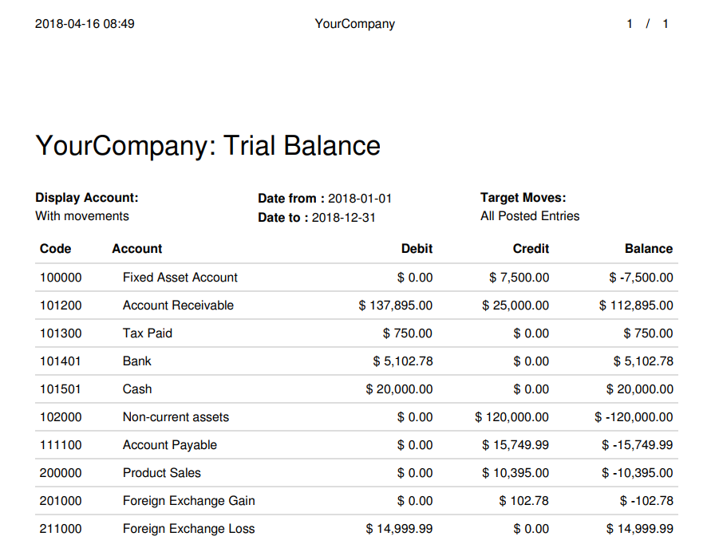

:banner: banners/cash-flow-app-banner.jpg

=================
Account Cash Flow
=================

Cash Flow Statement is Finanicial Statement, which shows changes in
all accounts affect cash and cash equivalents, and breaks the analysis
down to Operating Activities, Investing Activities and Financial Activities.

Account type configuration
==========================

Activity type configuration in account type and activity types are following:

   * Operation-Income
   * Operation-Expense
   * Operation-Current Asset
   * Operation-Cuurent Liability
   * Investing
   * Financing

.. image:: images/activity_type.png
    :class: img-responsive

Cash Flow Wizard
================

It is a wizard for printing cash flow report.

    * Target Moves: If 'All Posted Entries' radio button is selected then it
                    will fetch only posted account move lines entries.

                    If 'All Entries' radio button is selected then it will
                    fetch all account move lines entries.

    * Company: Current company

    * Previous Period: Enter number of periods for fetching cash flow data
                       year wise.
                       Default is 0 means it will fetch current year data.

    * Branch: If multi branch boolean is true, Branch selection will display.
              Enter current company's branch.

.. image:: images/cash_flow_wizard.png
    :class: img-responsive

Trial balance
=============

PDF Report for trial balance of a company.

Cash Flow Report
================

PDF Report for cash flow of a company. You can compare it with trial balance.

.. image:: images/cash_flow_statement.png
    :class: img-responsive

If 2 years is entered in a Previous Period field, it displays result
of 2 previous years from current year.

.. image:: images/cash_flow_for_2yrs.png
    :class: img-responsive
