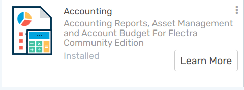
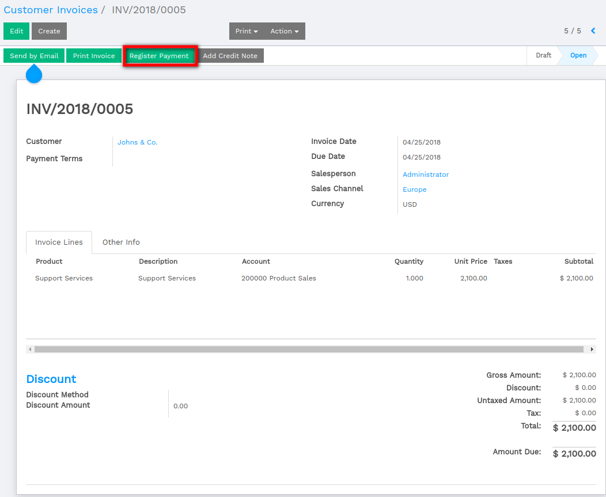
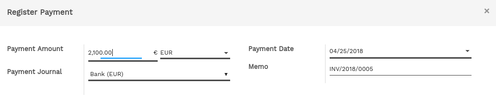
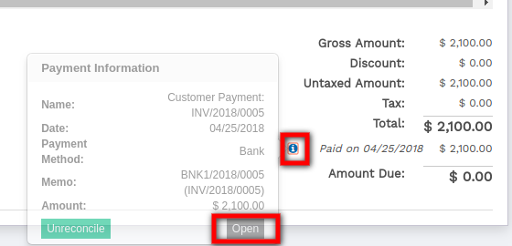

=============================================
Use case in the bank reconciliation process?
=============================================

Overview
========

Linking your bank statements with your accounting can be a lot of work.
You need to find invoices back, relate payments and that amount of
administration can cast a lot of time. Luckily, with Flectra you can very
easily link your invoices or any other payment with your bank
statements.

Reconciliation process exist in Flectra.

1. We can directly register a payment on the invoices

Configuration
=============

No special configuration is necessary to register invoices. All we need
to do is install the accounting app.

Use cases
=========

Payments registration
---------------------

We received the payment proof for our invoice of 2100 euros issued to
Johns & Co.

We start at our issued Invoice of 2100 euros for Johns & Co. Because the
sold product is a service we demand an immediate payment. Our accountant
only handles the bank statements at the end of week, so we have to mark
the invoice as paid so we can remember we can start the service with our
customer.

Our customer send us a payment confirmation. We can thus register a
payment and mark the invoice as paid.

By clicking on **register payment,** we are telling Flectra that our
customer paid the Invoice. We thus have to specify the amount and the
payment method

We can always find the payment back from the Invoice by clicking on the
:menuselection:`Info --> Open`.

The invoice has been paid and **the reconciliation has been done
automatically.**

.. seealso::

	* :doc:`../feeds/manual`
