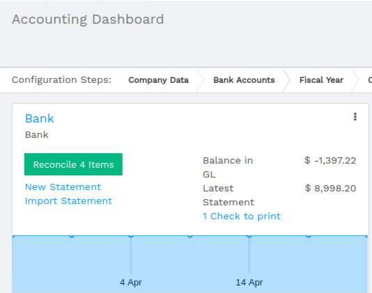
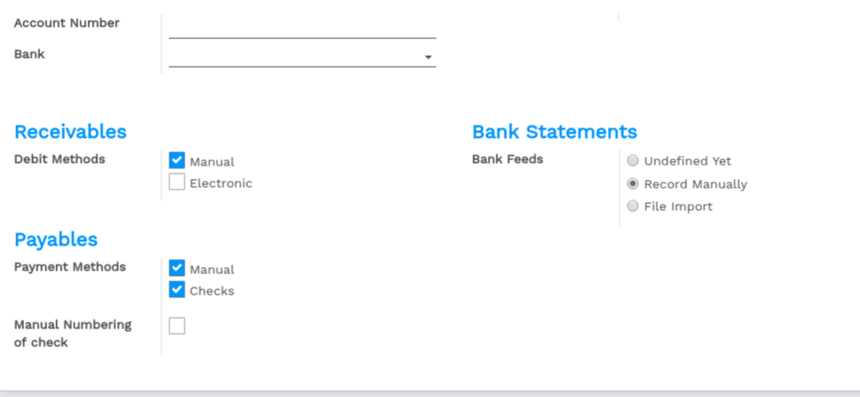

================================
How to setup a new bank account?
================================

In Flectra, you can manage multiple bank accounts. In this page, you will
be guided in the creation, modification or deletion of a bank or a
credit card account.

Edit a bank account
--------------------

To ease the process, a bank account is already there. We suggest you to 
edit it first before filling your own bank information. 

Go to :menuselection:`Accounting --> Configuration --> Bank
Accounts` and click on the **Bank** item. Edit it.

Create a bank account
---------------------

Go to :menuselection:`Accounting --> Configuration --> Bank
Accounts`. Click on **create** and fill in the form. You can
decide to show the bank account number in you intend to send documents 
like sales orders or invoices. Select the payments methods you 
support with this bank account.

.. note::

    If you are working in a multi-company environnement, you'll have to switch 
    the company on your user preferences in order to add, edit or delete bank 
    accounts from another company.

Delete a bank account or credit card account
--------------------------------------------

From the list of bank accounts, select items to delete and delete them from the action menu or go to the form and delete a single item from the action menu

.. |image5| image:: media/image05.png
	:class: btn-group

