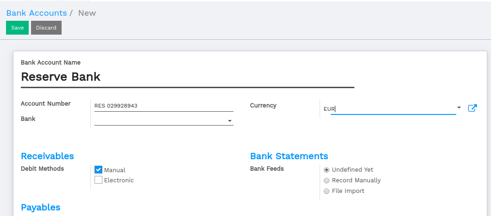
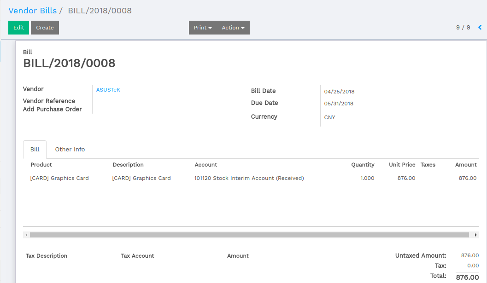
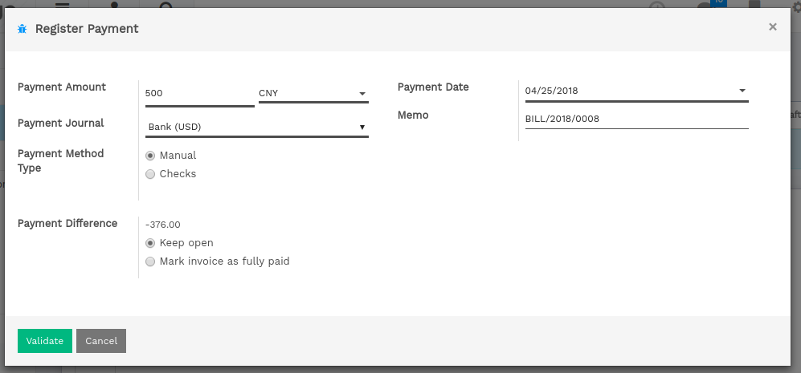

===========================================
How to manage a bank in a foreign currency?
===========================================

In Flectra, every transaction is recorded in the default currency of the
company. Reports are all based on the currency of the company. But for
transactions occurring in another currency, Flectra stores both the value
in the currency of the company and the value in the currency of the
transaction.

When you have a bank account in a foreign currencies, for every
transaction, Flectra stores two values:

-  The debit/credit in the currency of the company

-  The debit/credit in the currency of the bank account

Currency rates are updated automatically using yahoo.com, or the
European Central bank web-services.

Configuration
=============

Activate the multi-currency feature
-----------------------------------

In order to allow your company to work with multiple currencies, you
should activate the multi-currency mode. In the accounting application,
go into :menuselection:`Configuration --> Settings --> Invoicing`
make sure the **Multi-currencies** box is ticked. Provide
a **Currency Exchange Gain / Loss** journal, then click on **Save**.

Configure currencies
--------------------

Once the Flectra is configured to support multiple currencies, you should
activate the currencies you plan to work with. To do that, go the menu
:menuselection:`Configuration --> Currencies`. All the currencies are created by default,
but you should activate the ones you plan to support. (to activate a
currency, check his active field)

Create a new bank account
-------------------------

In the accounting application, we first go to :menuselection:`Configuration -->
Accounting / Bank account`, and we create a new one.

Once you save this bank account, Flectra will create all the documents for
you:

- An account in the trial balance

- A journal in your dashboard

- Information about the bank account in the footer of your invoices if
  checked the box **Show in Invoices Footer**

Example: A vendor bill in a foreign currency
============================================

Based on the above example, let's assume we receive the following bill
from a supplier in China.

In the :menuselection:`Purchase --> Vendor Bills` , this is what you could see:

Once you are ready to pay this bill, click on register payment on the
bill to record a payment.

That's all you have to do. Flectra will automatically post the foreign
exchange gain or loss at the reconciliation of the payment with the
invoice, depending if the currency rate increased or decreased between
the invoice and the payment date.

Note that you can pay a foreign bill with another currency. In such a
case, Flectra will automatically convert between the two currencies.
