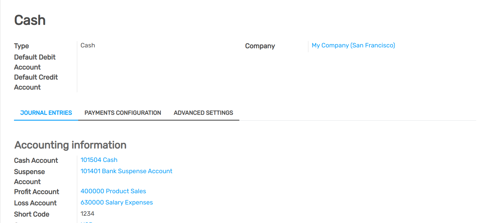

==============================
How to manage a cash register?
==============================

The cash register is a journal to register receivings and payments transactions.
It calculates the total money in and out, computing the total balance.

Configuration
==============

1. Configure the Cash journal in :menuselection:`Invoicing --> Configuration -->
   Accounting --> Journals`.

2. In the tab Journal Entries, the Default Debit and Credit Account can be
   configured as well as the currency of the journal

.. demo:fields:: account.action_account_journal_form
