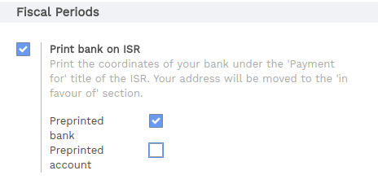
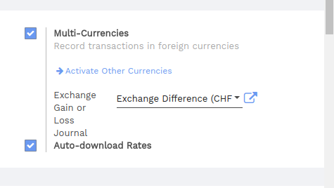

===========
Switzerland
===========

ISR (In-payment Slip with Reference number)
~~~~~~~~~~~~~~~~~~~~~~~~~~~~~~~~~~~~~~~~~~~

The ISRs are payment slips used in Switzerland. You can print them
directly from Flectra. On the customer invoices, there is a new button
called *Print ISR*.

.. image:: media/switzerland00.png
    :align: center

.. tip:: 
    The button *Print ISR* only appears there is well a bank account
    defined on the invoice. You can use CH6309000000250097798 as bank
    account number and 010391391 as CHF ISR reference.

.. image:: media/switzerland01.png
    :align: center

Then you open a pdf with the ISR.

.. image:: media/switzerland02.png
    :align: center

There exists two layouts for ISR: one with, and one without the bank
coordinates. To choose which one to use, there is an option to print the
bank information on the ISR. To activate it, go in
:menuselection:`Accounting --> Configuration --> Settings --> Accounting Reports`
and tick this box :

Currency Rate Live Update
~~~~~~~~~~~~~~~~~~~~~~~~~

You can update automatically your currencies rates based on the Federal
Tax Administration from Switzerland. For this, go in
:menuselection:`Accounting --> Settings`, activate the multi-currencies setting and choose the service
you want.

Updated VAT for January 2018
~~~~~~~~~~~~~~~~~~~~~~~~~~~~

Starting from the 1st January 2018, new reduced VAT rates will be
applied in Switzerland. The normal 8.0% rate will switch to 7.7% and the
specific rate for the hotel sector will switch from 3.8% to 3.7%.
