========================
Manage your fixed assets
========================

The "Assets" module allows you to keep track of your fixed assets like
machinery, land, and building. The module allows you to generate monthly
depreciation entries automatically, get depreciation board, sell or
dispose assets and perform reports on your company assets.

As an example, you may buy a car for $36,000 (gross value) and you plan
to amortize it over 36 months (3 years). Every month (periodicity),
Flectra will create a depreciation entry automatically reducing your assets
value by $1,000 and passing $1,000 as an expense. After 3 years,
assets account for $0 (salvage value) in your balance sheet.

The different categories of assets are grouped into "Assets Categories" that
describe how to depreciate an asset. Here are examples of assets
Categories:

-  Hardware: 3 years, yearly linear depreciation
-  Car: 5 years, monthly linear depreciation
-  Electronics: 6 years, yearly linear depreciation

Configuration
=============

Install the Asset module
------------------------

Start by *installing the Asset module.*

Once the module is installed, you should see new menus in the
accounting application:

-  :menuselection:`Adviser --> Management --> Assets`
-  :menuselection:`Configuration --> Management --> Asset Categories`
-  :menuselection:`Reporting --> Management --> Assets`
-  :menuselection:`Reporting --> PDF Reports --> Asset Depreciation Summary Report`

Before registering your first asset, you must :ref:`define your Asset
Categories <accounting/adviser/assets_management/defining>`.

.. _accounting/adviser/assets_management/defining:

Defining Asset Categories
-------------------------

Asset categories are used to configure all information about an assets: asset
and depreciation accounts, amortization method, etc. That way, advisers
can configure asset categories and users can further record assets without
having to provide any complex accounting information. They just need to
provide an asset category on the supplier bill.

You should create asset categories for every group of assets you frequently
buy like "Cars: 5 years", "Computer Hardware: 3 years". For all other
assets, you can create generic asset categories. Name them according to the
duration of the asset like "36 Months", "10 Years", ...

To define asset Categories, go to :menuselection:`Configuration --> Management --> Asset Categories`

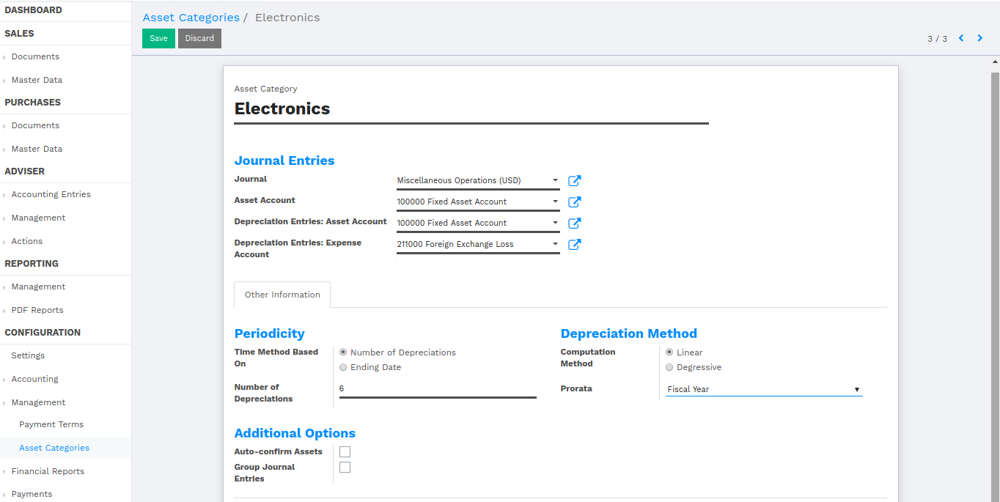

Create assets manually
======================

To register an asset manually, go to the menu :menuselection:`Adviser --> Management
--> Assets`.

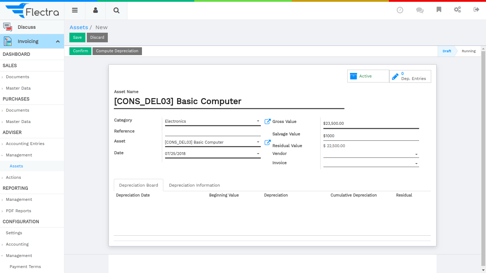

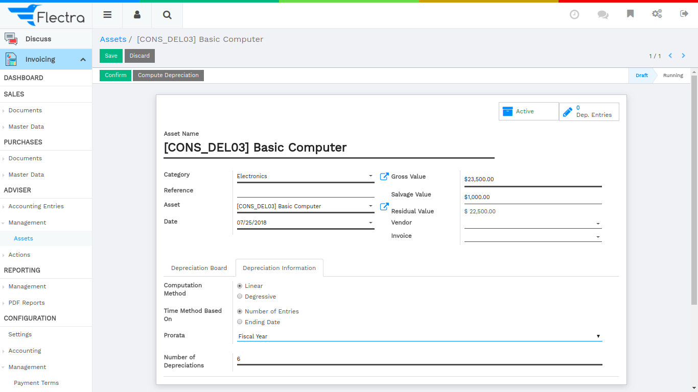

Once your asset is created, don't forget to Confirm it. You can also
click on the Compute Depreciation button to check the depreciation board
before confirming the asset.

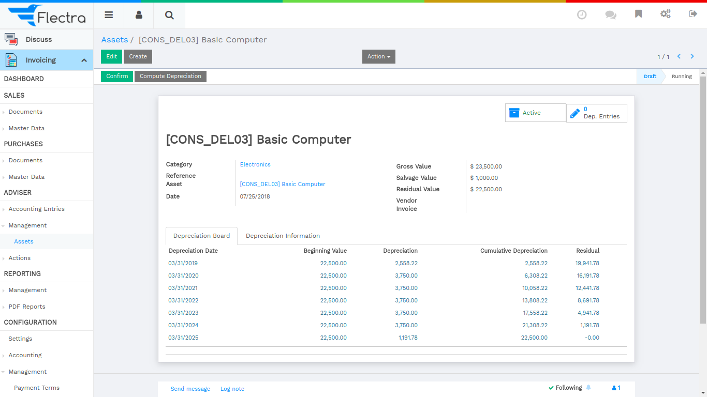

Here deprecation date is set fiscal year date wise because we have set `Prorata` as `Fiscal Year`.
After confirmed assets.

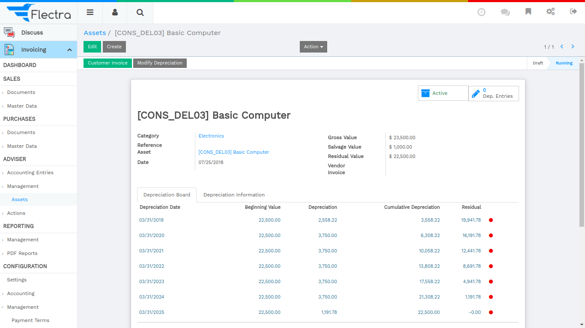

You can also cancel deprecated line using click on Cancel Entry button.

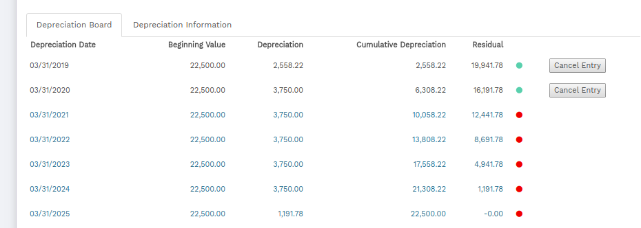

.. tip::

   if you create asset manually, you still need to create the supplier
   bill for this asset. The asset document will only produce the
   depreciation journal entries, not those related to the supplier
   bill.

Explanation of the fields:

.. demo:fields:: account_asset.action_account_asset_asset_form

Sale Asset
==========

We can sale asset directly to the particular customer

- Date: Define here asset sale date.
- Sale Value: It will calculate the amount by default Date wise.

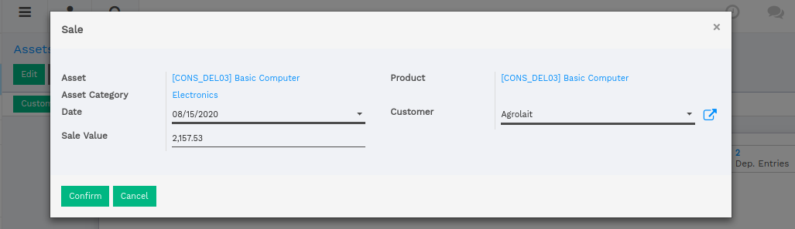

Here remove other depreciations line which is greater than Date.
You can also view Customer Invoice button.

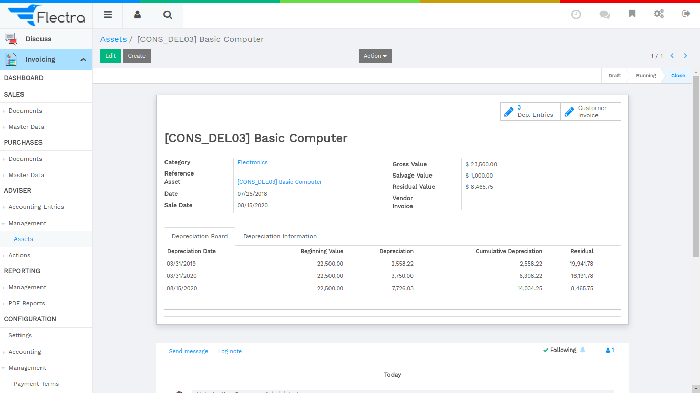

Create assets automatically from a supplier bill
================================================

Assets can be automatically created from supplier bills. All you need to
do is to set an asset category on your bill line. When the user will
validate the bill, an asset will be automatically created, using the
information of the supplier bill.

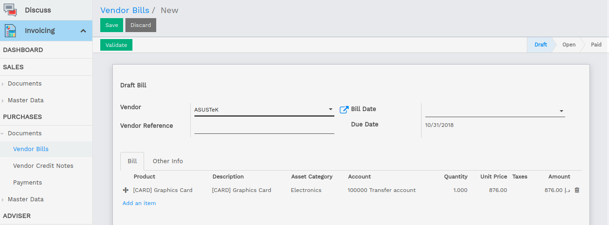

Depending on the information on the asset category, the asset will be
created in the draft or directly validated\ *.* It's easier to confirm
assets directly so that you won't forget to confirm it afterward.
(check the field *Skip Draft State* on *Asset Category)* Generate assets
in draft only when you want your adviser to control all the assets
before posting them to your accounts.

.. tip:: if you put the asset on the product, the asset category will
         automatically be filled in the supplier bill.

How to depreciate an asset?

Flectra will create depreciation journal entries automatically at the right
date for every confirmed asset. (not the draft ones). You can control in
the depreciation board: a green bullet point means that the journal
entry has been created for this line.

But you can also post journal entries before the expected date by
clicking on the green bullet and forcing the creation of related
depreciation entry.

.. note:: In the Depreciation board, click on the red bullet to post
          the journal entry. Click on the :guilabel:`Items` button on
          the top to see the journal entries which are already posted.
          You can also cancel deprecated line using click on Cancel Entry button.

How to modify an existing asset?
================================

-  Click on :guilabel:`Modify Depreciation`
-  Change the number of depreciation

Flectra will automatically recompute a new depreciation board.

How to record the sale or disposal of an asset?
===============================================

If you sell or dispose of an asset, you need to deprecate completely this
asset. Click on the button :guilabel:`Sell or Dispose`. This action
will post the full costs of this assets but it will not record the
sales transaction that should be registered through a customer
invoice.

.. todo:: → This has to be changed in Flectra: selling an asset should:

   #. remove all "Red" lines
   #. create a new line that deprecates the whole residual value

Reports
=======

Analysis Report
---------------

-  :menuselection:`Reporting --> Management --> Assets`

This report display graph view data of remaining depreciated amount.

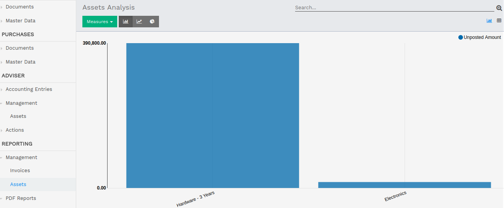

Summary Report
--------------

-  :menuselection:`Reporting --> PDF Reports --> Asset Depreciation Summary Report`

You can print summary report of asset from Start date to End date.

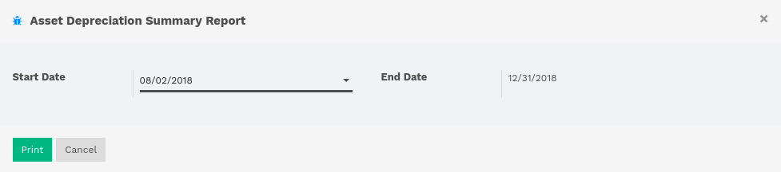