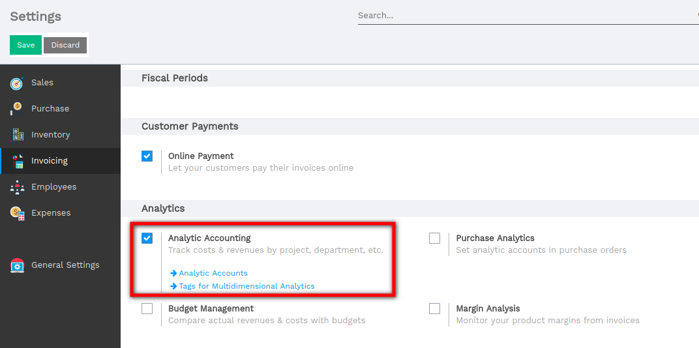

==========================
Analytic account use cases
==========================

The analytic accounting can be used for several purposes:

-  analyse costs of a company

-  reinvoice time to a customer

-  analyse performance of a service or a project

To manage analytic accounting, you have to activate it in
:menuselection:`Configuration --> Settings`:

Analytic accounting helps you to analyse costs and revenues whatever the
use case. You can sell or purchase services, track time or analyse the
production performance.

Analytic accounting is flexible and easy to use through all Flectra
applications (sales, purchase, timesheet, production, invoice, …).
