====================================
What are the main reports available?
====================================

Besides the reports created specifically in each localisation module, a
few very useful **generic** and **dynamic reports** are available for all
countries :

- **Journal Audit**
- **Partner Ledger**
- **General Ledger**
- **Trial Balance**
- **Balance Sheet**
- **Profit and Loss**
- **Aged Partner Balance**
- **Tax Report**

You can annotate every reports to print them and report to your adviser.
Export to xls to manage extra analysis. Drill down in the reports to see
more details (payments, invoices, journal items, etc.).

You can also compare values with another period. Choose how many periods
you want to compare the chosen time period with. You can choose up to 12
periods back from the date of the report if you don't want to use the
default **Previous 1 Period** option.

Journal Audit
-------------

The **Journal Audit** shows a **Customer Invoices Journal** and **Vendor Bills Journal**
with all details.

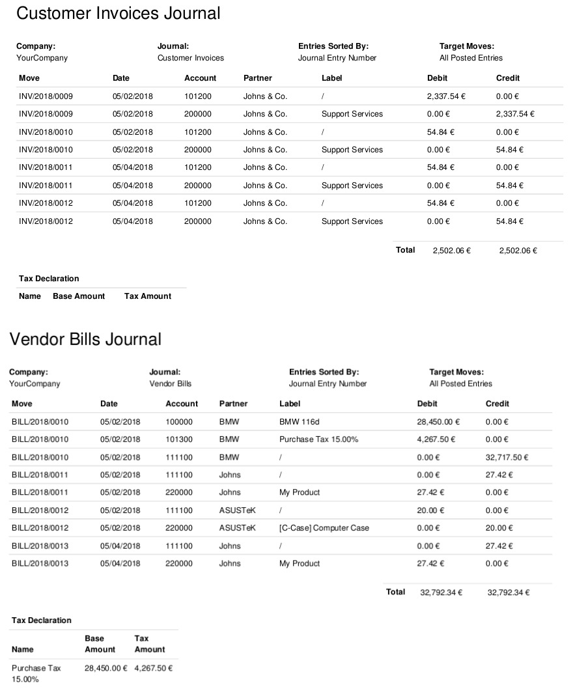

Balance Sheet
-------------

The **Balance Sheet** shows a snapshot of the assets, liabilities and equity
of your organisation as at a particular date.

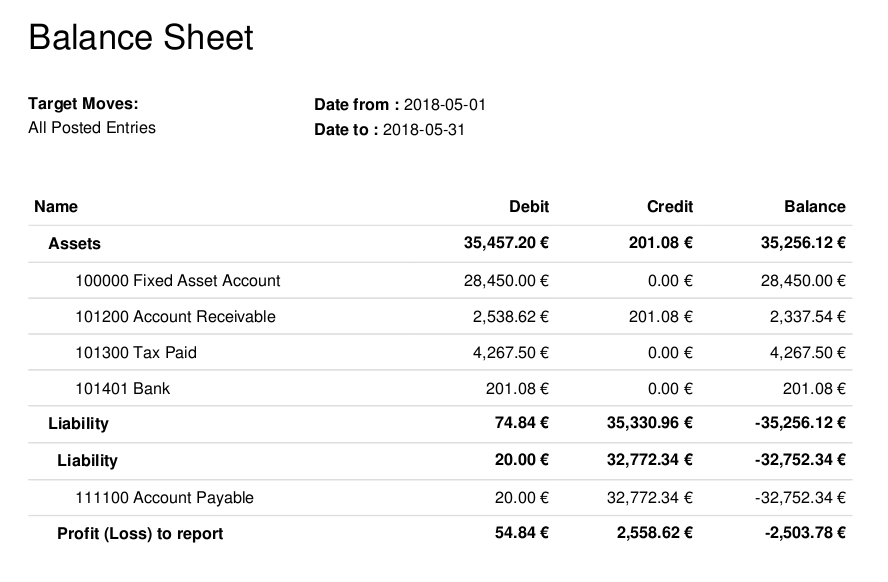

Profit and Loss
---------------

The **Profit and Loss** report (or **Income Statement**) shows your
organisation's net income, by deducting expenses from revenue for the
report period.

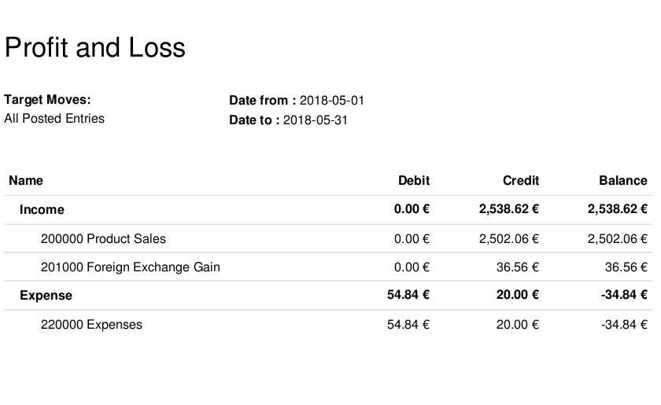

General Ledger
--------------

The **General Ledger Report** shows all transactions from all accounts for a
chosen date range. The initial summary report shows the totals for each
account and from there you can view a detailed transaction report or any
exceptions. This report is useful for checking every transaction that
occurred during a certain period of time.

.. image:: media/main_reports05.png  
    :align: center

Trail Balance
--------------

A trial balance may include all accounts (even the ones without balance), only accounts
with transactions or accounts of which the balance is not equal to zero.

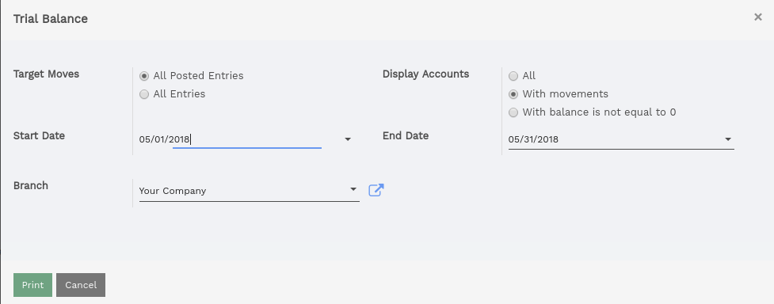

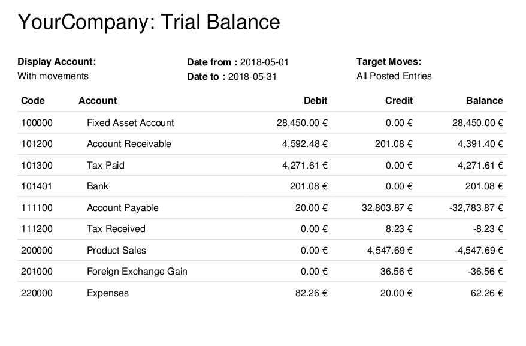

Cash Flow Statement
-------------------

Cash Flow Statement is Finanicial Statement, which shows changes in
all accounts affect cash and cash equivalents, and breaks the analysis
down to Operating Activities, Investing Activities and Financial Activities.

Account type configuration
==========================

Activity type configuration in account type and activity types are following:

   * Operation-Income
   * Operation-Expense
   * Operation-Current Asset
   * Operation-Cuurent Liability
   * Investing
   * Financing

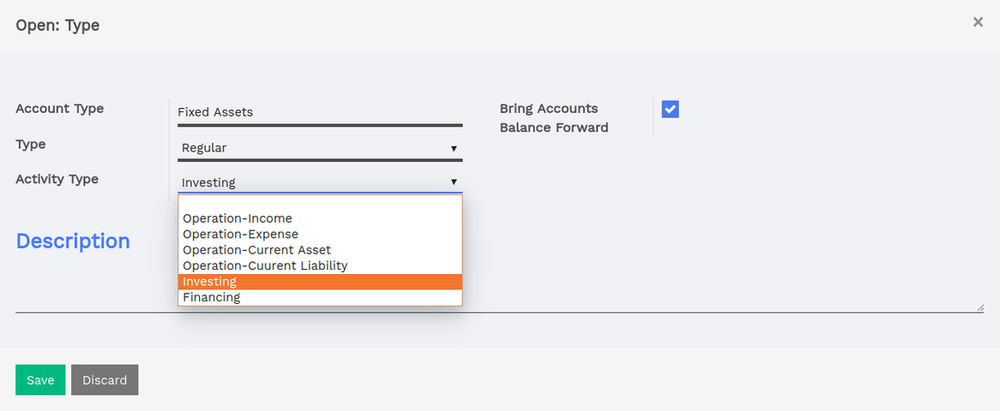

Cash Flow Wizard
================

It is a wizard for printing cash flow report.

    * Target Moves: If 'All Posted Entries' radio button is selected then it
                    will fetch only posted account move lines entries.

                    If 'All Entries' radio button is selected then it will
                    fetch all account move lines entries.

    * Company: Current company

    * Previous Period: Enter number of periods for fetching cash flow data
                       year wise.
                       Default is 0 means it will fetch current year data.

    * Branch: If multi branch boolean is true, Branch selection will display.
              Enter current company's branch.

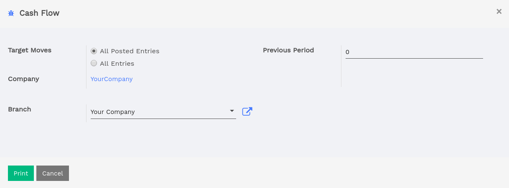

Trial balance
=============

PDF Report for trial balance of a company.

.. image:: media/trial_balance.png
    :class: img-responsive

Cash Flow Report
================

PDF Report for cash flow of a company. You can compare it with trial balance.

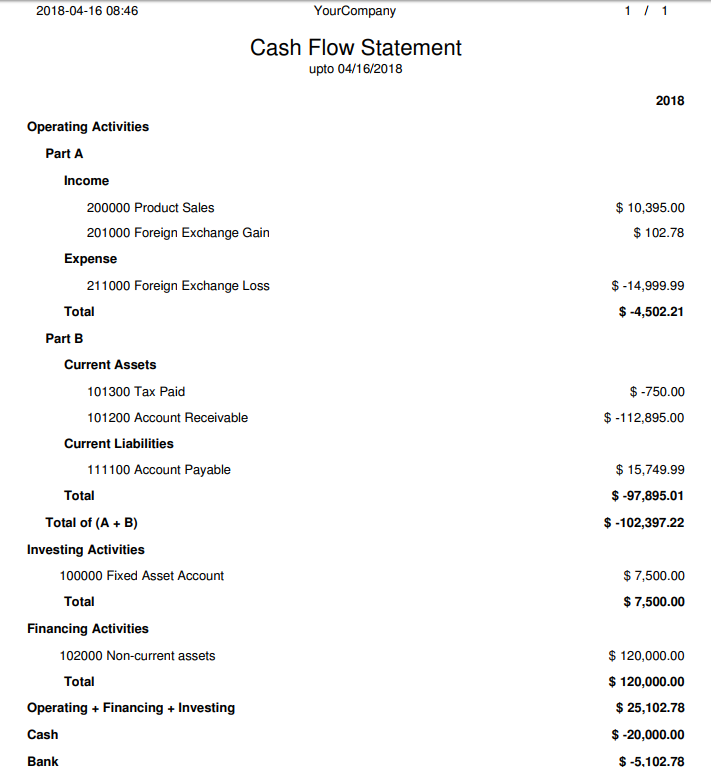

If 2 years is entered in a Previous Period field, it displays result
of 2 previous years from current year.

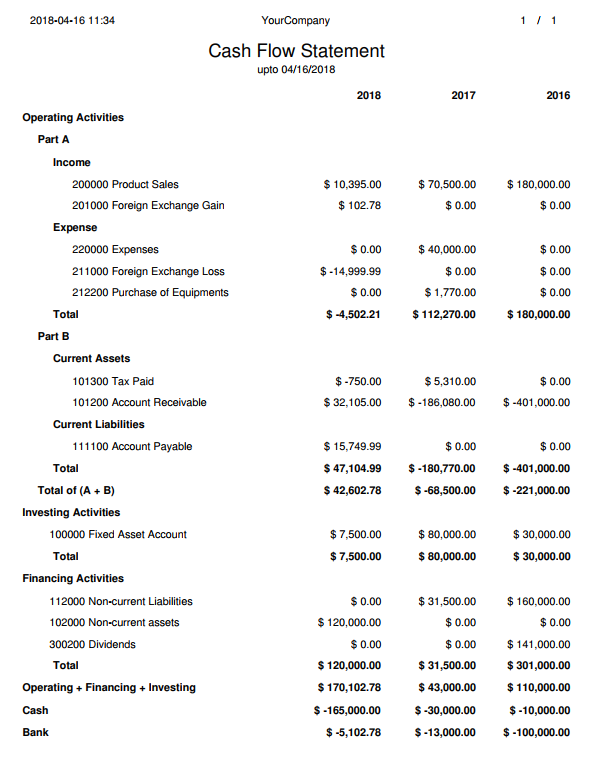

Aged Partner Balance
--------------------

Aged Partner Balance is a more detailed report of your receivables by intervals.
Flectra calculates a table of credit balance by start Date. So if you request an
interval of 30 days Flectra generates an analysis of creditors for the past month,
past two months, and so on.

**Payable Accounts**

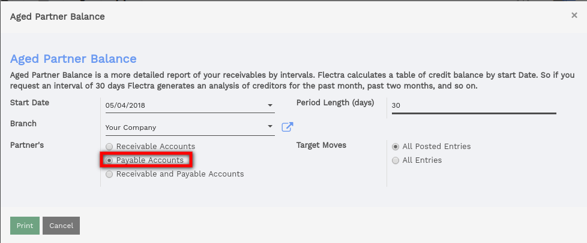

Run the **Aged Payable Details** report to display information on individual
bills, credit notes and overpayments owed by you, and how long these
have gone unpaid.

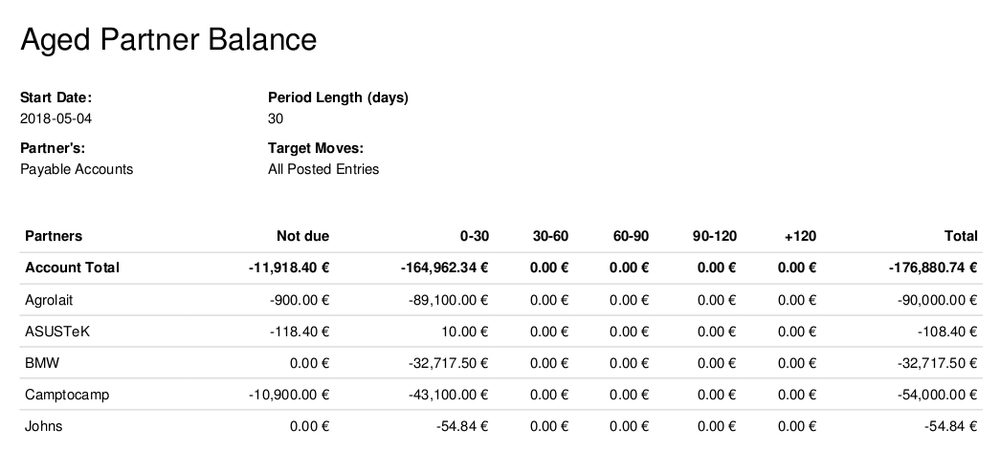

**Receivable Accounts**

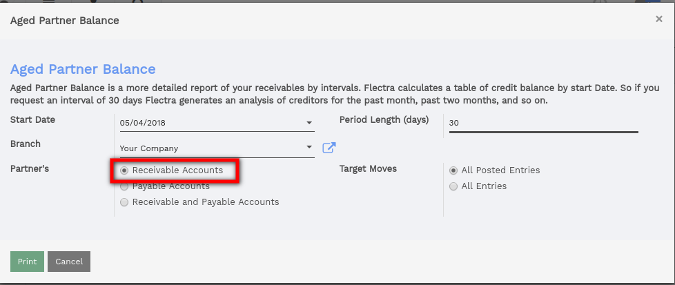

The **Aged Receivables** report shows the sales invoices that were awaiting
payment during a selected month and several months prior.

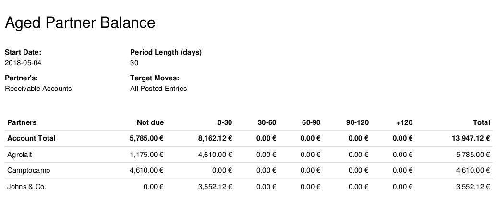

Partner Ledger
--------------
**Receivable Accounts**

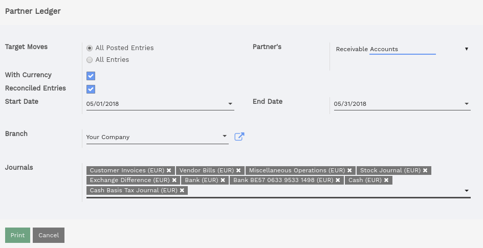

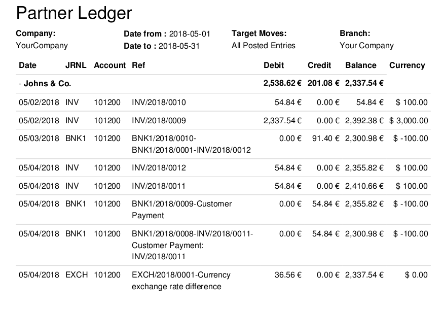

**Payable Accounts**

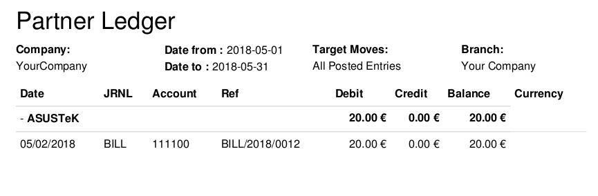

Tax Report
----------

This report allows you to see the **net** and **tax amounts** for all the taxes
grouped by type (sale/purchase).

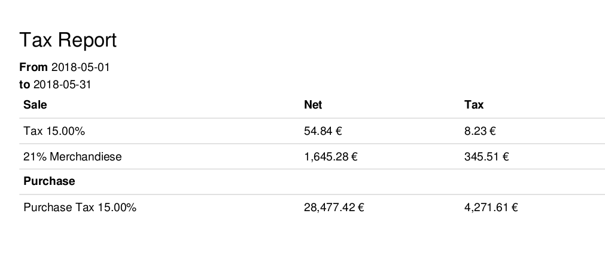
