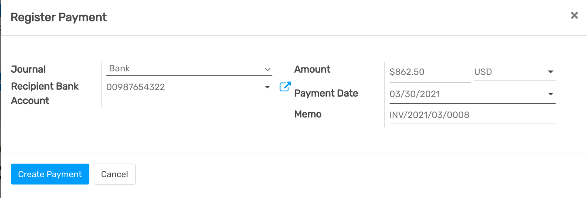

============================================
How to register customer payments by checks?
============================================

To handle payments received by checks. Flectra support
approach so that you can use.

**Undeposited Funds:**
   once you receive the check, you record a payment
   by check on the invoice. (using a Check journal and posted on the
   Undeposited Fund account) Then, once the check arrives in your
   bank account, move money from Undeposited Funds to your bank
   account.

We recommend this approach as it is more accurate (your bank
account balance is accurate, taking into accounts checks that have not
been cashed yet).

Undeposited Funds
=================

Configuration
-------------

-  Create a journal **Checks**

-  Set **Undeposited Checks** as a defaut credit/debit account

-  Set the bank account related to this journal as **Allow Reconciliation**

From check payments to bank statements
--------------------------------------

The first way to handle checks is to create a check journal. Thus,
checks become a payment method in itself and you will record two
transactions.

Once you receive a customer check, go to the related invoice and click
on **Register Payment**. Fill in the information about the payment:

-  Payment method: Check Journal (that you configured with the debit and
   credit default accounts as **Undeposited Funds**)

-  Memo: write the Check number

This operation will produce the following journal entry:

+----------------------+-------------------+----------+----------+
| Account              | Statement Match   | Debit    | Credit   |
+======================+===================+==========+==========+
| Account Receivable   |                   |          | 100.00   |
+----------------------+-------------------+----------+----------+
| Undeposited Funds    |                   | 100.00   |          |
+----------------------+-------------------+----------+----------+

The invoice is marked as paid as soon as you record the check.

Then, once you get the bank statements, you will match this statement
with the check that is in Undeposited Funds.

+---------------------+-------------------+----------+----------+
| Account             | Statement Match   | Debit    | Credit   |
+=====================+===================+==========+==========+
| Undeposited Funds   | X                 |          | 100.00   |
+---------------------+-------------------+----------+----------+
| Bank                |                   | 100.00   |          |
+---------------------+-------------------+----------+----------+

If you use this approach to manage received checks, you get the list of
checks that have not been cashed in the **Undeposit Funds** account
(accessible, for example, from the general ledger).

.. tip:: 
    You may also record the payment directly without going on the
    customer invoice, using the menu :menuselection:`Sales --> Payments`. This method may
    be more convenient if you have a lot of checks to record in a batch but
    you will have to reconcile entries afterwards (matching payments with
    invoices)
