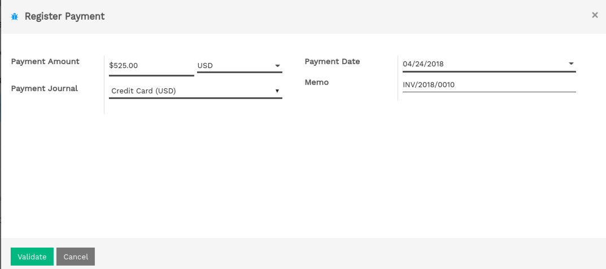

=================================================
How to register credit card payments on invoices?
=================================================

To handle payments received by credit cards. Flectra
support approach so that you can use.

**Undeposited Funds** (mostly used in european countries): once you
   receive the credit card payment authorization, you record a
   payment by credit card on the invoice (using a Credit card
   journal and posted on the Undeposited Fund account). Then, once
   the credit card payments arrives in your bank account, move money
   from Undeposited Funds to your bank account.

We recommend this approach as it is more accurate (your bank account
balance is accurate, taking into accounts credit cards that have not
been cashed yet).

Undeposited Funds
=================

Configuration
-------------

On the Accounting module, go to :menuselection:`Configuration --> Journals --> Create`

Create a Journal called 'Credit card payments' with the following data:

-  **Journal Name**: Credit card
-  **Default debit account**: Credit cards
-  **Default credit account**: Credit cards

The account type should be "Credit Card". Once it's done, don't forget to set the "Credit cards" account as "Allow
Reconciliation".

.. image:: ./media/credit01.png
  :align: center

From credit card payments to bank statements
--------------------------------------------

The first way to handle credit cards is to create a credit card journal.
Thus, credit cards become a payment method in itself and you will record
two transactions.

Once you receive a customer credit card payment, go to the related
invoice and click on Register Payment. Fill in the information about the
payment:

-  **Payment method**: Credit card

-  **Memo**: write the invoice reference

This operation will produce the following journal entry:

+----------------------+-------------------+----------+----------+
| Account              | Statement Match   | Debit    | Credit   |
+======================+===================+==========+==========+
| Account Receivable   |                   |          | 100.00   |
+----------------------+-------------------+----------+----------+
| Credit Cards         |                   | 100.00   |          |
+----------------------+-------------------+----------+----------+

The invoice is marked as paid as soon as you record the credit card
payment.

Then, once you get the bank statements, you will match this statement
with the credit card that is in the 'Credit card' account.

+----------------+-------------------+----------+----------+
| Account        | Statement Match   | Debit    | Credit   |
+================+===================+==========+==========+
| Credit cards   | X                 |          | 100.00   |
+----------------+-------------------+----------+----------+
| Bank           |                   | 100.00   |          |
+----------------+-------------------+----------+----------+

If you use this approach to manage credit cards payments, you get the
list of credit cards payments that have not been cashed in the "Credit
card" account (accessible, for example, from the general ledger).

.. seealso::
   
   * :doc:`recording`
   * :doc:`check`
