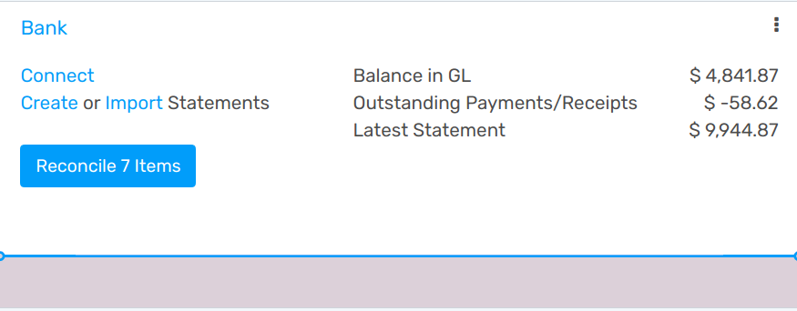
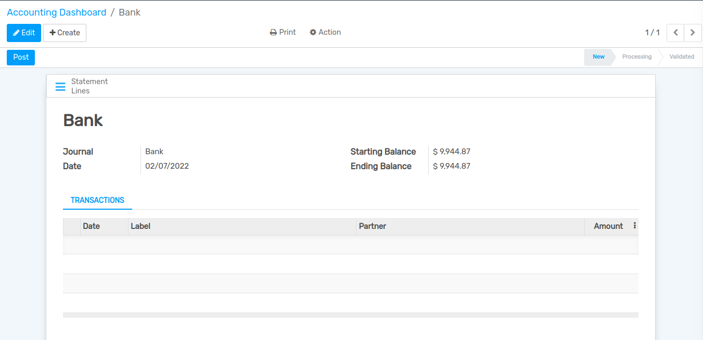
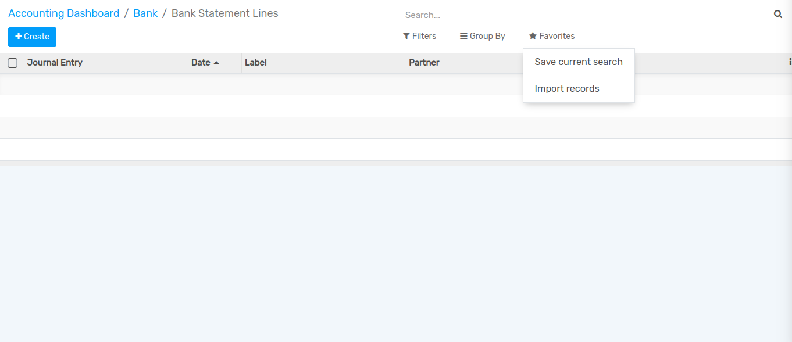
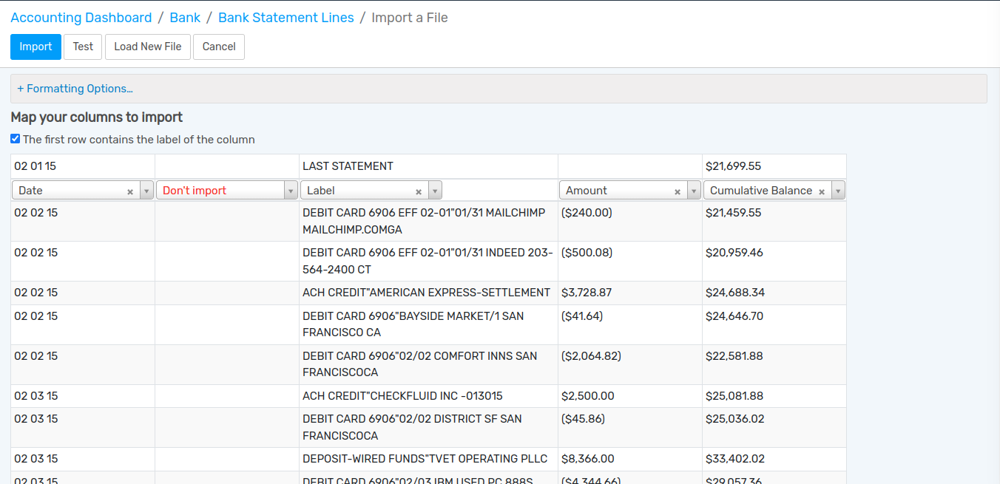
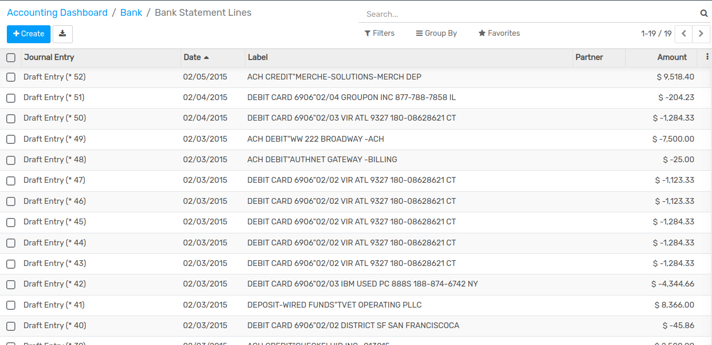
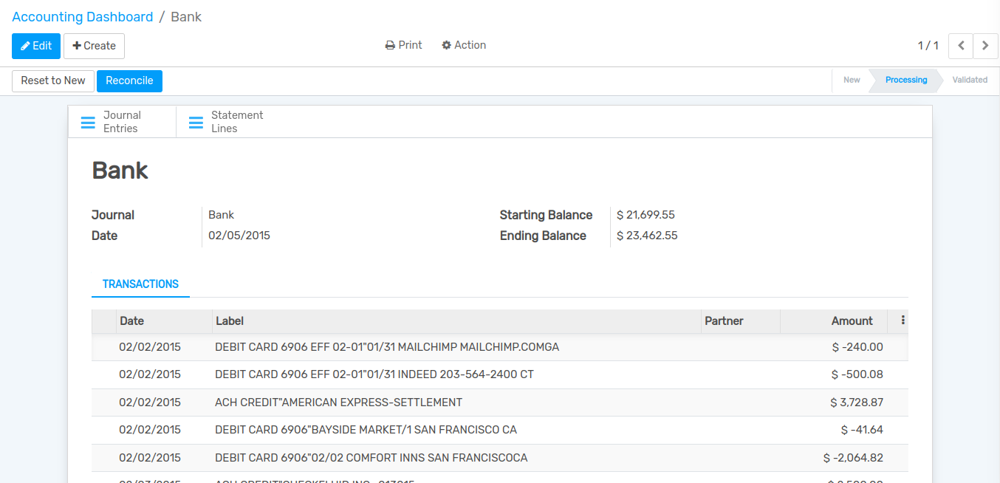
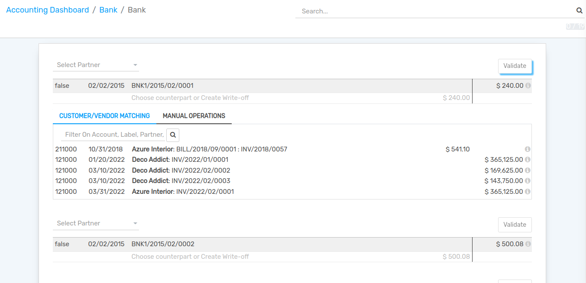
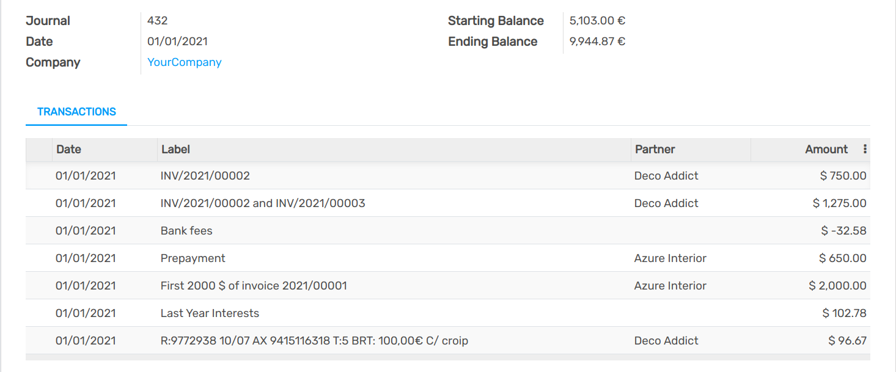

===============
Bank Statements
===============

Importing your bank statements in Flectra Accounting allows you to keep track of the financial
movements that occur on your bank accounts and reconcile them with the transactions recorded in your
accounting.

However, if you don't want to use bank synchronization or if your bank is not a supported
institution, you still have other options:

#. Import the bank statement files delivered by your bank
#. Register the bank statements manually

Import bank statements files
============================

Flectra supports multiple file formats to import bank statements:

- SEPA recommended Cash Management format (CAMT.053)
- Comma-separated values (.CSV)
- Open Financial Exchange (.OFX)
- Quicken Interchange Format (.QIF)
- Belgium: Coded Statement of Account (.CODA)

To import them, go to :menuselection:`Accounting --> Overview --> Bank`, click on *Import
Statements*, or on the three dots, and then on *Import Statement*.

Import CSV bank statement files
===============================

To import them, go to :menuselection:`Accounting --> Overview --> Bank`, click on *Create*.

Click on `Statement Lines`.

Now click on :menuselection:`Favourites --> Import Records`.

Here you can upload the csv file of statement and click on `Import` button.

Here you can see transactions and reconcile it by clicking on `Reconcile` button.

Register bank statements manually
=================================

If needed, you can also record your bank statements manually.

To do so, go to :menuselection:`Accounting --> Overview --> Bank`, click on *Create Statements*, or
on the three dots, and then on *New Statement*.

Add a new line for each transaction written on the original bank statement.

To ease the reconciliation process, make sure to fill out the *Partner* field. You can also write
the payments’ references in the *Label* field.

.. note::
   The *Ending Balance* and the *Computed Balance* should have the same amount. If it is not the
   case, make sure that there is no mistake in the transactions’ amounts.

