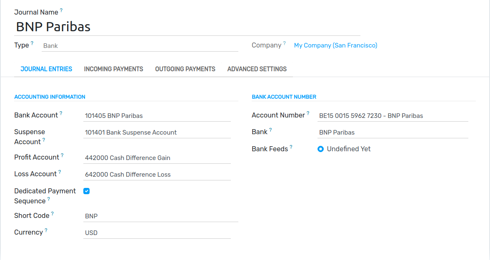

===========================================
Manage a bank account in a foreign currency
===========================================

In Flectra, every transaction is recorded in the default currency of the company, and reports are all
based on that default currency. When you have a bank account in a foreign currency, for every
transaction, Flectra stores two values:

-  The debit/credit in the currency of the *company*;
-  The debit/credit in the currency of the *bank account*.

Currency rates are updated automatically using the web services of a banking institution. By
default, Flectra uses the European Central Bank's web services but other options are available.

Configuration
=============

Activate multi-currencies
-------------------------

To work with multiple currencies, go to :menuselection:`Accounting --> Configuration --> Settings
--> Currencies` and tick :guilabel:`Multi-Currencies`. Under :guilabel:`Post Exchange difference
entries in:`, provide a :guilabel:`Journal`, a :guilabel:`Gain Account`, a :guilabel:`Loss Account`,
and then click on :guilabel:`Save`.

Configure currencies
--------------------

Once Flectra is configured to support multiple currencies, they are all created by default, but not
necessarily active. To activate the new currencies, click on :guilabel:`Activate Other Currencies`
under the :guilabel:`Multi-Currencies` setting or go to :menuselection:`Accounting --> Configuration
--> Accounting: Currencies`.

When the currencies are activated, you can choose to **automate** the currency rate update, or leave
it on **manual**. To configure the rate update, go back to :menuselection:`Accounting -->
Configuration --> Settings --> Currencies`, check :guilabel:`Automatic Currency Rates`, set
:guilabel:`Interval` to your desired frequency, and then click on :guilabel:`Save`. You also have
the option to choose the :guilabel:`Service` you wish to obtain currency rates from.

Click on the Update now button (:guilabel:`🗘`) besides the :guilabel:`Next Run` field to update
the currency rates manually.

Create a new bank account
-------------------------

In the accounting application, go to :menuselection:`Accounting --> Configuration --> Journals` and
create a new one. Enter a :guilabel:`Journal Name` and set the :guilabel:`Type` to `Bank`. In the
:guilabel:`Journal Entries` tab, enter a **short code**, a **currency**, and then finally click on
the :guilabel:`Bank Account` field to create a new account. In the pop-up window of the account
creation, enter a name, a code (ex.: 550007), set its type to `Bank and Cash`, set a currency type,
and save. When you are back on the **journal**, click on the :guilabel:`Account Number` field, and
in the pop-up window, fill out the :guilabel:`Account Number`, :guilabel:`Bank` of your account, and
save.

Upon creation of the journal, Flectra automatically links the bank account to the journal. It can be
found under :menuselection:`Accounting --> Configuration --> Accounting: Chart of Accounts`.

Vendor bill in a foreign currency
=================================

To pay a bill in a foreign currency, simply select the currency next to the :guilabel:`Journal`
field and register the payment. Flectra automatically creates and posts the foreign **exchange gain or
loss** as a new journal entry.

.. image:: foreign_currency/foreign-bill-currency.png
   :align: center
   :alt: How to set a bill currency.

.. note::
   Note that you can pay a foreign bill with another currency. In that case, Flectra automatically
   converts between the two currencies.

