=====
India
=====

Einvoice Generation
===================

Configuration
-------------

Go to :menuselection:`Settings --> Users & companies --> Company`.

Choose the company for which you wish to configure Einvoice.

Under the `GST CONFIGURATION` page user can configure GST.

Create GST E-Invoicing Bill, add details and click `Generate Token` button.

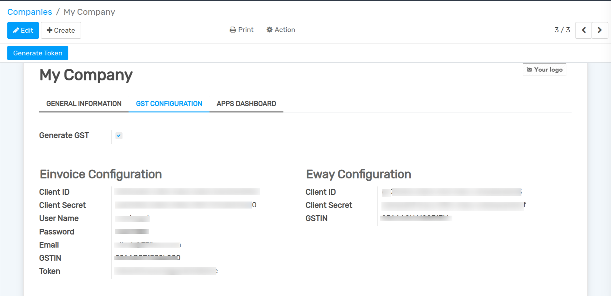

Invoice
-------

For Create Invoice go to :menuselection:`Invoicing --> Customers --> Invoices`.
and make the Generate Invoice checkbox to True, and add E-invoicing Details.

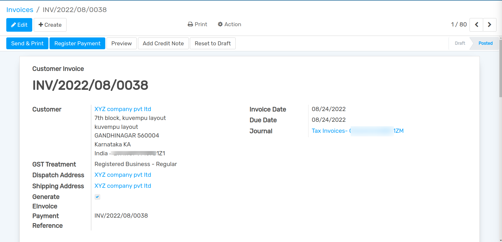

When you `Confirm` the invoice `Generate E-Invoicing` button will be visible, click it.

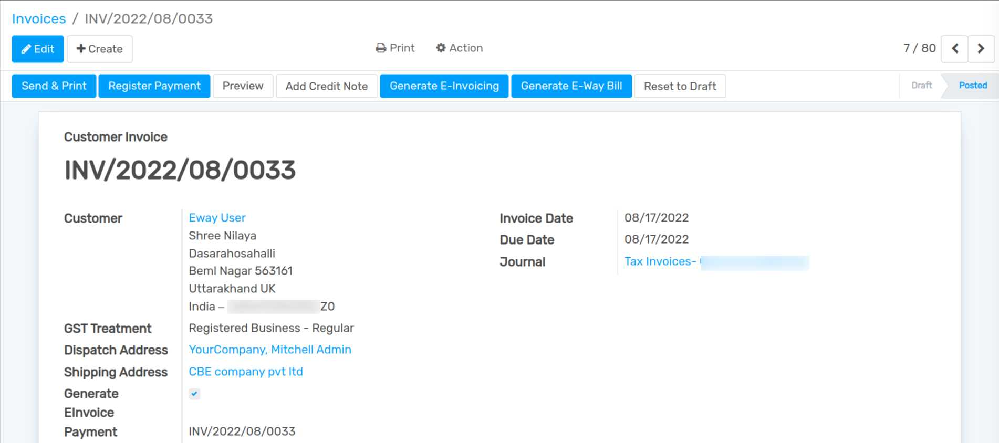

After click on  `Generate E-Invoicing` button IRN, Acknowledgement Number and Signed Invoice is generated. 

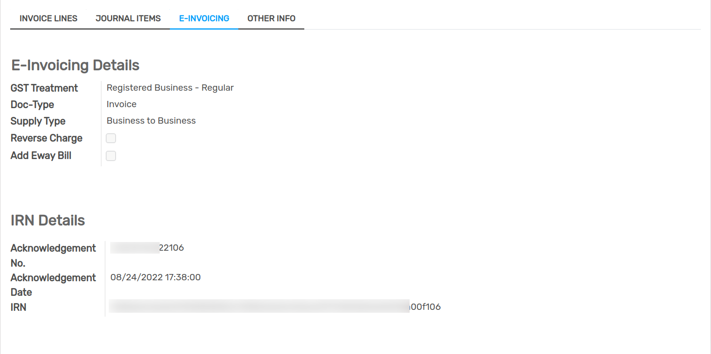

Also Users can check QR code in Invoice Report.

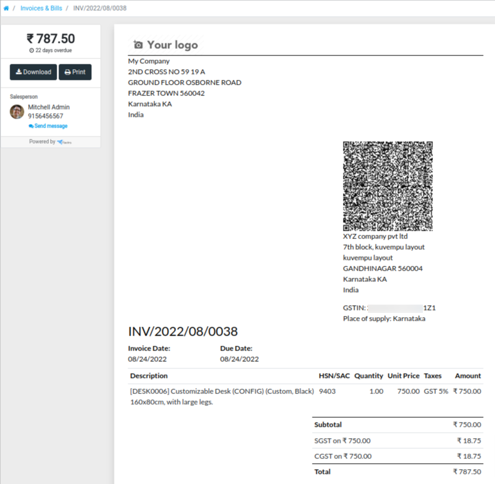

E-Way Bill Generation
=====================

Configuration
-------------

Go to :menuselection:`Settings --> Users & companies --> Company`.

Choose the company for which you wish to configure E-Way Bill.

Under the `GST CONFIGURATION` page user can configure E-Way Bill.

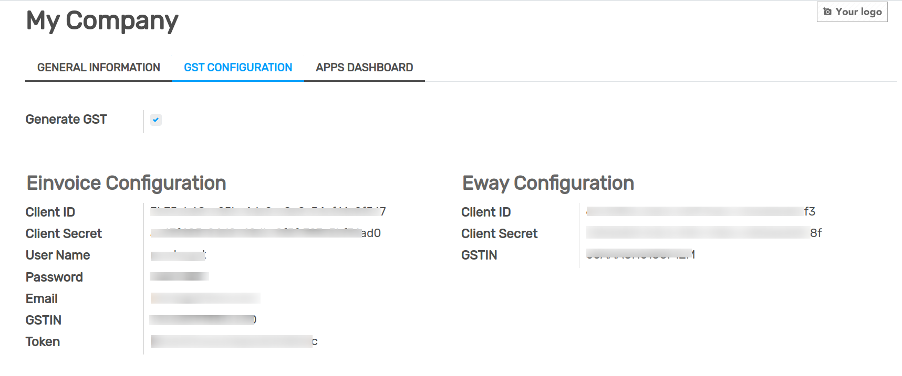

For create an E-Way Bill go to :menuselection:`Invoicing --> GST --> E-Way Bill`.

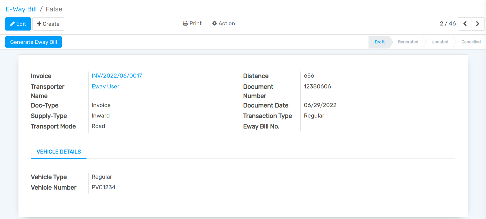

After that click on `Generate E-way Bill` button and E-way Bill number will be generate.

.. image:: media/gst-8.png
   :align: center

For Update Vehicle number click on `Update Vehicle Number` button.

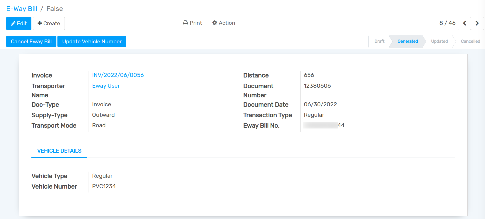

After clicking `Update Vehicle Number` button one wizard will be open, here user can update vehicle number.

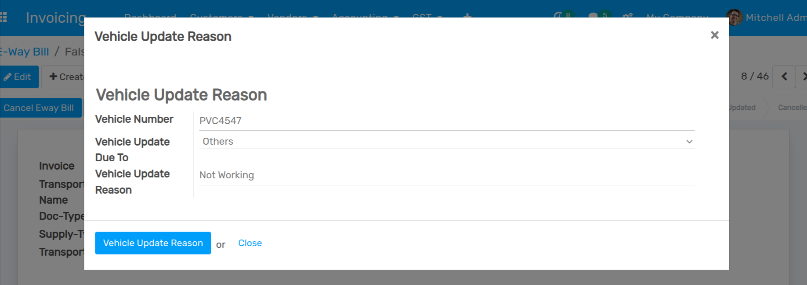

And Vehicle Number will be updated.

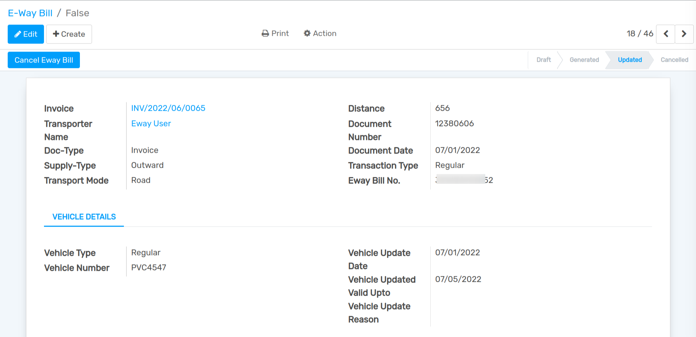

For cancel the E-way Bill, click on `Cancel Eway Bill` button, and one wizard will be open here you can add cancel reason.

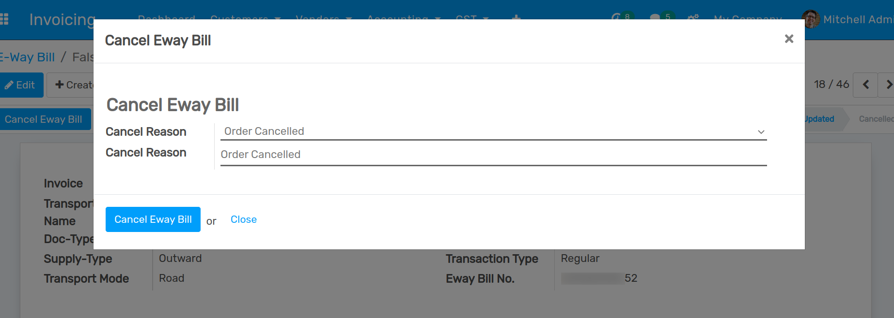

And E-way Bill will be cancelled.

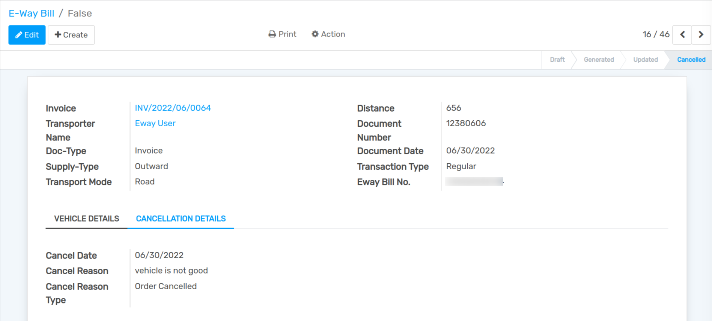

Consolidate E-Way Bill
======================

For create an Consolidate E-Way Bill go to :menuselection:`Invoicing --> GST --> Consolidate E-Way Bill`.

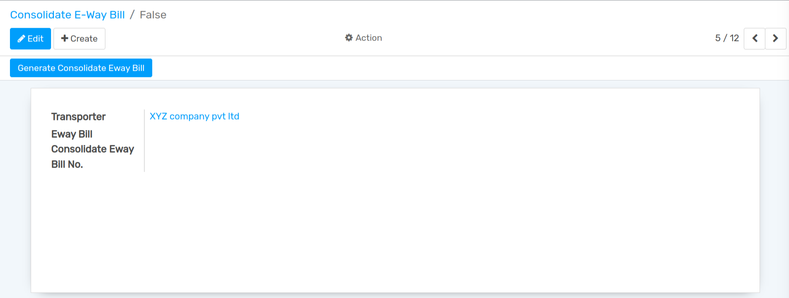

After that click on `Generate Consolidate E-Way Bill` button and Consolidate E-Way Bill number will be generate.

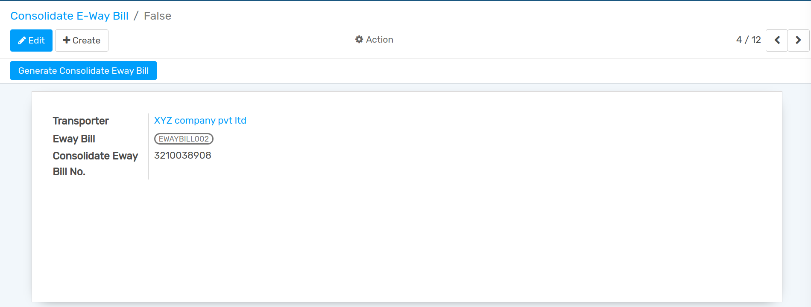

