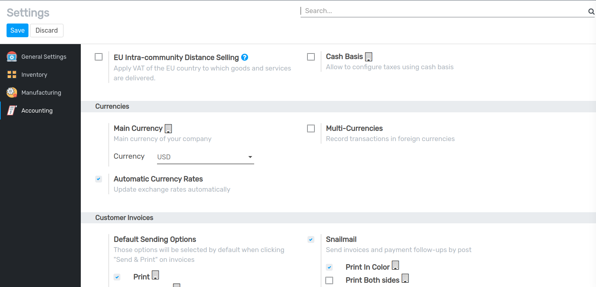
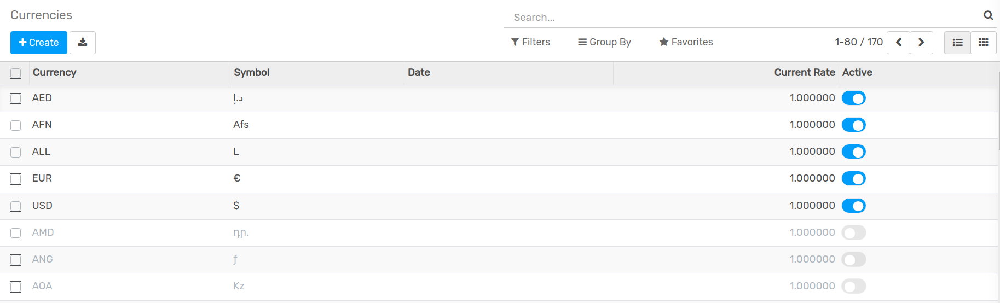
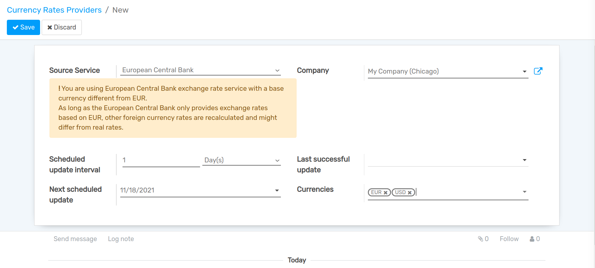
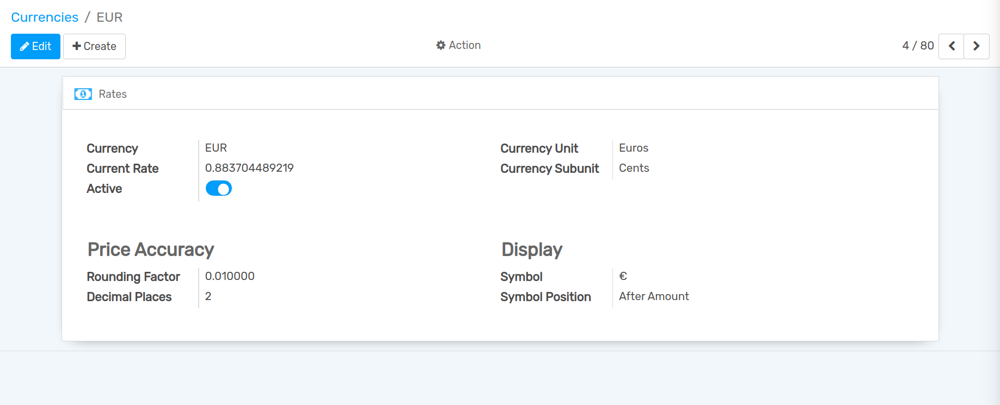
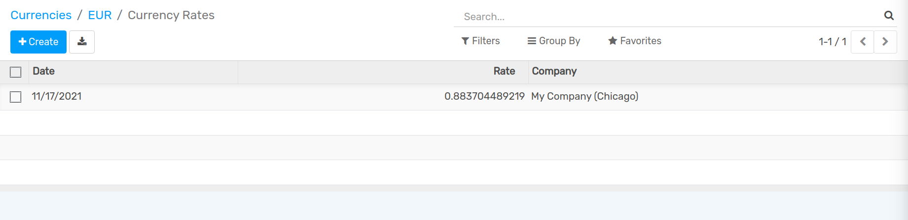
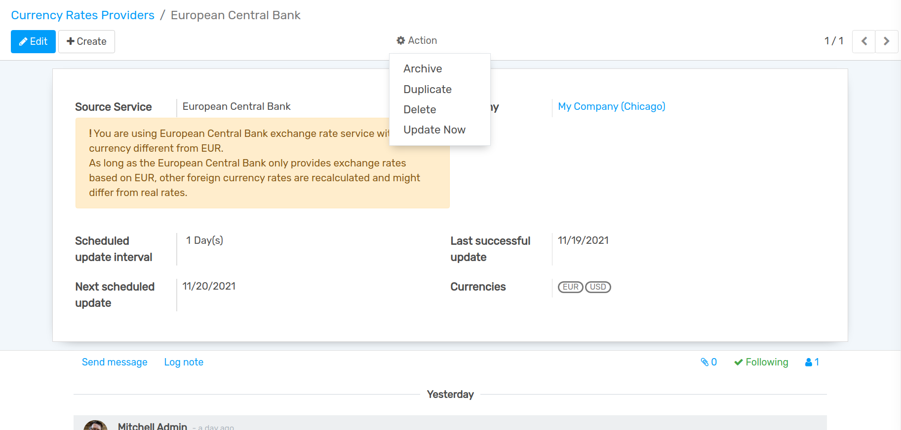
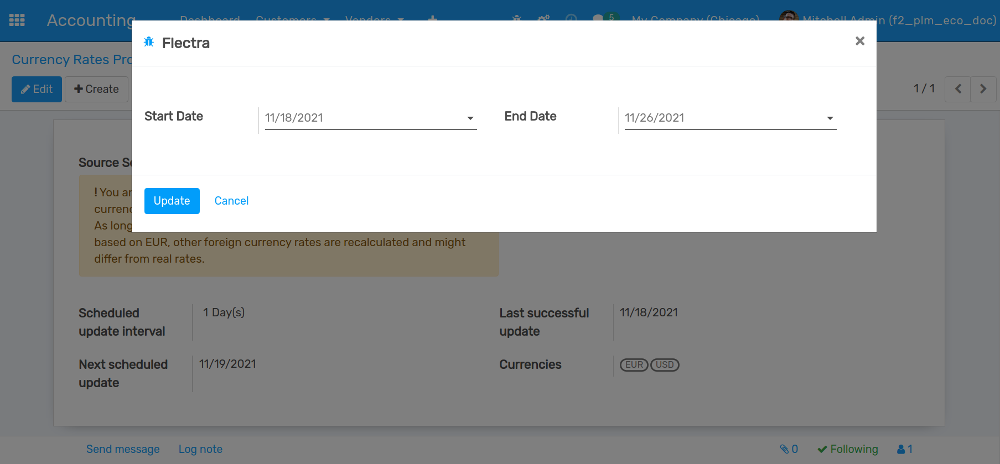
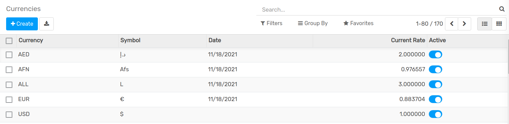
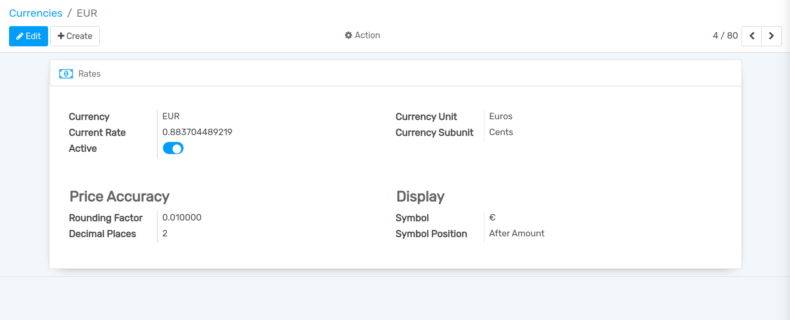

=======================
Automatic Currency Rate
=======================

Configuration
=============

Enable Automatic Currency Rate
------------------------------

In the accounting module, Go to :menuselection:`Configuration --> Settings` and flag
**Automatic Currency Rates**, then click on **Save**.

Active Currency
---------------

In the accounting module, Go to :menuselection:`Configuration --> Settings --> Accounting --> Currencies`.
Here you can active currencies as per requirement.

Set Currency Rates Providers
----------------------------

In the accounting module, Go to :menuselection:`Configuration --> Settings --> Accounting --> Currency Rates Providers`.
Here you can create currency rates providers.

#. Source Service :- Select Service Provider.
#. Scheduled update interval :- Select update interval as per your requirements.
#. Currencies :- Select Currencies in which you want to update currency rates.

Rates
-----

In the accounting module, Go to :menuselection:`Configuration --> Settings --> Accounting --> Currencies`.

Click on ``Rates`` button.

After update currency rate based on selected Scheduled interval time you can see updated rate here.

Manually Update Currency Rate
-----------------------------

If you want to Manually Update Rates, Go to :menuselection:`Configuration --> Settings --> Accounting --> Currency Rates Providers`.
Go to ``Action`` and Click on ``Update Now`` button.

When you click on ``Update Now`` button a wizard will be open.

Select Start Date and End Date in which you want to update currency rate between those dates. and click on ``Update`` button.

Now, Go to :menuselection:`Configuration --> Settings --> Accounting --> Currencies`. here you can see updated rates if currencies.

Now, select any currency and click on ``Rates`` button.

Here, you can see updated rate of CAD Currency.

.. image:: media/acr-10.png
   :align: center