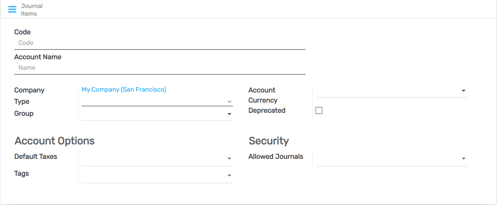
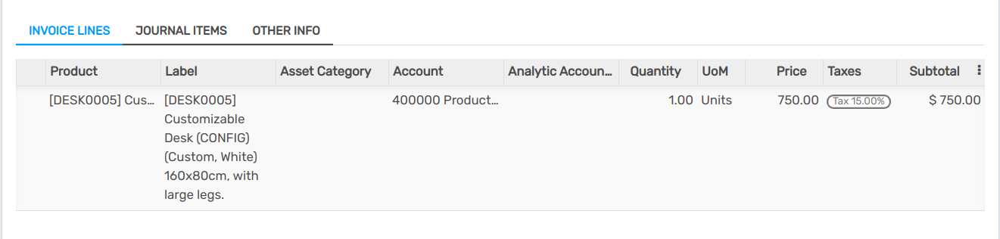
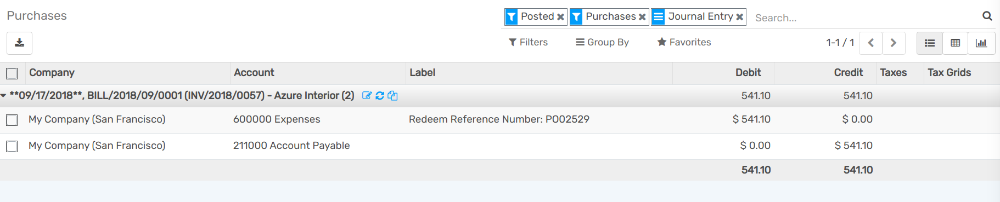

=================================
Deferred Expenses and Prepayments
=================================

**Deferred expenses** and **prepayments** (also known as **prepaid expense**), are both costs that
have already occurred for unconsumed products or services yet to receive.

Such costs are **assets** for the company that pays them since it already paid for products and
services still to receive or that are yet to be used. The company cannot report them on the current
**Profit and Loss statement**, or *Income Statement*, since the payments will be effectively
expensed in the future.

These future expenses must be deferred on the company's balance sheet until the moment in time they
can be **recognized**, at once or over a defined period, on the Profit and Loss statement.

For example, let's say we pay $ 1200 at once for one year of insurance. We already pay the cost now
but haven't used the service yet. Therefore, we post this new expense in a *prepayment account* and
decide to recognize it on a monthly basis. Each month, for the next 12 months, $ 100 will be
recognized as an expense.

Flectra Accounting handles deferred expenses and prepayments by spreading them in multiple entries that
are automatically created in *draft mode* and then posted periodically.

.. note::
   The server checks once a day if an entry must be posted. It might then take up to 24 hours before
   you see a change from *draft* to *posted*.

Prerequisites
=============

Such transactions must be posted on a **Deferred Expense Account** rather than on the default
expense account.

Configure a Deferred Expense Account
-------------------------------------

To configure your account in the **Chart of Accounts**, go to :menuselection:`Accounting -->
Configuration --> Chart of Accounts`, click on *Create*, and fill out the form.

.. note::
   This account's type must be either *Current Assets* or *Prepayments*

Post an expense to the right account
------------------------------------

Select the account on a draft bill
~~~~~~~~~~~~~~~~~~~~~~~~~~~~~~~~~~~~~

On a draft bill, select the right account for all the products of which the expenses must be
deferred.

Choose a different Expense Account for specific products
~~~~~~~~~~~~~~~~~~~~~~~~~~~~~~~~~~~~~~~~~~~~~~~~~~~~~~~~

Start editing the product, go to the *Accounting* tab, select the right **Expense Account**, and
save.

Change the account of a posted journal item
~~~~~~~~~~~~~~~~~~~~~~~~~~~~~~~~~~~~~~~~~~~~

To do so, open your Purchases Journal by going to :menuselection:`Accounting --> Accounting -->
Purchases`, select the journal item you want to modify, click on the account, and select the right
one.

