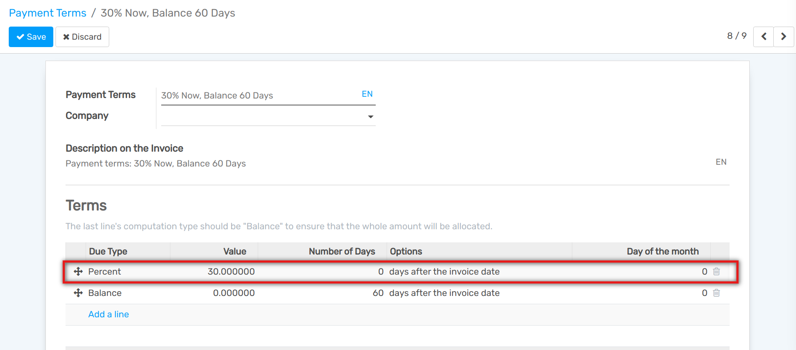
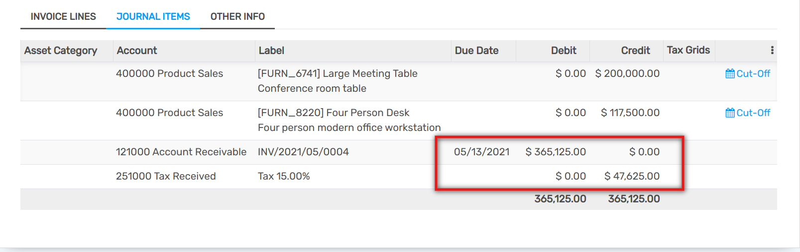

====================
Offer cash discounts
====================

Cash discounts are incentives you can offer to customers to motivate
them to pay within a specific time frame. For instance, you offer a 2%
discount if the customer pays you within the first 5 days of the
invoice, when it is due in 30 days. This approach can greatly improve
your average collection period.

Set up a cash discount
======================

To set up a cash discount, go to :menuselection:`Accounting -->
Configuration --> Management --> Payment Terms` and click on
*Create*. Add a *Percent* type of term with a corresponding value
(e.g. 98% of the total price for a 2% discount) and the number of days
during which the offer is valid. You can also change the default balance
term if needed.

Start offering the cash discount
================================

Now, you can create a customer invoice and select the cash discount
payment term you added. Once the invoice is validated, Flectra will
automatically split the account receivables part of the journal entry
into two installments having different due dates. Since the discounted
price is already calculated, your payment controls will be simplified.

