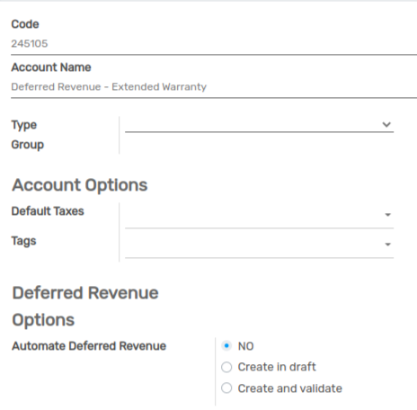
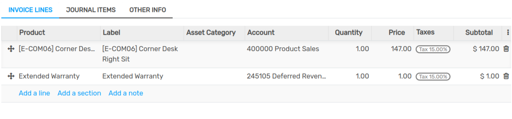
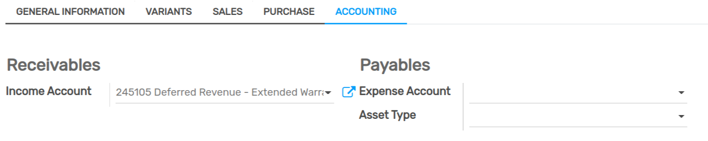
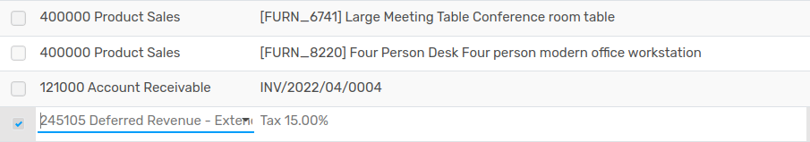

=================
Deferred Revenues
=================

**Deferred revenues**, or **unearned revenue**, are payments made in advance by customers for
products yet to deliver or services yet to render.

Such payments are a **liability** for the company that receives them since it still owes its
customers these products or services. The company cannot report them on the current **Profit and
Loss statement**, or *Income Statement*, since the payments will be effectively earned in the future.

These future revenues must be deferred on the company's balance sheet until the moment in time they
can be **recognized**, at once or over a defined period, on the Profit and Loss statement.

For example, let's say we sell a five-year extended warranty for $ 350. We already receive the money
now but haven't earned it yet. Therefore, we post this new income in a deferred revenue account and
decide to recognize it on a yearly basis. Each year, for the next 5 years, $ 70 will be recognized
as revenue.

Flectra Accounting handles deferred revenues by spreading them in multiple entries that are
automatically created in *draft mode* and then posted periodically.

.. note::
   The server checks once a day if an entry must be posted. It might then take up to 24 hours before
   you see a change from *draft* to *posted*.

Prerequisites
=============

Such transactions must be posted on a **Deferred Revenue Account** rather than on the default income
account.

Configure a Deferred Revenue Account
------------------------------------

To configure your account in the **Chart of Accounts**, go to :menuselection:`Accounting -->
Configuration --> Chart of Accounts`, click on *Create*, and fill out the form.

.. note::
   This account's type must be either *Current Liabilities* or *Non-current Liabilities*
   
Post an income to the right account
-----------------------------------

Select the account on a draft invoice
~~~~~~~~~~~~~~~~~~~~~~~~~~~~~~~~~~~~~

On a draft invoice, select the right account for all the products of which the incomes must be
deferred.

Choose a different Income Account for specific products
~~~~~~~~~~~~~~~~~~~~~~~~~~~~~~~~~~~~~~~~~~~~~~~~~~~~~~~

Start editing the product, go to the *Accounting* tab, select the right **Income Account**, and
save.

Change the account of a posted journal item
~~~~~~~~~~~~~~~~~~~~~~~~~~~~~~~~~~~~~~~~~~~~

To do so, open your Sales Journal by going to
:menuselection:`Accounting --> Accounting --> Sales`, select the journal item you
want to modify, click on the account, and select the right one. 

