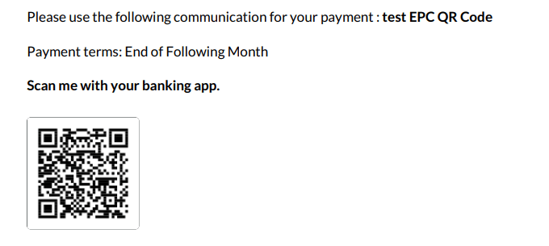

============================
Add EPC QR Codes to invoices
============================

European Payments Council Quick Response Code,
or **EPC QR Code**, are two-dimensional barcodes
that customers can scan with their **mobile banking
applications** to initiate a **SEPA Credit Transfer
(SCT)**, and pay their invoices instantly.

In addition to bringing ease of use and speed,
it greatly reduces typing errors that would potentially
make for payment issues.

.. note::
   This feature is only available in several European
   countries such as Austria, Belgium, Finland, Germany,
   and The Netherlands.

Configuration
=============

Go to :menuselection:`Accounting --> Configuration --> Settings`
and activate the **SEPA QR Code** feature.

Issue Invoices with EPC QR Codes
================================

EPC QR Codes are added automatically to your invoices, as
long as you issue them to customers that are located in a
country where this feature is available.

Go to :menuselection:`Accounting --> Customers --> Invoices`,
and create a new invoice.

Before posting it, open the *Other Info* tab. Flectra automatically
fills out the *Bank Account* field with your IBAN.

Make sure that the account indicated is the one you want to use to
receive your customer’s payment as Flectra uses this field to generate
the EPC QR Code.

.. tip::
   If you want to issue an invoice without an EPC QR Code,
   remove the IBAN indicated in the *Bank Account* field,
   under the *Other Info* tab of the invoice.

.. seealso::
   * :doc:`../../bank/setup/bank_accounts`
   * `Flectra Academy: QR Code on Invoices for European Customers <https://www.flectra.com/r/VuU>`_
