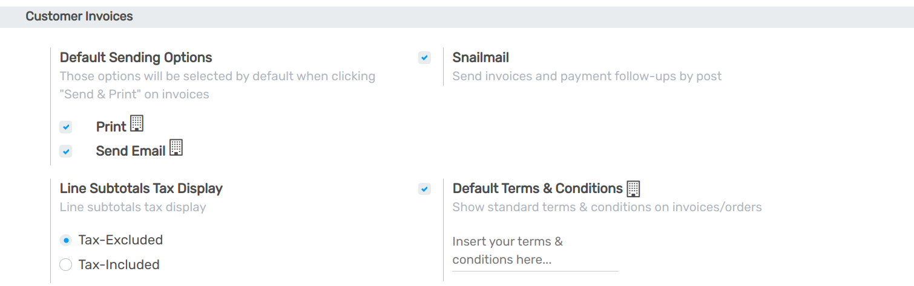
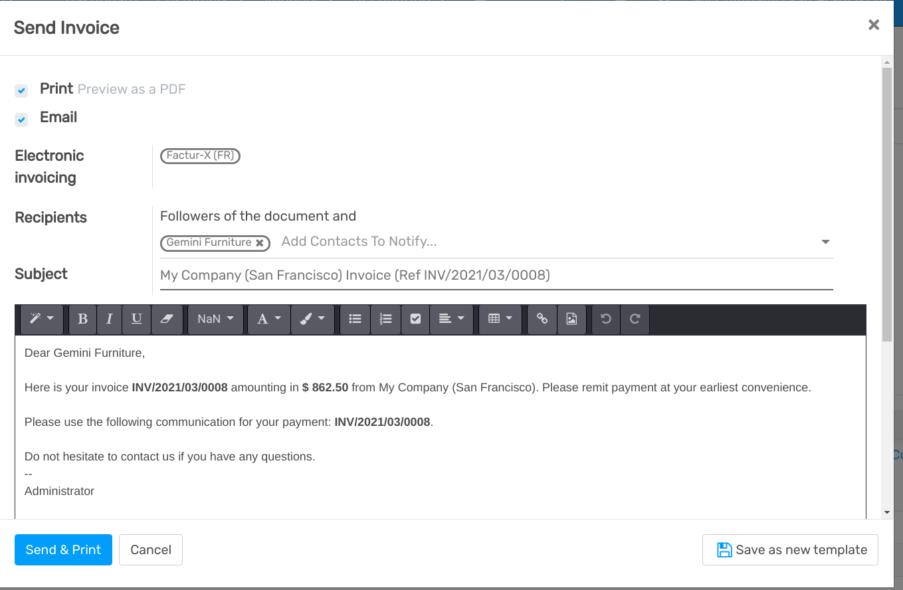

======================================
Send your Invoices by Post (Snailmail)
======================================

Direct mail is a great way to capture individuals’ attention at a time where inboxes are always
full. Flectra allows you to send invoices and follow-up reports by post, worldwide, directly from
your database.

Set up Snailmail
================

| Go to :menuselection:`Accounting --> Settings --> Snailmail` and activate the feature.
| If you would like this option to be a default feature, enable *Send by Post* under
  *Default Sending Options*..

Send your invoices by post
--------------------------

Open your Invoice, click on the *Send & Print* button and select *Send by Post*.

.. important::
   Make sure to have your customer’s address set correctly, and that it includes a country,
   before sending the letter.

Pricing
=======

| *Snailmail* is an *In-App Purchase (IAP)* service which requires prepaid stamps (=credits)
  to work. Sending one document consumes one stamp.
| To buy stamps, go to :menuselection:`Accounting --> Configuration --> Settings --> Snailmail`
  and click on *Buy credits*, or go to :menuselection:`Settings --> Flectra IAP` and click on
  *View my Services*.

.. tip::
   - If you are on Flectra Online (SAAS) and have the Professional version, you benefit from free trial
     credits to test the feature.
   - Click `here <https://iap.flectra.com/privacy#header_4>`_ to know about our *Privacy Policy*.
