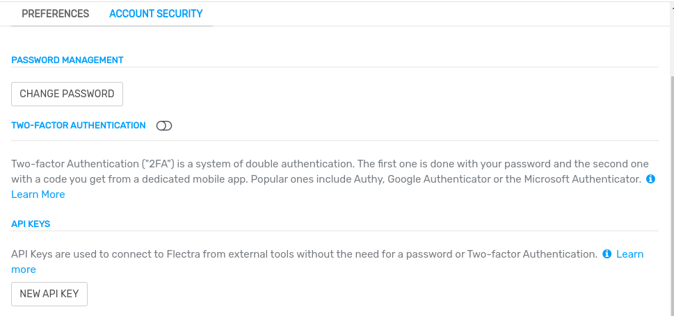

=====================
Silverfin integration
=====================

`Silverfin <https://www.silverfin.com>`_ is a third-party service provider that offers a cloud
platform for accountants.

Flectra and Silverfin provide an integration to automate the synchronization of data.

Configuration
=============

To configure this integration, you need to input the following data into your Silverfin account:

- user's email address
- :ref:`Flectra API key <silverfin/api-key>`
- URL of the Flectra database
- name of your Flectra database

.. _silverfin/api-key:

Flectra API key
---------------

You can create Flectra external API keys either :ref:`for a single database <silverfin/api-singledb>`
(hosting: Flectra Online, On-premise, and Flectra.sh) or :ref:`for multiple databases managed by a user
<silverfin/api-multipledb>` (hosting: Flectra Online).

.. important::
   - These API keys are personal and provide full access to your user account. Store it securely.
   - You can copy the API key only at its creation, and you cannot retrieve it later.
   - If you need it again, create a new API key (and delete the old one).

.. seealso::
   :doc:`/developer/reference/external_api`

.. _silverfin/api-singledb:

One key per database
~~~~~~~~~~~~~~~~~~~~

To create a new API key valid for a single database, click on the user menu, then on
:guilabel:`My Profile`. Under the :guilabel:`Account Security` tab, click on :guilabel:`New API
key`, confirm your password, give a descriptive name to your new key, and copy the new API key.

.. seealso::
   :ref:`api/external_api/keys`

.. _silverfin/api-multipledb:

One key for multiple databases (fiduciaries)
~~~~~~~~~~~~~~~~~~~~~~~~~~~~~~~~~~~~~~~~~~~~

To create a new API key valid for all the databases of a single user **(the easiest for
fiduciaries)**, navigate to `Flectra's website <https://www.flectra.com>`_  and sign in with your
administrator account. Next, open `your account security settings in developer mode
<https://www.flectra.com/my/security?debug=1>`_, click on :guilabel:`New API Key`, confirm your
password, give a descriptive name to your new key, and copy the new API key.

.. image:: silverfin/api-key-user.png
   :align: center
   :alt: creation of an Flectra external API key for an Flectra user
