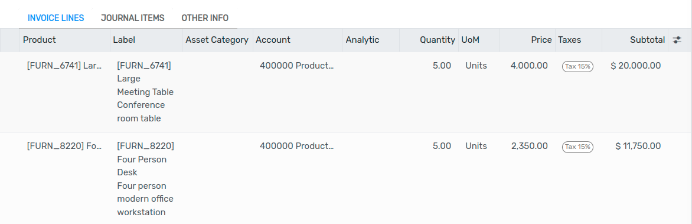
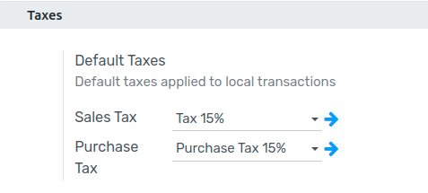

=============
Default taxes
=============

**Default Taxes** define which :doc:`taxes <taxes>` are automatically selected when there is no
other indication about which tax to use. For example, Flectra prefills the **Taxes** field with the
Default Taxes when you create a new product or add a new line on an invoice.

.. important::
   :doc:`Fiscal Positions <fiscal_positions>` take the Default Tax into account. Therefore, if a
   Fiscal Position is applied to an invoice, Flectra applies the related tax instead of the Default
   Taxes, as mapped in the Fiscal Position.

Configuration
=============

To change your **Default Taxes**, go to :menuselection:`Accounting --> Configuration --> Settings
--> Taxes --> Default Taxes`, select the appropriate taxes for your default **Sales Tax** and
**Purchase Tax**, and click on *Save*.

.. note::
   Databases with multiple companies: the Default Taxes values are company-specific.

.. seealso::

  - :doc:`taxes`
  - :doc:`fiscal_positions`
