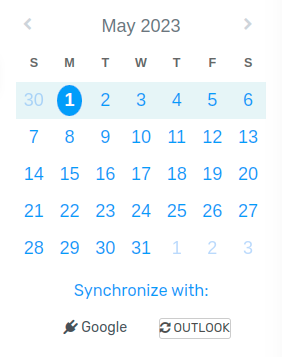

=========================================
Synchronize Outlook Calendar with Flectra
=========================================

Synchronizing a user's Outlook Calendar with Flectra is useful for keeping track of their tasks and
appointments across all related applications.

Register the application with Microsoft Azure
=============================================

To sync the Outlook Calendar with Flectra's Calendar, a Microsoft Azure account is needed. Creating an
account is free for users who have never tried or paid for Azure. For more information, `click here
<https://azure.microsoft.com/en-us/free/?WT.mc_id=A261C142F>`_.

Refer to `Microsoft's documentation <https://docs.microsoft.com/en-us/azure/active-directory/
develop/quickstart-create-new-tenant>`_ on how to set up an Azure AD Tenant (also called an
*environment*), which is a representation of an organization to manage and register apps.

Then, `Register an Application <https://docs.microsoft.com/en-us/azure/active-directory/develop/
quickstart-register-app>`_, choosing the appropriate :guilabel:`Supported account type`. Users who
wish to connect their Outlook calendar to Flectra should select the :guilabel:`Accounts in any
organizational directory (Any Azure AD directory - Multitenant) and personal Microsoft accounts
(e.g. Skype, Xbox)` option for :guilabel:`Supported account types`.

When configuring the :guilabel:`Redirect URI`, choose :guilabel:`Web` and copy the Flectra database
URI (URL) followed by `/microsoft_account/authentication`.

.. example::
   Enter `https://www.companyname.flectra.com/microsoft_account/authentication` for the
   :guilabel:`Redirect URI`.

.. image:: outlook_calendar/azure-register-application.png
   :align: center
   :alt: The "Supported account type" and "Redirect URI" settings in the Microsoft Azure AD portal.

For more information on the restrictions and limitations of URIs, `check this page <https://docs.
microsoft.com/en-us/azure/active-directory/develop/reply-url>`_.

Regarding the application credentials, the user *must* add a client secret, which allows Flectra to
authenticate itself, requiring no interaction from the user's side. :guilabel:`Certificates` are
optional.

To do add a client secret, click :guilabel:`Add a certificate or secret` and then click
:guilabel:`New client secret`. Next, type a :guilabel:`Description` and select when the client
secret :guilabel:`Expires`.

Since resetting the synchronization can be tricky, Flectra recommends setting the maximum allowed
expiration date for the client secret (24 months), so there is no need to re-synchronize soon.
Finally, click :guilabel:`Add` to generate the client secret (:guilabel:`Secret ID`).

Configuration in Flectra
========================

In the Flectra database, go to :menuselection:`Settings --> General Settings --> Integrations` and
activate the :guilabel:`Outlook Calendar` setting.

.. image:: outlook_calendar/outlook-calendar-setting.png
   :align: center
   :alt: The "Outlook Calendar" setting activated in Flectra.

From the Microsoft Azure portal, under the :guilabel:`Overview` section of the application, copy
the :guilabel:`Application (Client) ID`, and paste it into the :guilabel:`Client ID` field in Flectra.

.. image:: outlook_calendar/client-id.png
   :align: center
   :alt: The "Client ID" in the Microsoft Azure portal.

In the Microsoft Azure portal, under the :guilabel:`Certificates & secrets` section, copy the
:guilabel:`Client Secret Value` and paste it into the :guilabel:`Client Secret` field in Flectra.

.. image:: outlook_calendar/client-secret-value.png
   :align: center
   :alt: The "Client Secret" token to be copied from Microsoft to Flectra.

Finally, on the Flectra :menuselection:`Settings --> General Settings` page, click :guilabel:`Save`.

.. _outlook_calendar/sync_with_outlook:

Sync with Outlook
=================

.. warning::

   Flectra highly recommends testing the Outlook calendar synchronization on a test database and a
   test email address (that is not used for any other purpose) before attempting to sync the
   desired Outlook Calendar with the user's production database.

   If the user has any past, present, or future events on their Flectra calendar before syncing their
   Outlook calendar, Outlook will treat the events pulled from Flectra's calendar during the sync as
   new events, causing an email notification to be sent from Outlook to all the event attendees.

   To avoid unwanted emails being sent to all past, present, and future event attendees, the user
   must add the events from the Flectra calendar to the Outlook calendar before the first ever sync,
   delete the events from Flectra, and then start the sync.

   Even after synchronizing the Flectra Calendar with the Outlook calendar, Outlook will still send a
   notification to all event participants every time an event is edited (created, deleted,
   unarchived, or event date/time changed), with no exceptions. This is a limitation that cannot be
   fixed from Flectra's side.

   After one user syncs their Outlook calendar to the Flectra database, unwanted email notifications
   are unavoidable because the first synchronized user's events will be in the Flectra Calendar. If
   the Flectra database is shared amongst multiple users, and another user wants to sync their Outlook
   calendar with Flectra Calendar, Outlook will again pull the existing Flectra Calendar events during
   the sync and treat them as new events, causing Outlook to send email invitations to all event
   attendees.

   In summary, once a user synchronizes their Outlook calendar with the Flectra calendar:

   - Creating an event in Flectra causes Outlook to send an invitation to all event attendees.
   - Deleting an event in Flectra causes Outlook to send a cancellation to all event attendees.
   - Unarchiving an event in Flectra causes Outlook to send an invitation to all event attendees.
   - Archiving an event in Flectra causes Outlook to send a cancellation to all event attendees.
   - Adding a contact to an event causes Outlook to send an invitation to all event attendees.
   - Removing a contact from an event causes Outlook to send a cancellation to all event attendees.

Sync Flectra Calendar and Outlook
---------------------------------

In the Flectra database, go to the :guilabel:`Calendar` module and click the :guilabel:`Outlook` sync
button. The page will redirect to a Microsoft login page, and the user is asked to log in to
their account, if they are not already, and grant the required permissions.

The synchronization is a two-way process, meaning that events are reconciled in both accounts
(Outlook and Flectra).

.. note::
   All users that want to use the synchronization simply need to :ref:`sync their calendar with
   Outlook <outlook_calendar/sync_with_outlook>`. The configuration of Microsoft's Azure account
   is only done once, as Azure AD tenants' Client IDs and Client Secrets are unique, and represent
   an organization that helps the user to manage a specific instance of Microsoft cloud services
   for their internal and external users.

.. seealso::
   - :doc:`../../../productivity/mail_plugins/outlook`
   - :doc:`../google/google_calendar_credentials`
