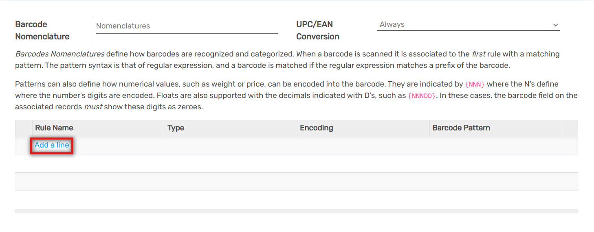
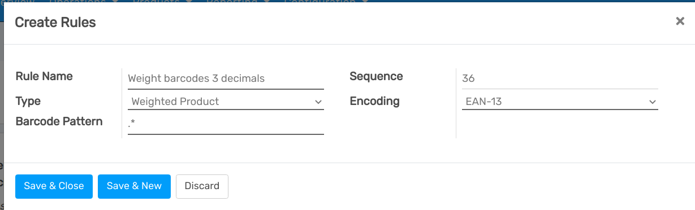
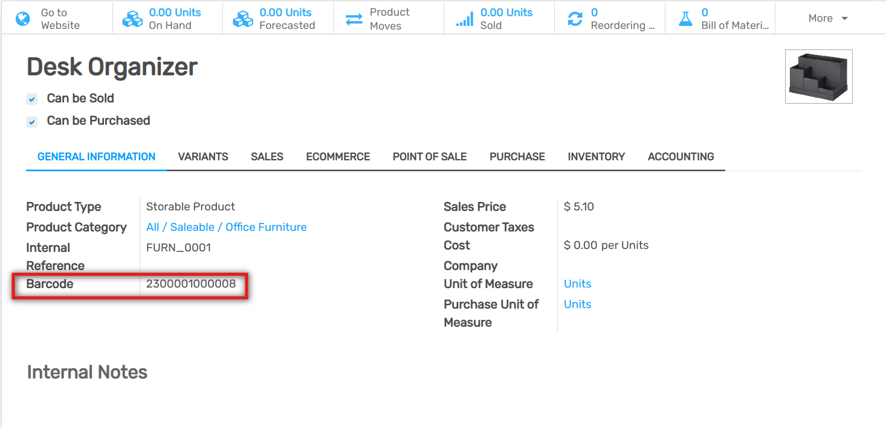

========
Overview
========

There are different situations in which barcode nomenclatures can be
useful. A well-known use case is the one of a point of sale which sells
products in bulk, in which the customers will scale their products
themselves and get the printed barcode to stick on the product. This
barcode will contain the weight of the product and help compute the
price accordingly.

Create a Barcode Nomenclature
=============================

Flectra supports Barcode Nomenclatures, which determine the mapping and
interpretation of the encoded information. You can configure your barcode nomenclature being in
:doc:`Developer mode </applications/general/developer_mode>`.
To do so, go to :menuselection:`Inventory --> Configuration --> Barcode Nomenclature`.

You can create a barcode nomenclature from there, and then add a line to
create your first rule.

The first step is to specify the **rule name**, for example Weight
Barcode with 3 Decimals. You then have to specify the type for barcode
nomenclature, in our case it will be Weighted Product.

The Barcode Pattern is a regular expression that defines the structure
of the barcode. In this example 21 defines the products on which the
rule will be applied, those are the numbers by which the product barcode
should start. The 5 “dots” are the following numbers of the product
barcode and are there simply to identify the product in question. The
“N” define a number and the “D” define the decimals.

The encoding allows to specify the barcode encoding on which the rule
should be applied.

.. note::
        You can define different rules and order their priority thanks to the
        sequence. The first rule which matches the scanned barcode will be
        applied.

Configure your Product
----------------------

1. The barcode of the product should start by “21”;
2. The 5 “dots” are the other numbers of your product barcode, allowing to identify the product;
3. The barcode should contain 0’s where you did defined D’s or N’s. In our case we need to set 5 zeros because we configured “21…..{NNDDD}”;
4. In EAN-13, the last number is a check number, use an EAN13 generator to know which digit it should be in your case.

