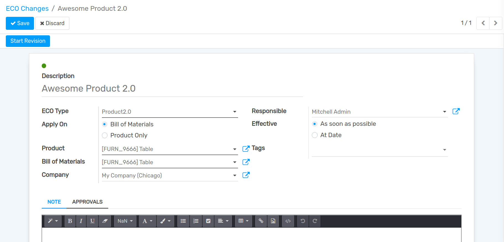
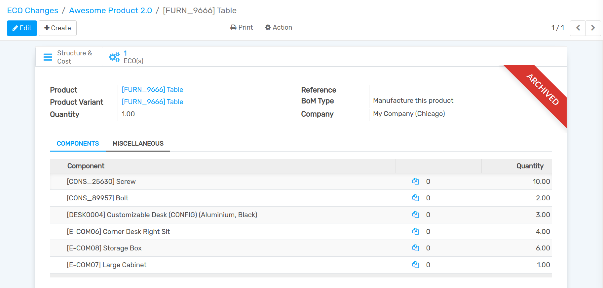
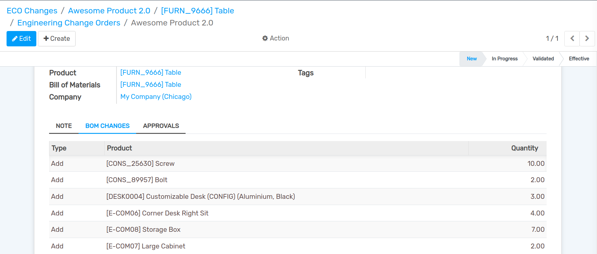
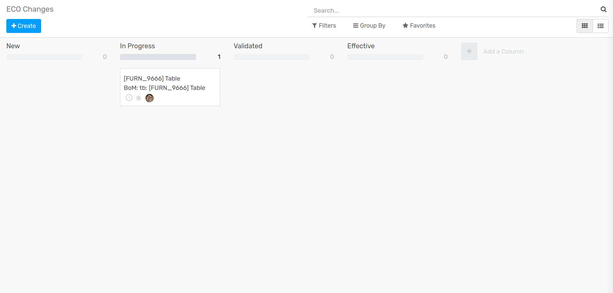
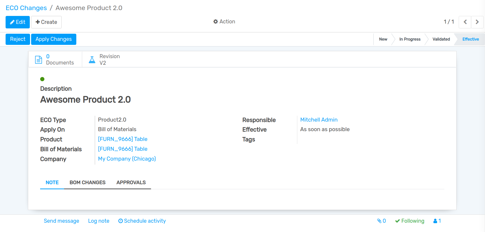

===========
ECO Changes
===========

You can now launch the Engineering Change Order in the PLM dashboard. You can fill in the appropriate fields such as

Go to the PLM dashboard and click the Engineering Change button for ECO to create an ECO (Engineering Change Order).

>> We need to include a brief summary of the change.

>> Apply on BoM, Routing, or Both for a product that we can choose based on the requirements.

>> At this stage, you can select the ECO type.

>> The date on which the changes should be implemented is shown in the Effectivity field.
   After you've completed all of the necessary fields, save your changes. Click the Start Revision Button at that point.

In the *PLM* app, open :menuselection:`Configuration --> ECO Stages` click on ``create`` to create new ECO Stage.

Manage BOM Versions
===================

As a result of this form of intervention, we now have a new revision for the Bill of Material, such as an Engineering Change Order (ECO), 
for which we can begin working on a new BOM. We may upload the CAD or other document to the appropriate ECO from here. 

.. image:: images/plm-5.png
   :align: center

Changing BOM
============

Whenever necessary, update the Bill of Materials (BoM) and add an attachment. You can then combine the two elements, and all of the modifications will be replicated in Engineering Change orders (ECO).

Reflection
==========

After two components have been added, the quantity of the existing component has been updated. Under the BoM changes tab in ECO, all of the changes are mirrored.

Validating ECO
==============

The ECO is now dragged and dropped from the In Progress stage to the Validated stage. The administrator will then be assigned to authorize the changes. 
After the ECO has been Validated by the assigned Administrator, the Kanban view of the ECO will analyze and identify the Stages by dragging and dropping the ECO. 
At the same time, we can drag and drop from the Validate stage to the Effective stage.

Effective Stage
===============

The final stage is the most important. Now we can easily drag the ECO to the Effective level, which is the same as the final stage and make similar adjustments.

Final Steps
===========

Here we can see all of the BOM versions that are managed by the Engineering department.

Conclusion: Flectra PLM Module - Product Life Cycle Management
==============================================================

To sum it up, Flectra PLM - Project Lifecycle Management is one of the most critical aspects of the product management industry. When it comes to the development and management 
of any commercial product, it is critical. PLM is not only used to handle a company's engineering activities. It also supports and manages every part of the sector, from raw 
material sourcing to sales activities and service and repair activities.

In a nutshell, PLM is a tool that allows an end-user to schedule and control all processes involved in a product's development cycle. This development cycle aids in the reduction 
of market risk as well as the growth of the company through customer confidence.

