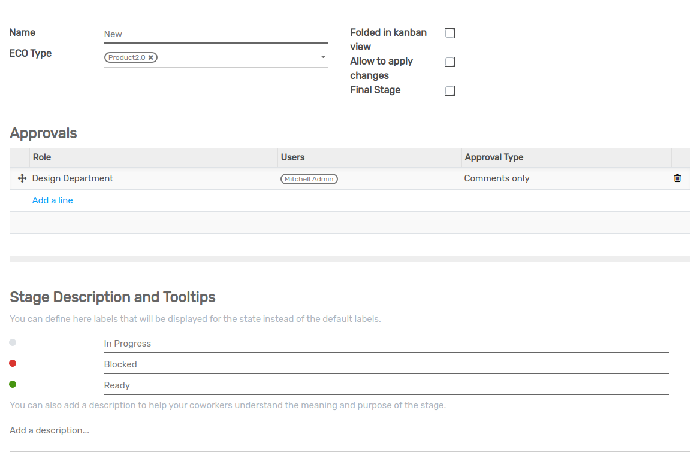

==========
ECO Stages
==========

Begin a new revision for ECO with a brief review of the Engineering Department's responsibilities and products. By adding columns, 
we can add several stages of the ECO type. This is similar to Flectra's CRM and Project modules. However, in this case, 
according to the configuration, an approval choice for each stage may be added. We'll go over this in more detail in the next segment.

New, In Progress, Validated, and Effective are the four stages of ECO (Engineering Change Orders) at this stage.

#. New: This field denotes that a new ECO is being created (Engineering Change Orders).
#. In progress: Engineering Change Orders (ECO) are currently in process, as indicated by this sector.
#. Validated: The hierarchy admin user will use this field to set Validate for a change for the appropriate officials.
   Stage Validate may be defined in the stage settings. Officials and Validate forms can also be added here.
#. Effective: When ECO is confirmed, this field is used. Enable to add adjustments, final steps, and folded in Kanban view are now available as checkboxes. 
   This is the last step. 

In the *PLM* app, open :menuselection:`Configuration --> ECO Stages` click on ``create`` to create new ECO Stage.

