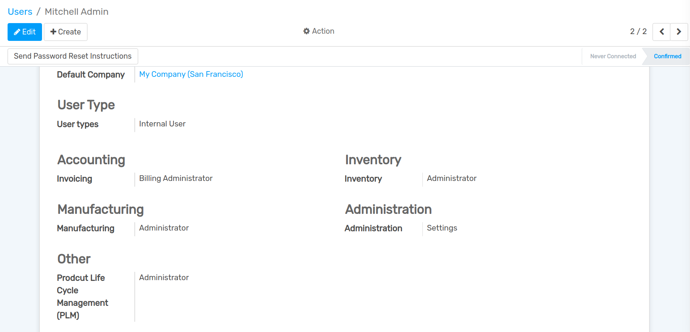

==================
User Configuration
==================

Product Life Cycle Management is developed specifically for the Engineering Department and is used to keep track of BOM revisions,

go to Settings --> Users & Companies --> Users . In the Users, define the groups in PLM which is Administrator or User.

