===================
Machine Managements
===================

While manufacturing a product, it is the prime responsibility of the manufacturing department to assure product performance. Product quality should be assured in each stage of its production so as to bring in the qualitative and high end- performing products. 

In order to assure the same, flectra has brought in maintenance module. flectra computes standard statistics to provide you with maintenance protocols like tracking equipment and maintenance request. Utilizing flectra, product maintenance can be carried in two ways:

#. Preventive 

#. Corrective

Preventive maintenance is a support that is routinely performed on equipment so as to decrease its probability of coming short. It is performed while the equipment is still working. It carried prior to equipment notifying any fault/failure. Preventive maintenance, in other words, can be called as servicing of equipment, carried in regular intervals.  

On the other hand, corrective maintenance is a support task performed to distinguish, segregate, and redress an issue so that the faulty equipment can be reestablished to an operational condition.

The prime motto of conducting equipment maintenance is that it reduces the downtime as well make the manufacturing process more proficient. Via servicing the equipment over regular periods, the risk of equipment failure can be brought down to a great extent.

Machines and Tools
==================

go to :menuselection:`Maintenance --> Equipments --> Machines and Tools`.
Click on `Create` to create new Machines and Tools.

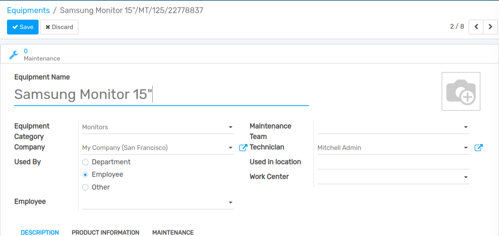

#. Equipment Name:- Name of the equipment.

#. Equipment Category:- Category of the equipment.

#. Company:- Company who owns the equipment.

Used By:  

#. Department:- Choose department, if this equipment is used by a specific department.

#. Employee:- Choose employee, if this equipment is used by a specific employee.

#. Other:- To choose an employee under a department. One can select both department and employee if chose the option-other.

Maintenance team: One can create/choose the maintenance team.

Maintenance Team
================

go to :menuselection:`Maintenance --> Configuration --> Maintenance Teams`.
Click on `Create` to create new Maintenance Teams.

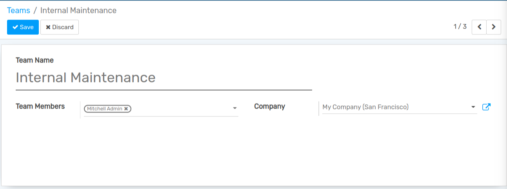

Here, one can add team members and choose a company for creating a maintenance team.

Coming back to creating an equipment, 

#. Technician:- Technician who is undertaking the equipment.

#. Assigned Date:- One can add the assigned date if any. For instance, if the equipment is used by an employee, one can add the specific date on which the equipment was assigned to that employee.

#. Scrap date:- One can add scrap date based on its durability.

#. Used in location:- Location where equipment is used.

#. Work Center:- One can add the work center of the equipment if any.

Under Product information tab, one can add details pertaining to the equipment, for instance when it was bought.

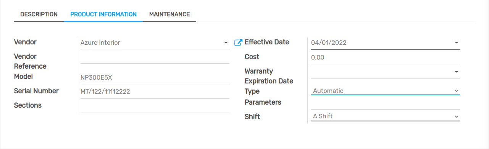

Here, one can add vendor associated with the equipment, vendor reference, the equipment model, serial number, equipment cost, and warranty expiration date. The effective date is the date on which the equipment became effective.

Under the Maintenance tab, details of the maintenance can be seen.

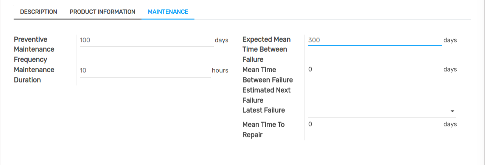

#. Preventive maintenance Frequency:- One can set the frequency of preventive maintenance in a number of days. 
#. Next Preventive maintenance:-  Once preventive maintenance is set, following preventive maintenance will set automatically based on that .ie when is the next preventive maintenance of that equipment. In the initial case,  it will be calculated based on the effective date.

Here, I have given preventive maintenance frequency as 100 days. You can see the next preventive maintenance after 100 days, based on the frequency set. 

#. Maintenance duration:- Duration of maintenance in hours.
#. Expected mean time between failures:- One can set the expected mean time between failures in days.
#. Mean time between failures(MTBF):- It is calculated based on the corrective failure. Suppose an equipment failure happens on 06/04/2019(6th April 2019), and next failure happens on 10/04/2019(10th April 2019), mean time between failures will be 4 days. However, the first failure is calculated based on the effective date.
#. Expected Next Failure:- Expected failure date will be generated based on the mean time between failures. In the case of the first failure of the equipment, it is calculated based on the effective date.
#. Latest failure:- Last failure date will be updated automatically.
#. Mean time to repair(MTTR):- Mean time between maintenance and repair in days. If the maintenance started on 2nd May 2019 and equipment got repaired on 3rd May 2019. In that case, the mean time to repair will be 1 day.

One can create a maintenance request from the maintenance module. 

Maintenance request
===================

go to :menuselection:`Maintenance --> Maintenance --> Maintenance requests`.

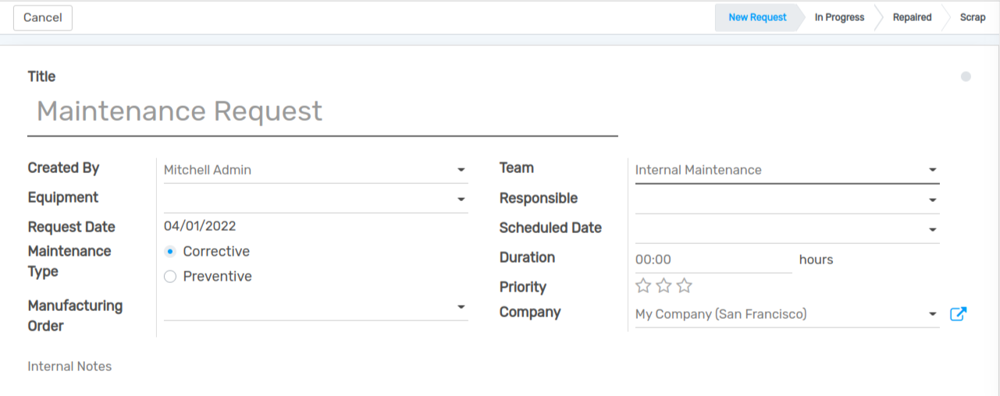

#. Name:- One can give a name for the maintenance request.
#. Created By:- Employee who create maintenance request.
#. Company:- Company that request for maintenance.
#. Equipment:- Choose the equipment for maintenance.  
#. Request date:- The date on which maintenance request is created. It will be generated automatically by the system.
#. Close Date:- Date on which maintenance is completed.
#. Maintenance type:- Maintenance is of 2 types, Corrective and Preventive.

Preventive maintenance is the maintenance support that is carried on an equipment before its failure. In other words, it is the servicing of an equipment carried in regular intervals.  

Corrective maintenance is the maintenance support carried on an equipment upon its failure. It is simply the corrective measure against the failure.

#. Manufacturing order:- When equipment failure happens in between manufacturing order, one can choose the manufacturing order here.
#. Teams:- Choose a maintenance team for maintenance.
#. Responsible:- Responsible person of the maintenance request.
#. Scheduled date:- Date on which the maintenance team plans the maintenance. It should not differ much from the requested date.
#. Duration:- Duration of maintenance. 
#. Priority:- Priority can be set to a maintenance request.

Maintenance Calendar
====================

Maintenance request can be created/viewed from the calendar.

For that go to :menuselection:`Maintenance --> Maintenance --> Maintenance Calendar`.

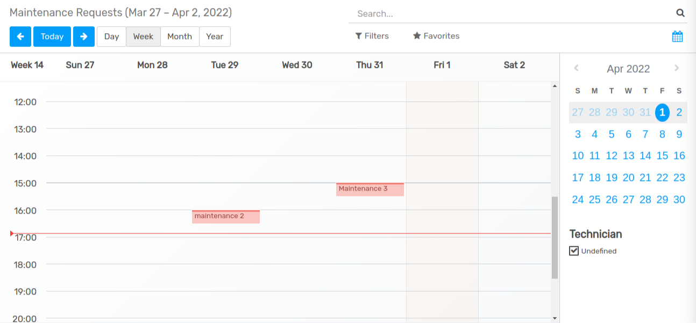

Here, one can choose the date and create maintenance request. For that click on a date -> edit.

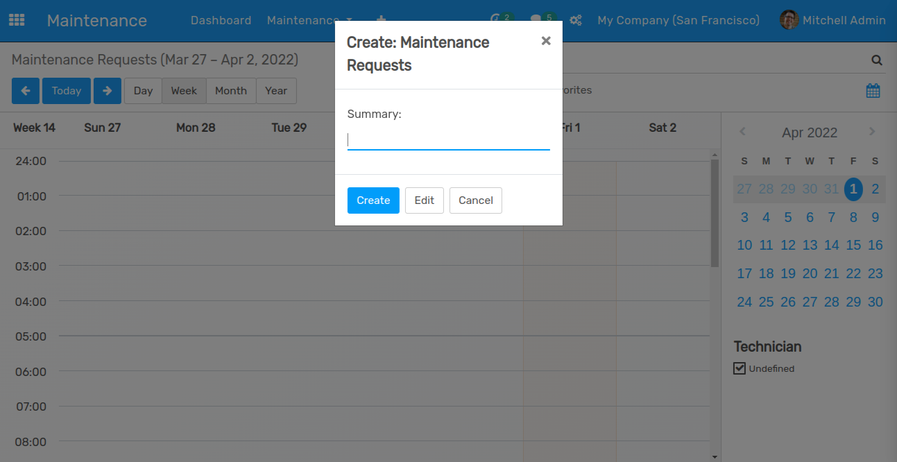

It will take you to create maintenance request, which I had explained above.

Let's see the flow of maintenance request. 

At first, let's see the maintenance request of type corrective:

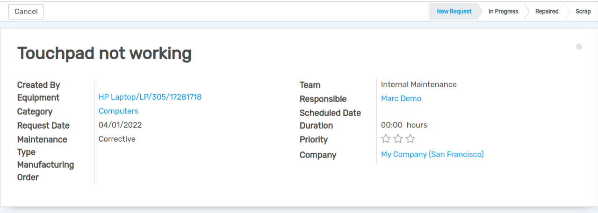

Once the maintenance is in progress, the state gets changed to INPROGRESS.
Once the equipment gets repaired, the state automatically gets changed to REPAIRED. 
If the equipment is scrapped, the state gets changed to SCRAP. Once the state is repaired or scraped, the close date will be automatically added. 
Also Expected Next Failure date over equipment correspondingly changes.

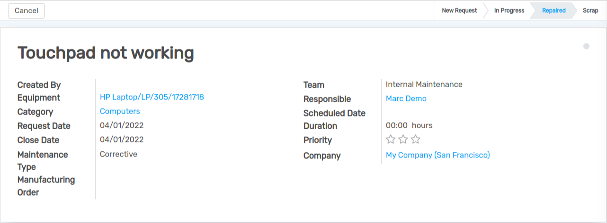

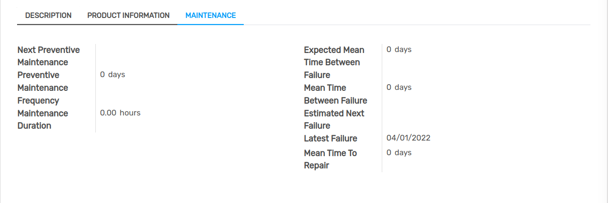

Estimated Next Failure = Requested date of maintenance request + Mean time between failure.

Latest Failure: Latest failure date will be updated based on the maintenance request date.

Here, Mean time to repair(MTTR) is 0 days as the maintenance request and repairing happened on the same date.

Now, let's see the preventive maintenance request.

When preventive maintenance request is saved. Corresponding to that, the next preventive date will be automatically set as maintenance requested date in the equipment. Here maintenance requested date on 07/13/2022. 

Let's check in equipment.

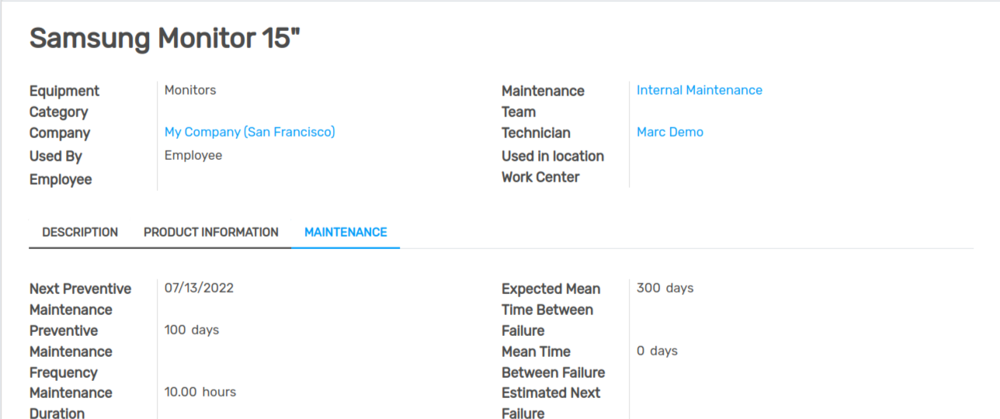

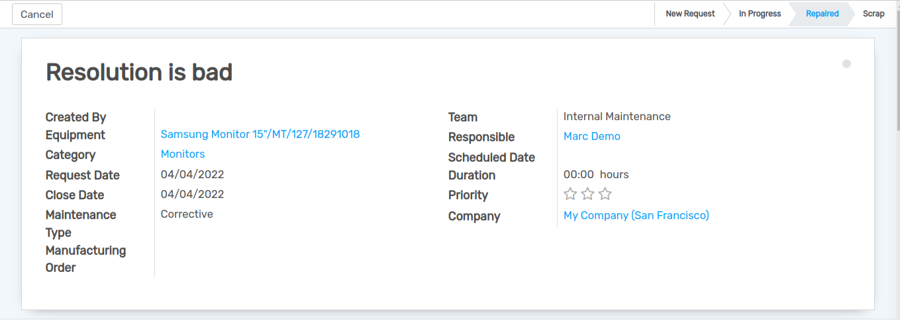

When preventive maintenance gets resolved, the next preventive date will be automatically calculated on the basis of preventive maintenance frequency in the equipment. So let's check in Samsung Monitor 15.

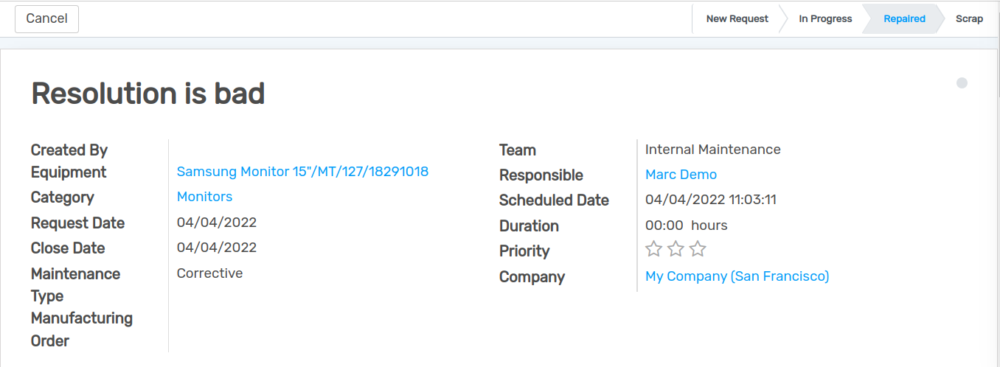

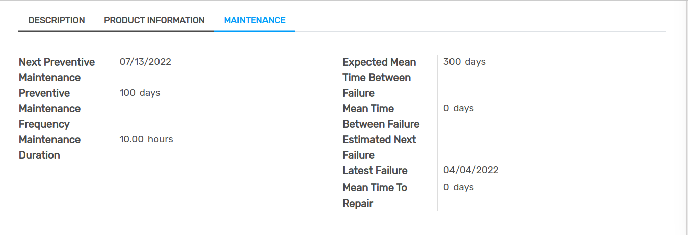

Here, the next preventive frequency is after 100 days and the maintenance close date is on 04/04/2022. So, the next preventive maintenance will be on 04/04/2022 + 100 days ie, 07/13/2022.

If the equipment failure happens, one can create maintenance request from manufacturing order and work order. For that Go to -> Manufacturing Module.

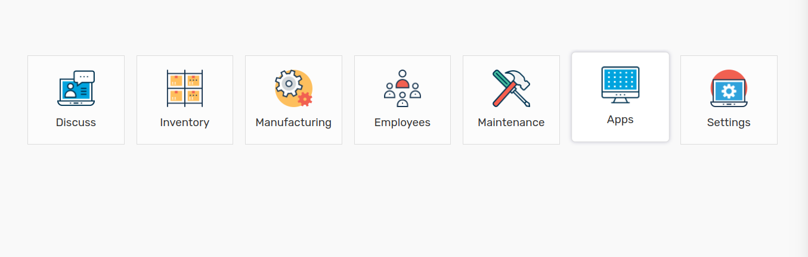

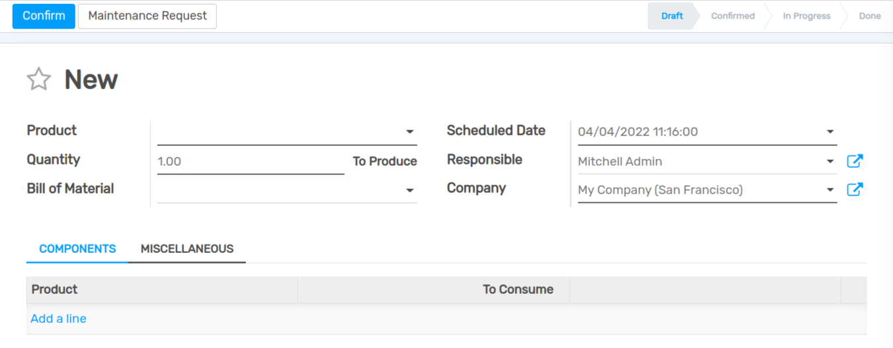

It will allow you to create a maintenance request.

