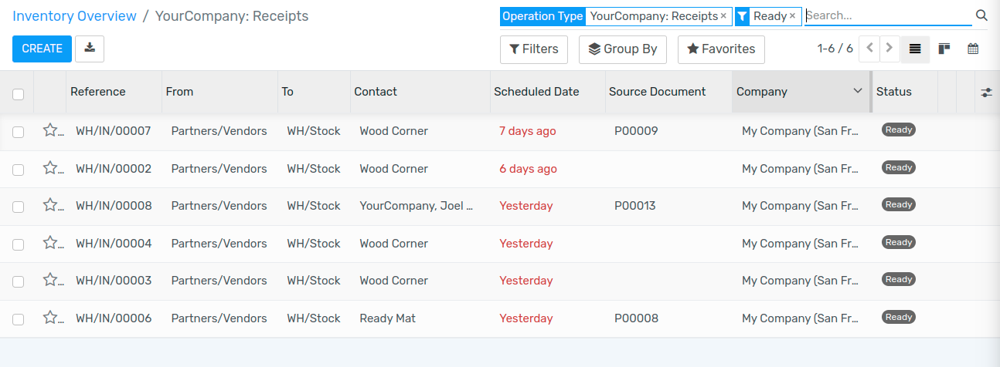

===================
Manage vendor bills
===================

The **Purchase** application allows you to manage your purchase orders,
incoming products, and vendor bills all seamlessly in one place.

If you want to set up a vendor bill control process, the first thing you
need to do is to have purchase data in Flectra. Knowing what has been
purchased and received is the first step towards understanding your
purchase management processes.

Here is the standard work flow in Flectra:

1. You begin with a **Request for Quotation (RFQ)** to send out to your
   vendor(s).

2. Once the vendor has accepted the RFQ, confirm the RFQ into a
   **Purchase Order (PO)**.

3. Confirming the PO generates an **Incoming Shipment** if you purchased
   any stockable products.

4. Upon receiving a **Vendor Bill** from your Vendor, validate the bill
   with products received in the previous step to ensure accuracy.

This process may be done by three different people within the company,
or only one.

Configuration
=============

Installing the Purchase and Inventory applications
--------------------------------------------------

From the **Apps** application, search for the **Purchase** module and
install it. Due to certain dependencies, installing Purchase will
automatically install the **Inventory** and **Accounting** applications.

Creating products
-----------------

Creating products in Flectra is essential for quick and efficient
purchasing within Flectra. Simply navigate to the Products submenu under
Purchase and click create.

When creating the product, pay attention to the **Product Type** field,
since it is important:

- Products that are set as **Stockable or Consumable** will allow you
  to keep track of their inventory levels. These options imply
  stock management and will allow for receiving these kinds of
  products.

- Conversely, products that are set as a **Service or Digital Product**
  will not imply stock management, simply due to the fact that
  there is no inventory to manage. You will not be able to receive
  products under either of these designations.

.. tip::
   It is recommended that you create a **Miscellaneous** product for all purchases
   that occur infrequently and do not require inventory valuation or management.
   If you create such a product, it is recommended to set the product type to **Service**.

Managing your Vendor Bills
==========================

Purchasing products or services
-------------------------------

From the purchase application, you can create a purchase order with as
many products as you need. If the vendor sends you a confirmation or
quotation for an order, you may record the order reference number in the
**Vendor Reference** field. This will enable you to easily match the PO
with the the vendor bill later (as the vendor bill will probably include
the Vendor Reference)

Validate the purchase order and receive the products from the Inventory
application.

Receiving Products
------------------

If you purchased any stockable products that you manage the inventory
of, you will need to receive the products from the Inventory application
after you confirm a purchase order. From the **Inventory dashboard**, you
should see a button linking you directly to the transfer of products.
This button is outlined in red below:

Navigating this route will take you to a list of all orders waiting to
be received.

If you have a lot of awaiting orders, apply a filter using the search
bar in the upper right. With this search bar, you may filter based on
the vendor (partner), the product, or the source document (also known as
the reference of your purchase order). You can also
group the orders by different criteria under **Group By**. Selecting an
item from this list will open the following screen where you then will
receive the products.

Purchasing service products does not trigger a delivery order.
