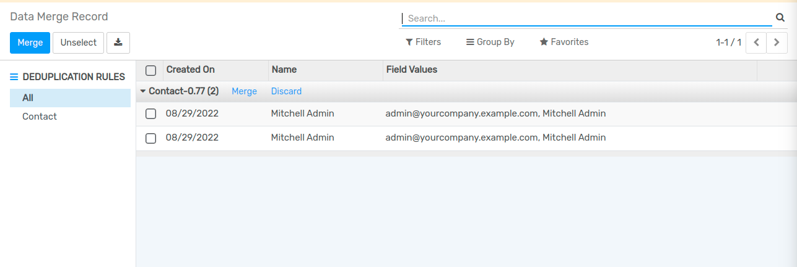
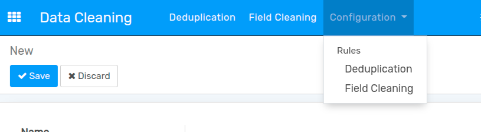
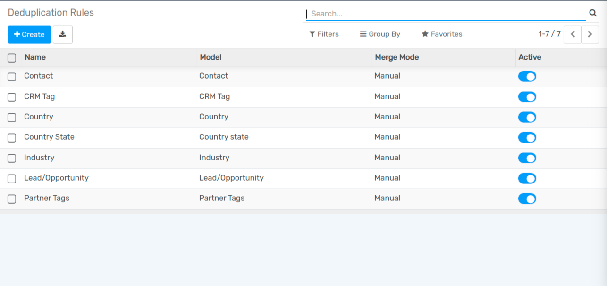
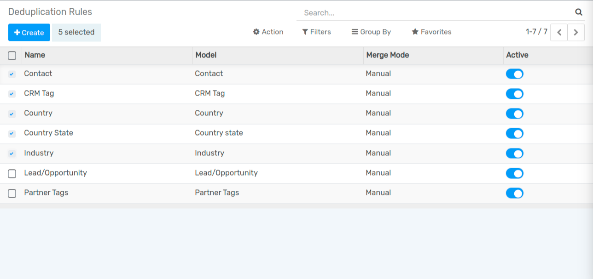
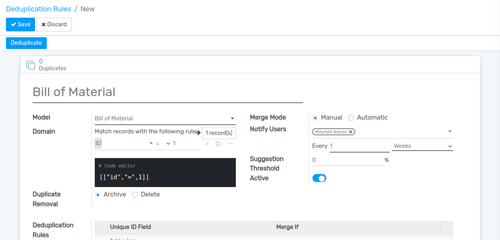
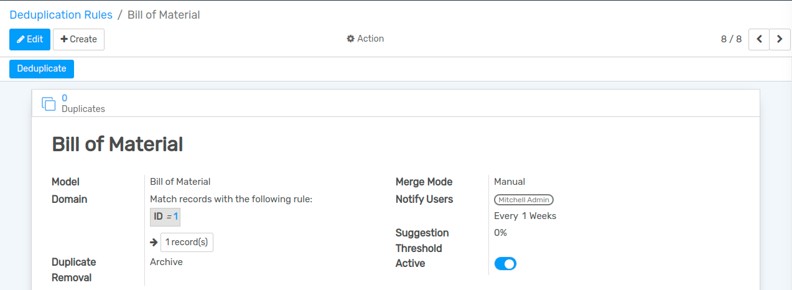
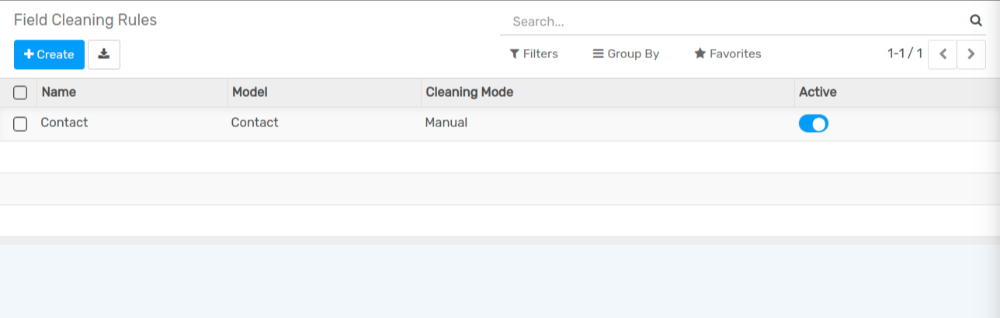
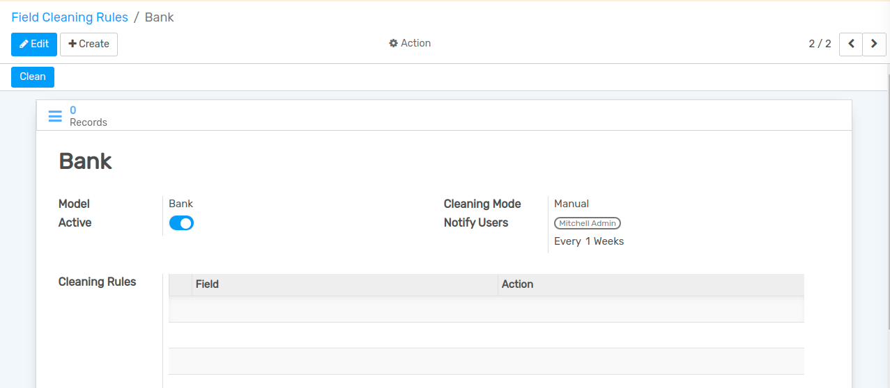
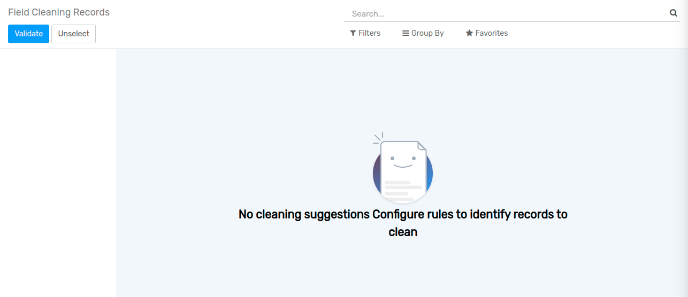

=============
Data Cleaning
=============

Data cleaning primarily is the process of removing unnecessary data. All data duplication including customer details, customer contact, field details, and other documents fall under the Data Cleaning process. An ERP solution that is used to store bundles of documents can easily feel the clutter. With a data cleaning solution, this issue can be solved.

Data Cleaning Dashboard
=======================

On clicking data cleaning, you will be taken to the dashboard. The dashboard portrays the list of duplicated documents in an easily traceable manner. On the left-hand side of the dashboard, you can find Rule.

Configure Rule
==============

The rule is the condition set for finding out the duplicated documents.

Go to `Configuration --> Deduplication`, to configure Rule.

The rule for Data Cleaning can be set in two ways.

#. Deduplication Rule
#. Field Cleaning Rule

Deduplication Rules
===================

When you click the Deduplication Rules you will get a new window where you can set the deduplication rules by checking the rules.

Flectra Data Cleaning App gives Deduplication Rules including CRM Tag, contact, Country, Country State, Industry, Lead Opportunity, Opportunity Lost Reason, etc.

Create Deduplication Rules
--------------------------

First, check the required fields.

Then click Create. You will get a new window then.

There you can select the Model and choose options. The deduplication rule can be selected and can set whether you want to merge the documents manually or automatically.  
You can also decide if you want to notify the user. This window also lets you decide the interval at which you should get a notification on deduplication.

Then this deduplication rule can be saved by clicking the Save button.

Once you click Deduplicate you will be taken to the Duplicates.

Configure Field Cleaning Rules
------------------------------

Field Cleaning Rules can be used to clean the field. Here you can tick the required columns and go ahead with Creating Field Cleaning Rules.

Here, you can choose the model. Once the fields are selected you can save the changes.

After clicking Save, you will get the above-given image.

Now let us look at how Deduplication is done.

On clicking Deduplication you will get the details including the document created date, name of the model or field then field values, and the number of documents using the same field.

This will also help to find contact similarities. You have two options here, one is to merge the documents and the second one is to discard the document.

On discarding the document will get discarded. On clicking merge, the merging process will be carried out after asking for confirmation.

Field Cleaning
--------------

On clicking Field Cleaning, you will get a window where you will get Record ID, Record Name, Field, Current details, and Suggested Action

