=====================
Easypost Shipping API
=====================

EasyPost is a software company that helps businesses integrate shipping from the major carriers. It has accross 60+ carriers. To start working with Easypost, you need to install easypost api(sudo apt-get install easypost).

Get Credentials
---------------

Login into the dashboard of Easypost. Easypost will provide you API KEY.

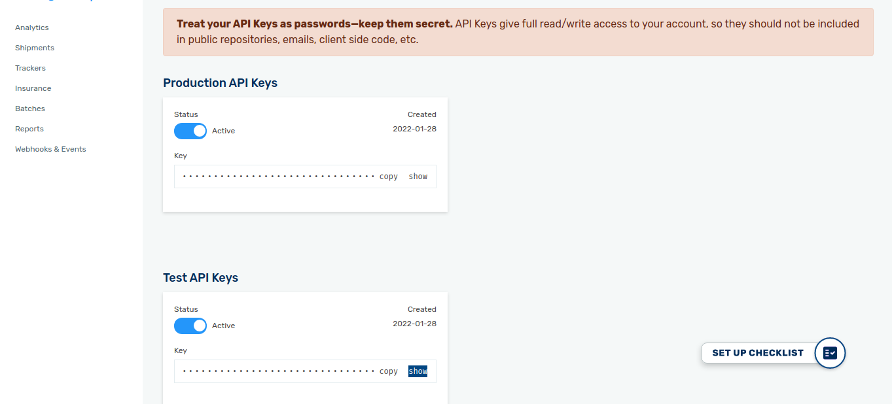

Carrier Account ID
------------------

You will get the carrier account ID from the Easypost Dashboard.
Go to :menuselection:`My Profile --> Carrier Accounts`.

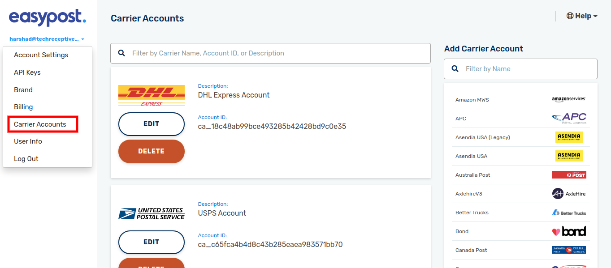

Easypost Configuration
----------------------

Delivery method name should be delivery carrier name and the package name.

If your easypost carrier account support the scanform then tick the ScanForm Supported.

Go to :menuselection:`Inventory --> Configuration --> Shipping Methods`..

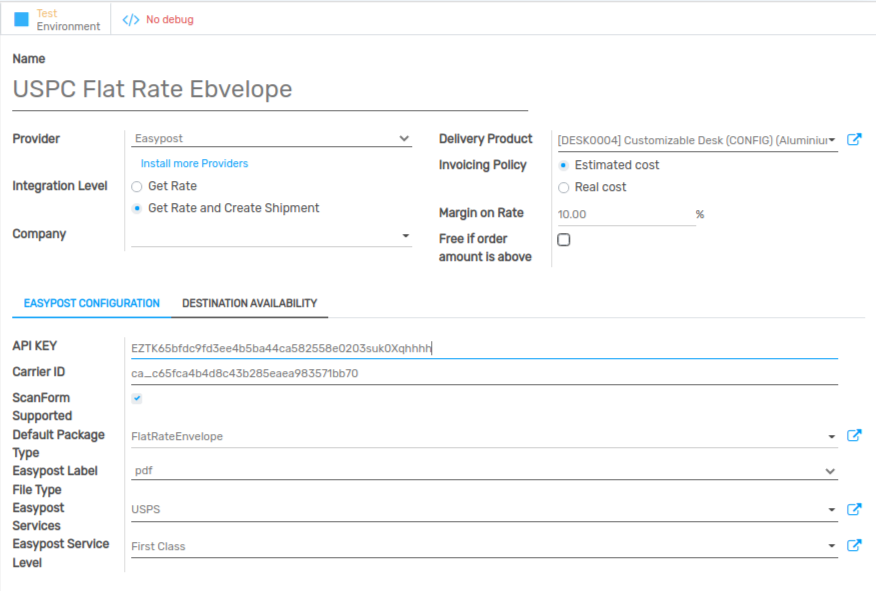

Sale Order
----------

Create new Sale Order and Select the delivery method, you will get the carrier rates of the items. Easypost also supports multi currency.

Note:Address should be correct. 

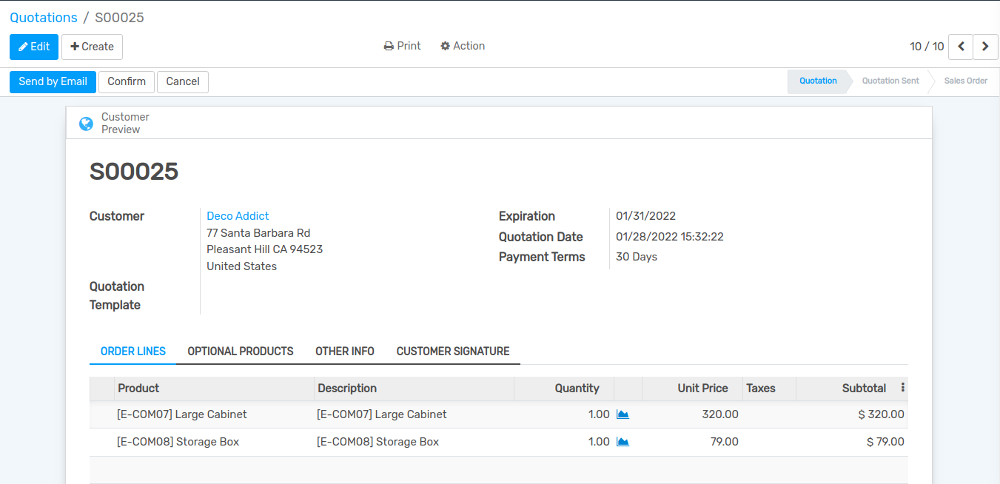

Get Label in attachment
-----------------------

After confirming Sale Order, click on :menuselection:`Delivery --> Validate --> Apply`, you will get the label url in attachment.

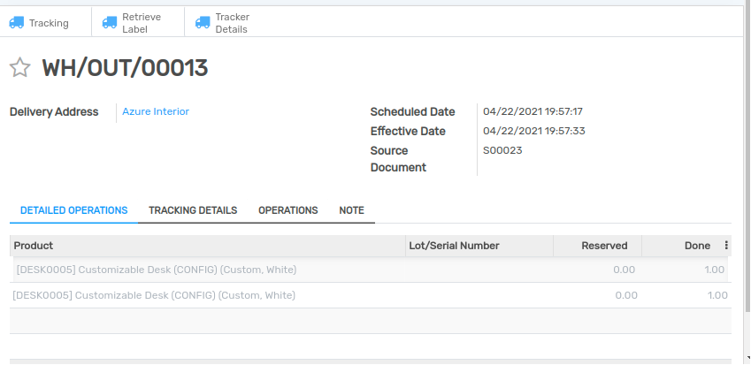

Shipment Label
--------------

Shipment Label In Attachment 

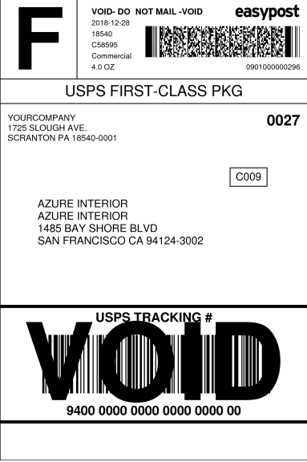

Retrieve Label
--------------

If the label is deleted, you can retrieve it by clicking on `Retrieve Label`. 

Tracking URL
------------

Click on Tracking, you will get the tracking url. 

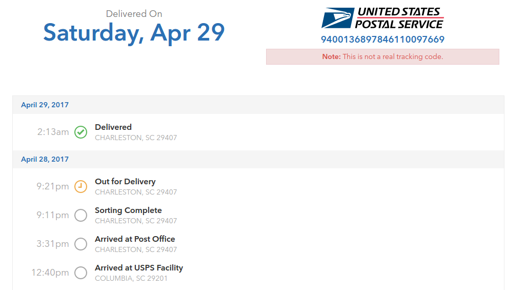

Get Tracking Details
--------------------

Click On `Tracker Details` to get the tracker status updated. Also a schedulers runs after every minute Which update the status and other details.

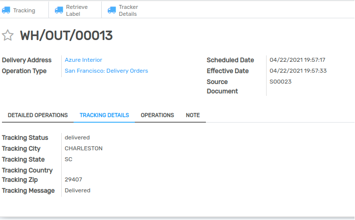

Get Shipping ID
---------------

Create new Scanform. Select the starting and ending date.Click on Get Shipping ID, you will get the list of Shipping IDS.
Note:The shipping Ids which are already manifested or whose labels are remaining to create will not be shown. 

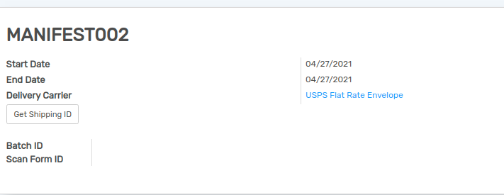

Create Batch and Scanform
-------------------------

Click on Create Batch And Scanform. Batch ID and Scanform ID will be generated. 

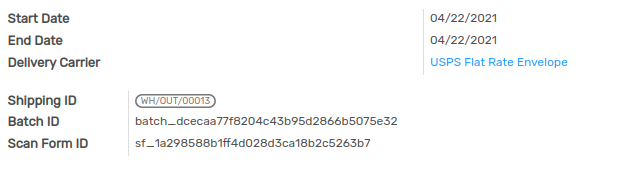

Postage Label
-------------

You will get the postage label in attachment while creating Batch and ScanForm.

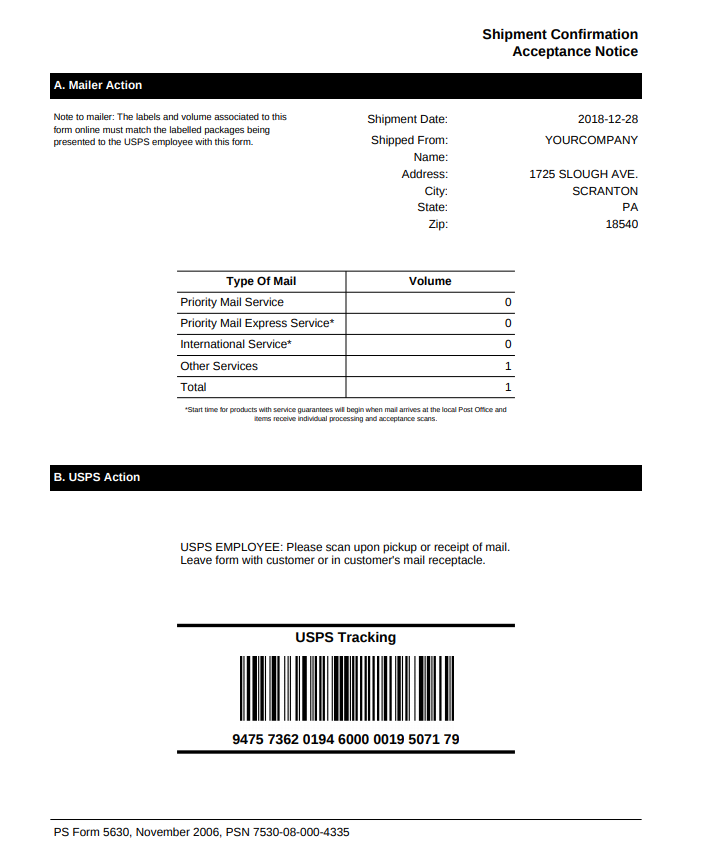

