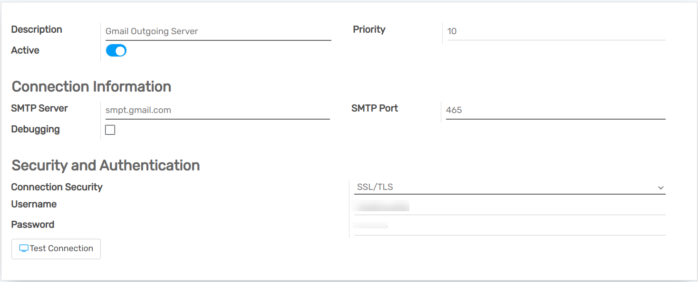
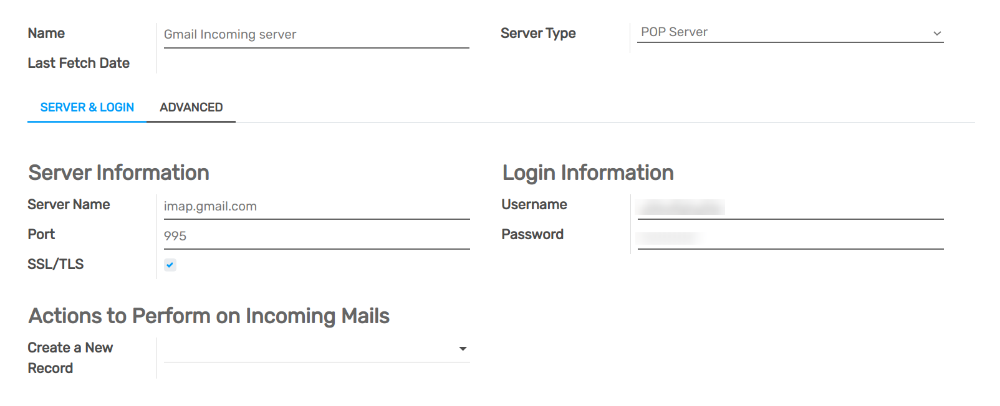

===============================================================
How to Use my Mail Server to Send and Receive Emails in Flectra
===============================================================

If you are a user of Flectra Online or Flectra.sh...
====================================================

You have nothing to do! **Flectra sets up its own mail servers for your database.**
Outgoing and incoming emails work out-of-the-box!

Unless you plan to send large batches of mass mailing that could require the 
use of an external mail server, simply enjoy your new Flectra database.

Scope of this documentation
===========================

This document is **mainly dedicated to Flectra on-premise users** who don't
benefit from an out-of-the-box solution to send and receive emails in Flectra,
unlike `Flectra Online <https://www.flectrahq.com/trial>`__ & `Flectra.sh <https://www.flectra.sh>`__.

.. warning::

    If no one in your company is used to manage email servers, we strongly recommend that
    you opt for those Flectra hosting solutions. Their email system
    works instantly and is monitored by professionals.
    Nevertheless you can still use your own email servers if you want
    to manage your email server's reputation yourself.

You will find here below some useful
information on how to integrate your own email solution with Flectra.

.. note:: Office 365 email servers don't easily allow to send external emails from hosts like Flectra.
    Refer to `Microsoft's documentation <https://support.office.com/en-us/article/How-to-set-up-a-multifunction-device-or-application-to-send-email-using-Office-365-69f58e99-c550-4274-ad18-c805d654b4c4>`__
    to make it work.

How to manage outbound messages
===============================
As a system admin, go to :menuselection:`Settings --> General Settings`
and check *External Email Servers*.
Then, click *Outgoing Mail Servers* to create one and reference the SMTP data of your email server. 
Once all the information has been filled out, click on *Test Connection*.

Here is a typical configuration for a G Suite server.

Then set your email domain name in the General Settings.

.. note::
   If you get a ``[AUTHENTICATIONFAILED] Invalid credentials (Failure)`` warning when you *Test
   Connection* on a Gmail address, activate the *Less secure app access* option. A direct link can
   be `accessed here <https://myaccount.google.com/lesssecureapps?pli=1>`_.

   In addition to that, enable the IMAP setting on your Gmail account.

Can I use an Office 365 server
------------------------------
You can use an Office 365 server if you run Flectra on-premise.
Office 365 SMTP relays are not compatible with Flectra Online.

Please refer to `Microsoft's documentation <https://support.office.com/en-us/article/How-to-set-up-a-multifunction-device-or-application-to-send-email-using-Office-365-69f58e99-c550-4274-ad18-c805d654b4c4>`__ 
to configure a SMTP relay for your Flectra's IP address.

How to use a G Suite server
---------------------------
You can use an G Suite server for any Flectra hosting type.
To do so you need to setup the SMTP relay service. The configuration steps are explained in 
`Google documentation <https://support.google.com/a/answer/2956491?hl=en>`__.

.. _discuss-email_servers-spf-compliant:

Be SPF-compliant
----------------
In case you use SPF (Sender Policy Framework) to increase the deliverability 
of your outgoing emails, don't forget to authorize Flectra as a sending host in your 
domain name settings. Here is the configuration for Flectra Online:

* If no TXT record is set for SPF, create one with following definition:
  v=spf1 include:_spf.flectra.com ~all
* In case a SPF TXT record is already set, add "include:_spf.flectra.com".
  e.g. for a domain name that sends emails via Flectra Online and via G Suite it could be:
  v=spf1 include:_spf.flectra.com include:_spf.google.com ~all

Find `here <https://www.mail-tester.com/spf/>`__ the exact procedure to 
create or modify TXT records in your own domain registrar.

Your new SPF record can take up to 48 hours to go into effect, 
but this usually happens more quickly.

.. note:: Adding more than one SPF record for a domain can cause problems 
   with mail delivery and spam classification. Instead, we recommend using 
   only one SPF record by modifying it to authorize Flectra.

Allow DKIM
----------
You should do the same thing if DKIM (Domain Keys Identified Mail) 
is enabled on your email server. In the case of Flectra Online & Flectra.sh,
you should add a DNS "flectra._domainkey" CNAME record to 
"flectra._domainkey.flectra.com". 
For example, for "foo.com" they should have a record "flectra._domainkey.foo.com" 
that is a CNAME with the value "flectra._domainkey.flectra.com".

Restriction
-----------
Please note that the port 25 is blocked for security reasons. Try using 587, 465 or 2525.

How to manage inbound messages
==============================

Flectra relies on generic email aliases to fetch incoming messages.

* **Reply messages** of messages sent from Flectra are routed to their original 
  discussion thread (and to the inbox of all its followers) by the
  catchall alias (**catchall@**). 

* **Bounced messages** are routed to **bounce@** in order to track them in Flectra.
  This is especially used in `Flectra Email Marketing <https://www.flectrahq.com/page/email-marketing>`__ 
  to opt-out invalid recipients.    

* **Original messages**: Several business objects have their own alias to 
  create new records in Flectra from incoming emails:

  * Sales Channel (to create Leads or Opportunities in `Flectra CRM <https://www.flectrahq.com/page/crm>`__),
  
  * Support Channel (to create Tickets in `Flectra Helpdesk <https://www.flectrahq.com/page/helpdesk>`__),

  * Projects (to create new Tasks in `Flectra Project <https://www.flectrahq.com/page/project-management>`__),

  * Job Positions (to create Applicants in `Flectra Recruitment <https://www.flectrahq.com/page/recruitment>`__),

  * etc.

Depending on your mail server, there might be several methods to fetch emails.
The easiest and most recommended method is to manage one email address per Flectra
alias in your mail server.

* Create the corresponding email addresses in your mail server 
  (catchall@, bounce@, sales@, etc.).
* Set your domain name in the General Settings.

  .. image:: media/alias_domain.png
      :align: center

* If you use Flectra on-premise, create an *Incoming Mail Server* in Flectra for each alias. 
  You can do it from the General Settings as well. Fill out the form according 
  to your email provider’s settings. 
  Leave the *Actions to Perform on Incoming Mails* blank. Once all the 
  information has been filled out, click on *TEST & CONFIRM*.

* If you use Flectra Online, We do recommend to redirect incoming messages 
  to Flectra's domain name rather than exclusively use your own email server. 
  That way you will receive incoming messages without delay. Indeed, Flectra Online is fetching
  incoming messages of external servers once per hour only. 
  You should set redirections for all the email addresses to Flectra's domain name in your 
  email server (e.g. *catchall@mydomain.ext* to *catchall@mycompany.flectrahq.com*).

