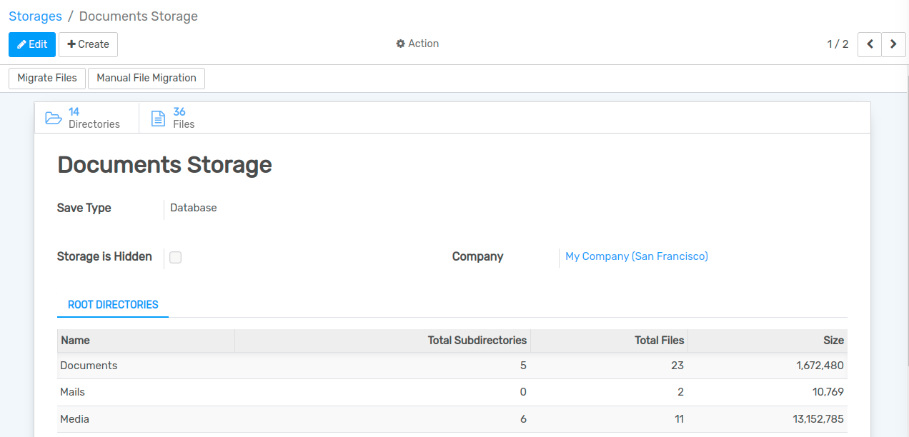
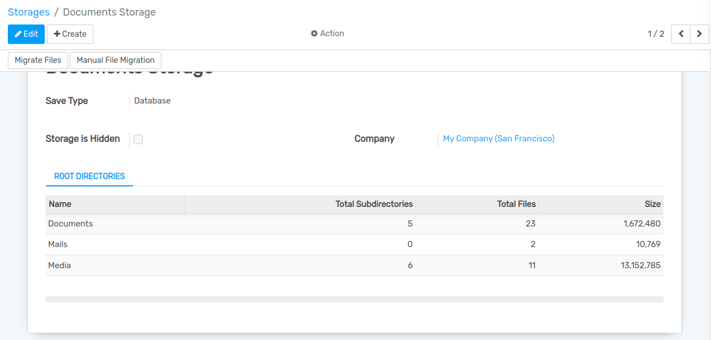

==========================
Document Management System
==========================

The best way to manage the documents is to switch to the Documents view. Existing documents can be managed there and new documents can be created.

Configuration
=============

Storages
--------

Go to :menuselection:`Documents -->  Configuration --> Storages`.

Create a new document storage. You can choose between two options on Save Type:

#. Database: Store the files on the database as a field.
#. Attachment: Store the files as attachments.

Access Groups
-------------

Next create an administrative access group.

Go to  :menuselection:`Configuration -> Access Groups`.

#. Create a new group, name it appropriately, and turn on all three permissions (Create, Write and Unlink - Read is implied and always enabled).
#. Add any other top-level administrative users to the group if needed (your user should already be there).
#. You can create other groups in here later for fine grained access control.

Directories
-----------

Go to  :menuselection:`Documents -> Directories`.

Create a new directory, mark it as root and select the previously created setting.

Select the Groups tab and add your administrative group created above.

On the Directory you can also add other access groups (created above) that will be able to:

#. Read
#. Create
#. Write
#. Delete

Migration
---------

If you need to modify the storage Save Type you might want to migrate the file data. In order to achieve it you need to:

Go to  :menuselection:`Documents -> Configuration -> Storage`, and select the storage you want to modify.

#. Modify the save type.
#. Press the button Migrate files if you want to migrate all the files at once.
#. Press the button Manual File Migration in order to specify files one by one.

You can check all the files that still needs to be migrated from all storages and migrate them manually on Documents -> Configuration -> Migration.

Portal functionality
--------------------

You can add any portal user to DMS access groups, and then allow that group in directories, so they will see in the portal such directories and their files. Another possibility is to click on "Share" button inside a directory or a file for obtaining a tokenized link for single access to that resource, no matter if logged or not.

