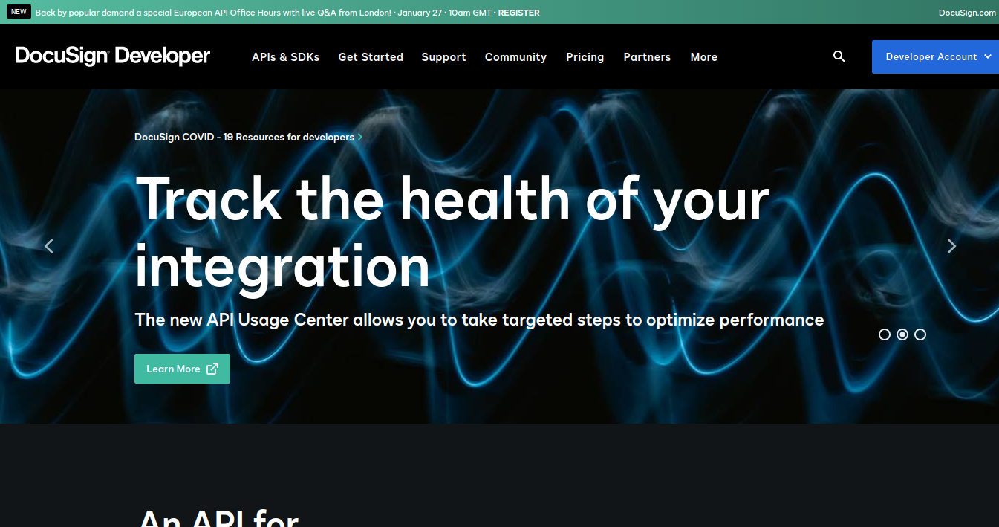
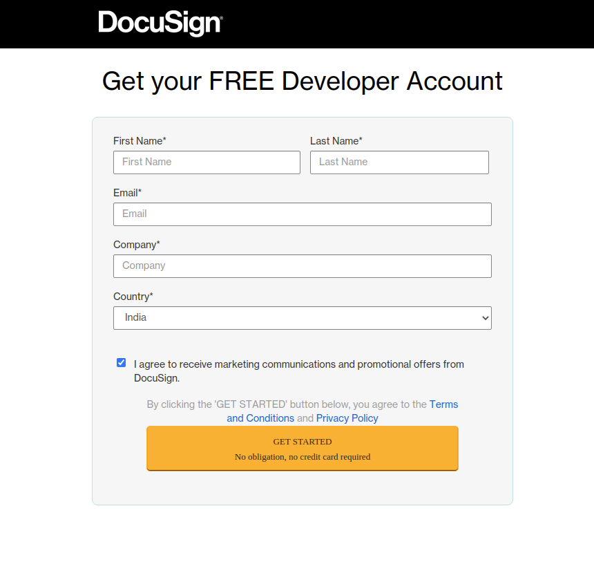
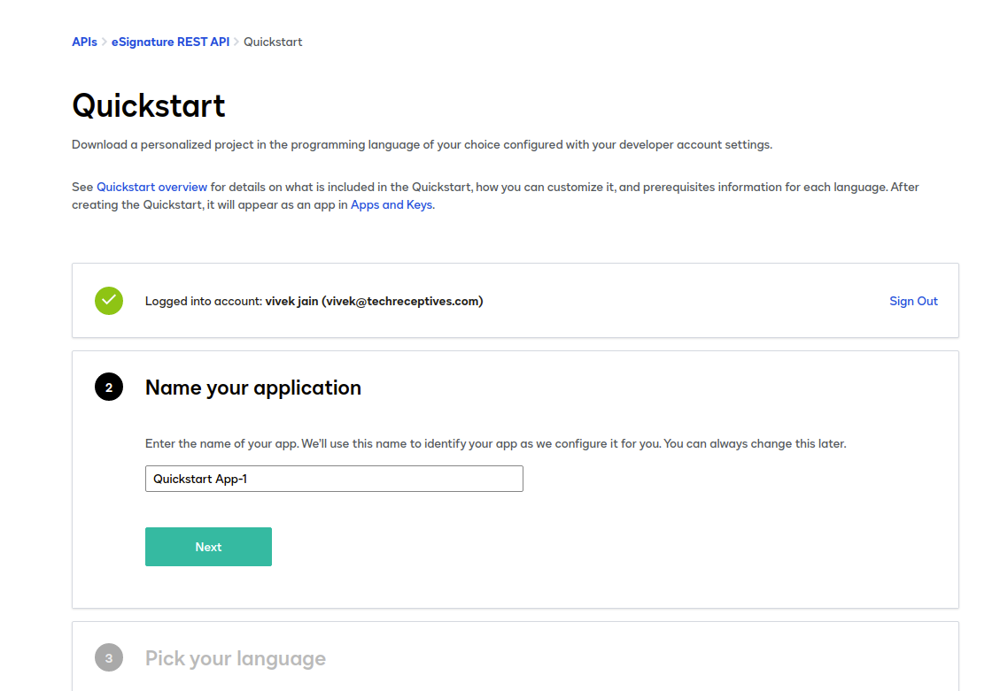
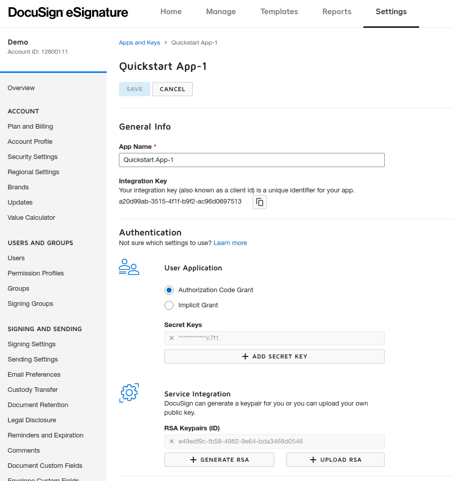
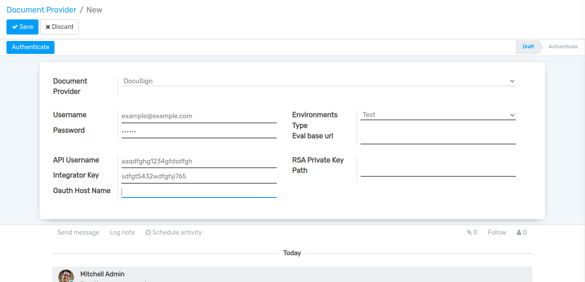
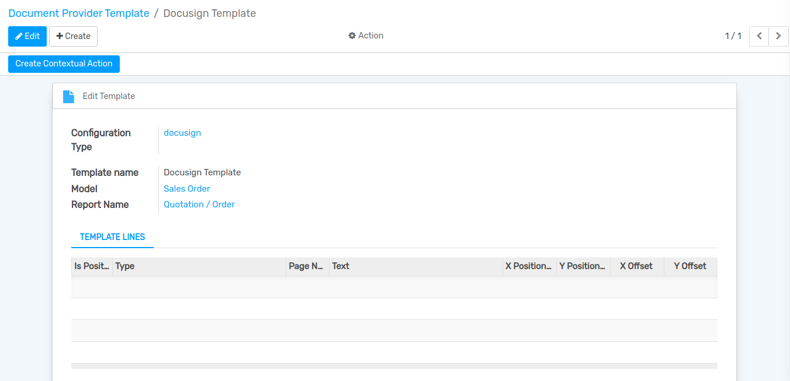
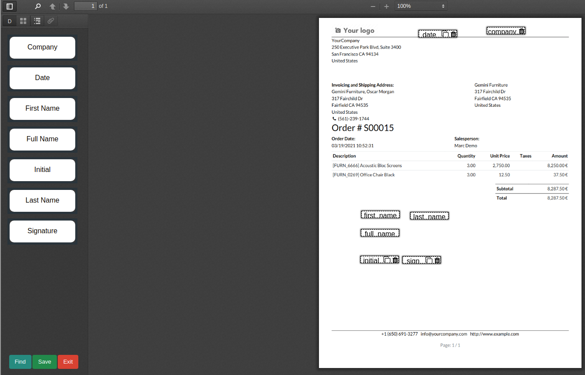
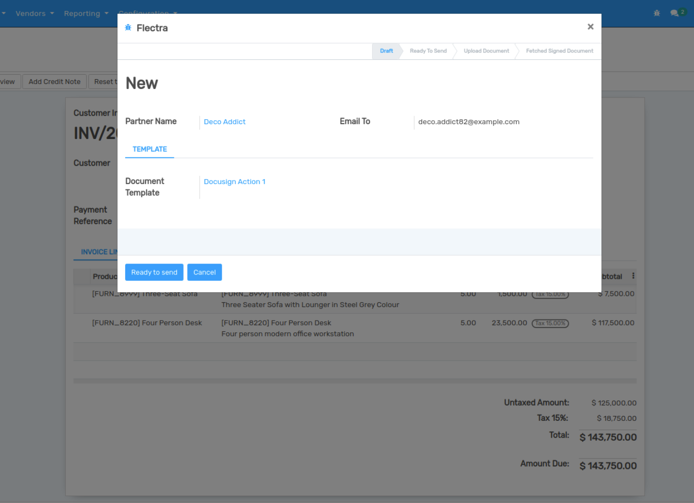
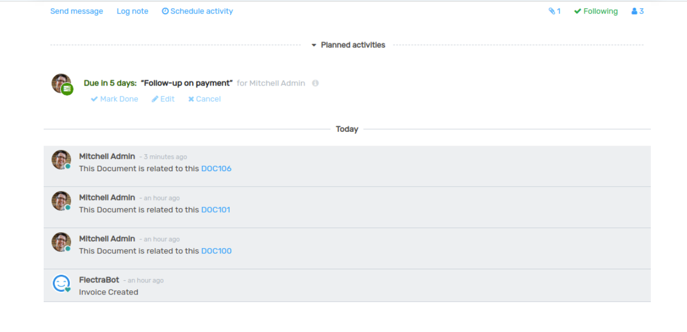

=========================
How to Configure Docusign
=========================

Configure Docusign
------------------

Go to 'https://developers.docusign.com/' and create your Docusign developer account.

Here, user can register and create developer account.

After that login into developer account and Create App.

Go to `Setting --> App and Keys --> Open Your Demo App`.And copy and save your required credential for the forther use.

How to Configure Docusign in Flectra
------------------------------------

Go to :menuselection:`Settings --> Technical --> Document Provider`.
Click on `Create` to create 

Fill the given required fields and click on `Authenticate` button.

Go to :menuselection:`Setting --> Technical --> Document Provider Template`.
Create Docusign Template Fill the fields then click on `Edit` template.

Set Your fields using this drag and drop features and click on save button.

Save document and click `Create Contextual Action` button.

.. image:: media/doc-8.png
    :align: center

Open Sale Order and click on `Action` Menu.Click on `Ready to send` button and it's automatically send data to document upload stage.

Then you can check your document status in chatter-box via it's document-id.

