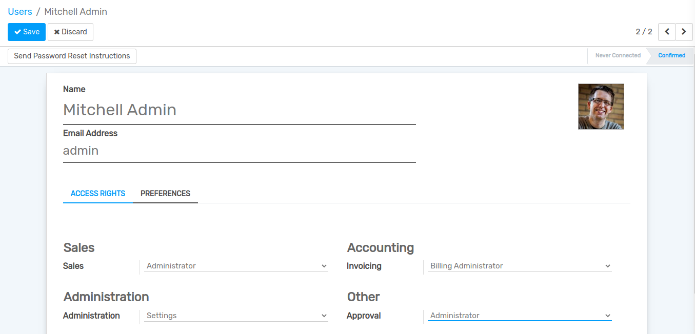
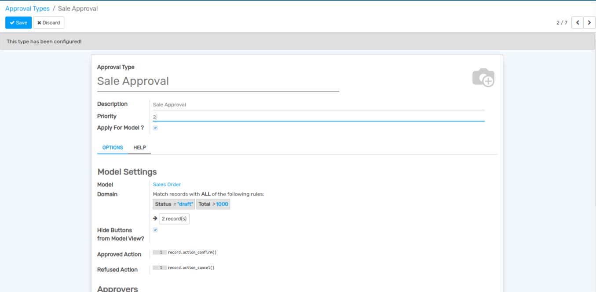
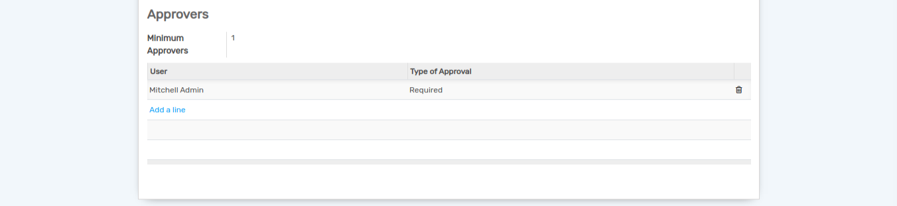
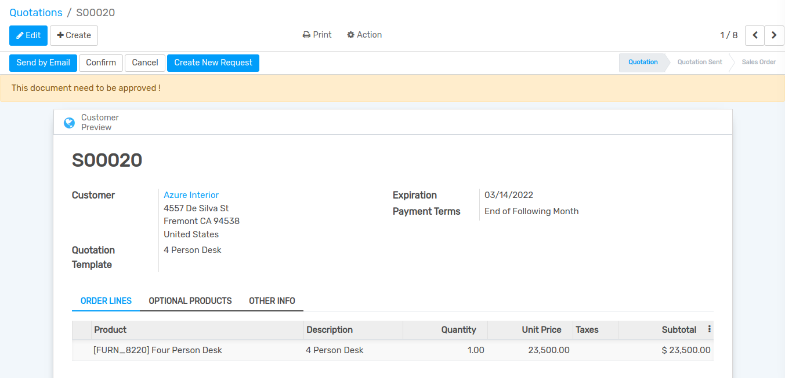
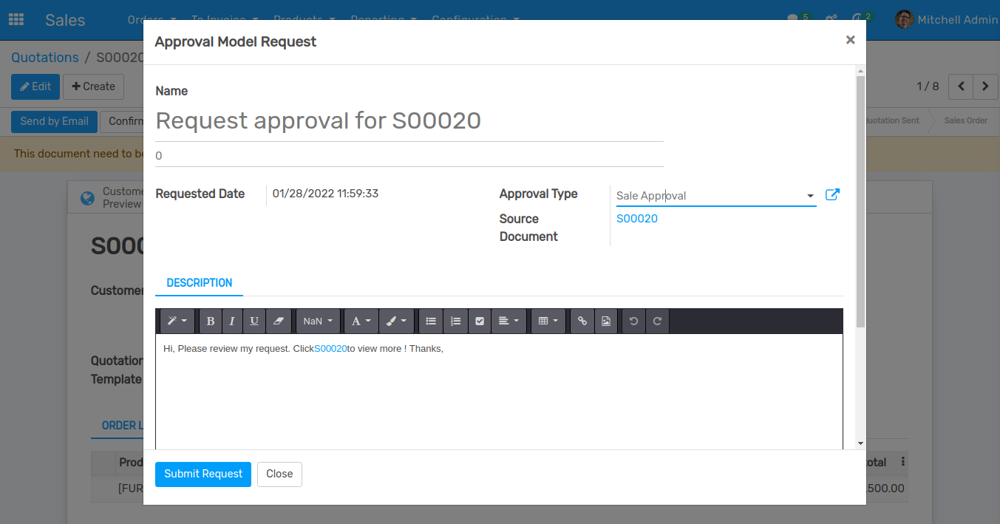
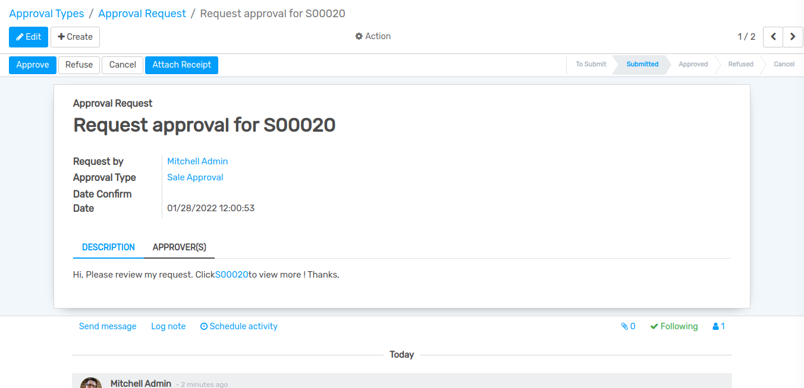
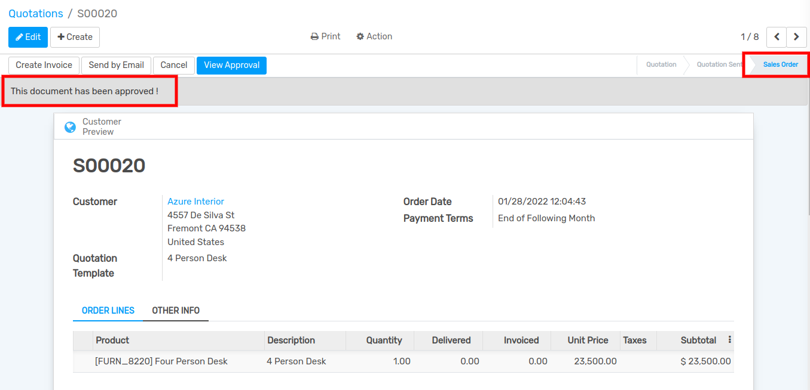

==========================
Sales multi level approval
==========================

Using this module you can Create multi level Approval. Easily use multi level scenario as per the company heirarche.

Configuration for User
----------------------

Go to :menuselection:`Settings --> Users & Companies --> Users`.
Here you can give the access rights of approval.

Approval Types
--------------

Go to :menuselection:`Approvals --> Approval Types`.
Here you can create a new approval type for each business model.There are two cases.

#. Approval type for new model. Each model needs different fields, you can choose those ones fit your company requirement.
#. Approval type for existed business model. Sale Order, Purchase Order, Stock Transfer, MRP Order, HR Recruitment, Invoice and Payment.. are defined in other modules. you don't need to choose fields but declare the domain,  which the approval flow will be applied on

Go to :menuselection:`Sales --> Orders --> Quotations`.
Here you can create new approval request.

Click on `Create New Request`.

You can see all the request in Approval Type.

.. image:: media/app-6.png
    :align: center

Here you can Approve particular Approval Request.

Then you can see Approval status in Quotations.

