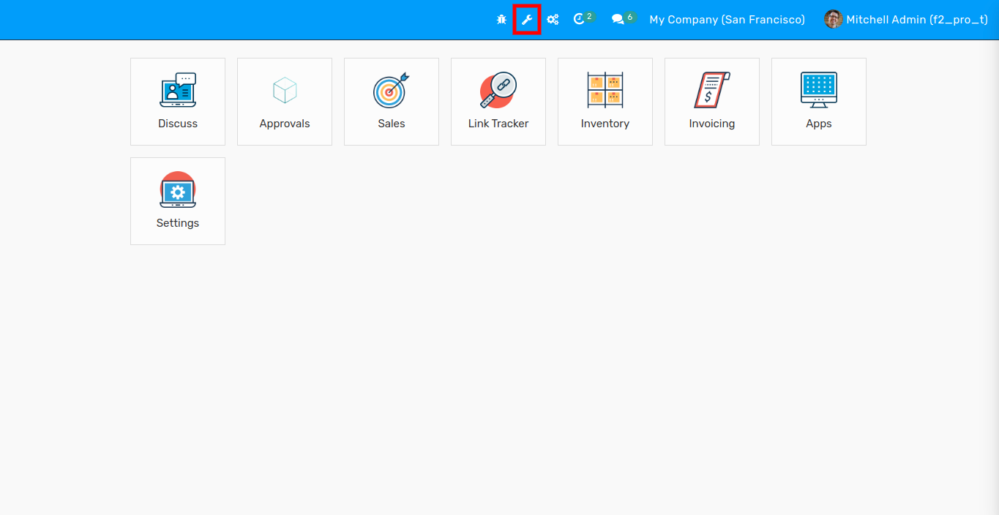
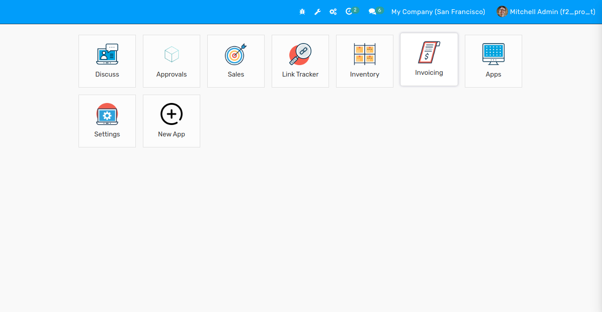
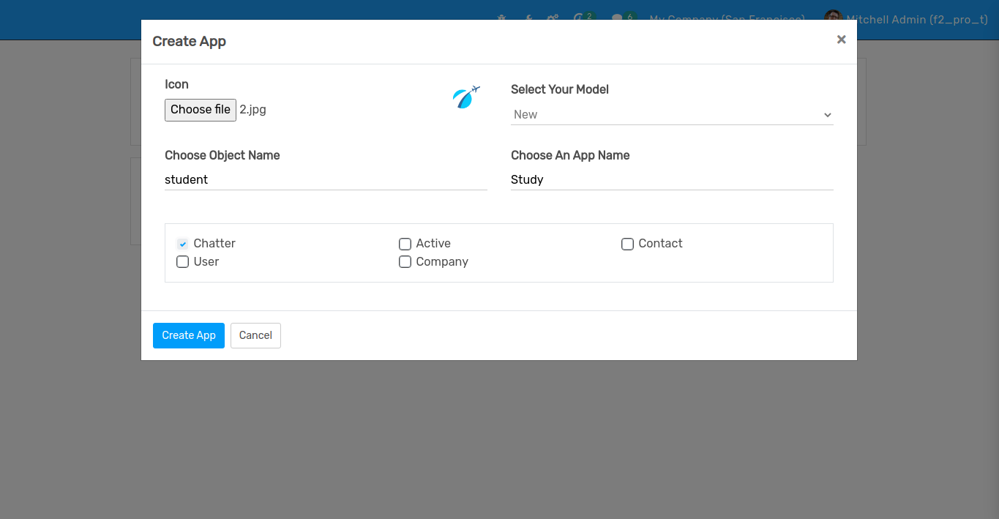
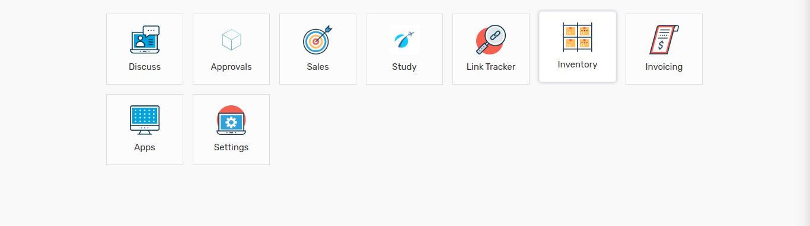
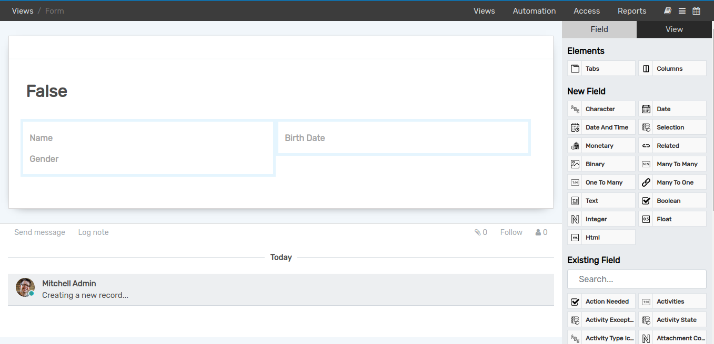
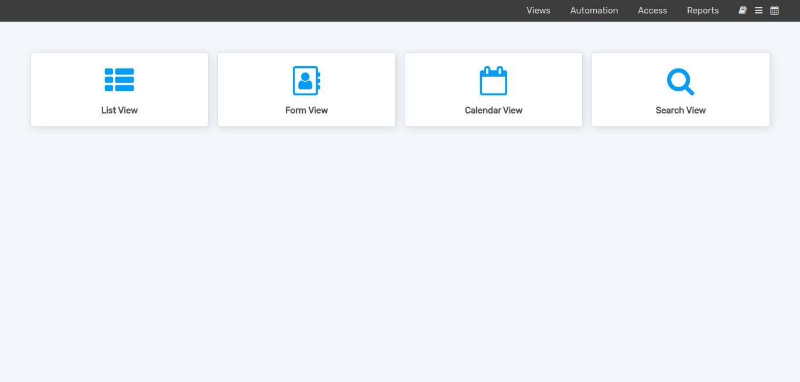
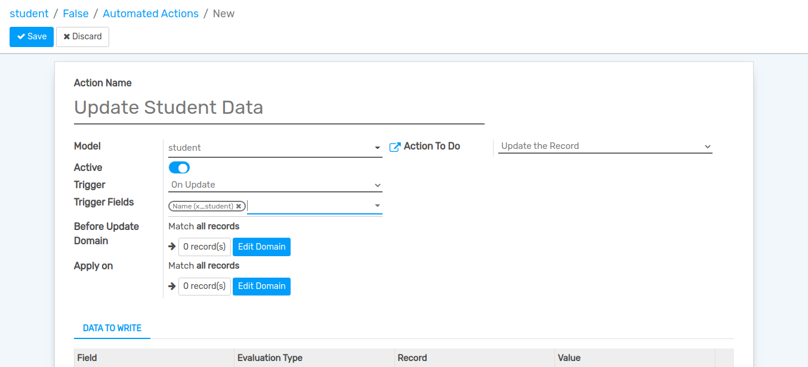
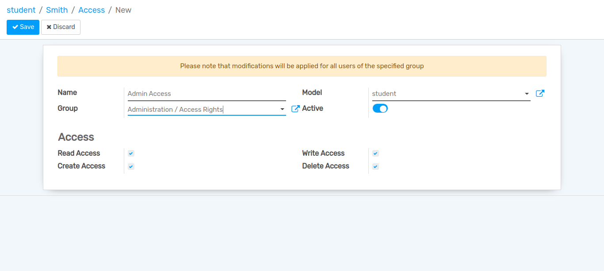
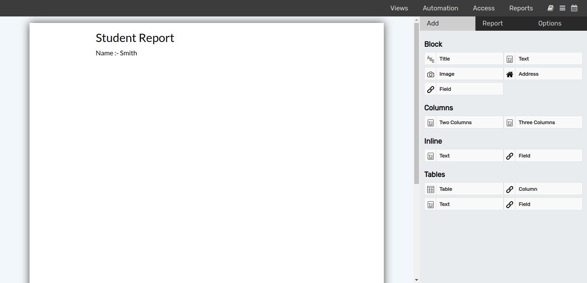

==================
Web No Code Studio
==================

Web No Code Studio is a tool integrated in Flectra that allows users define and execute their own reports without the need to code.

Create App
==========

Views
-----

Click on `View Editor` button on top of the page.

Now, you can see `New App` menu.

Click on `New App` menu, and wizard will be open. Here you can add Icon, select the model, choose object name,
choose an app name, etc.

Now, click on `Study` menu and after that click on `View Editor` button.

Click on `Views` button, here you can create different types of views.

Simpally Drag and Drop the fields types and you can create form view of the app.

Add the all required fields for particular model and after that click on `Study` menu.
Click on `Create` and you can see all the fields which you have added.

.. image:: media/no-code-7.png
    :align: center

In this way you can create different types of views like tree view, search view, calendar view etc.

Automation
----------

Click on `Automation` button, here you can add different types of Actions like create, update, execute python code etc.

Access
------

Click on `Access` button, here you can give the create, read, delete access to different groups.

Reports
-------

Click on `Reports` button, here you can create a report for the particular model.

