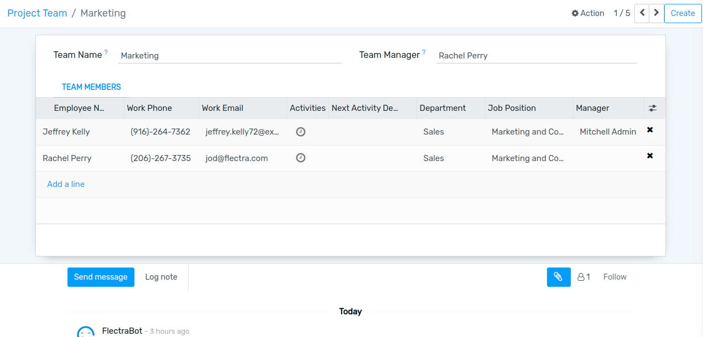

==============
Configuration
==============

Project teams
=============

Go to :menuselection:`OKR --> Configuration --> Project Team`.
Here you can create the project teams and add the team members.

Once team is created, two mail has been sent. One to the team leader and second to the team members.

