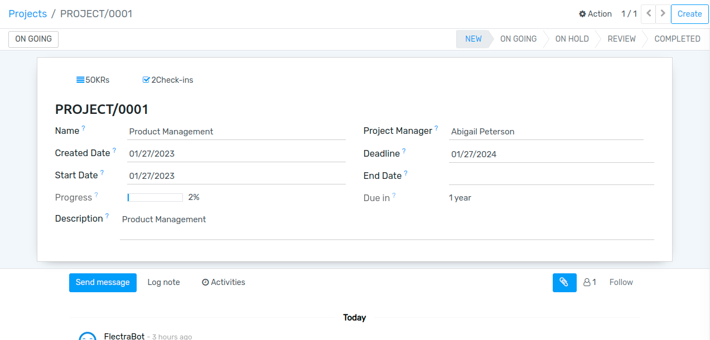
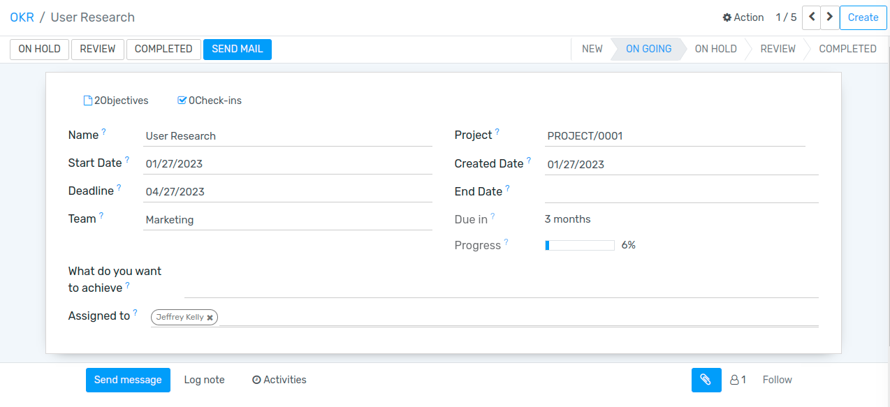
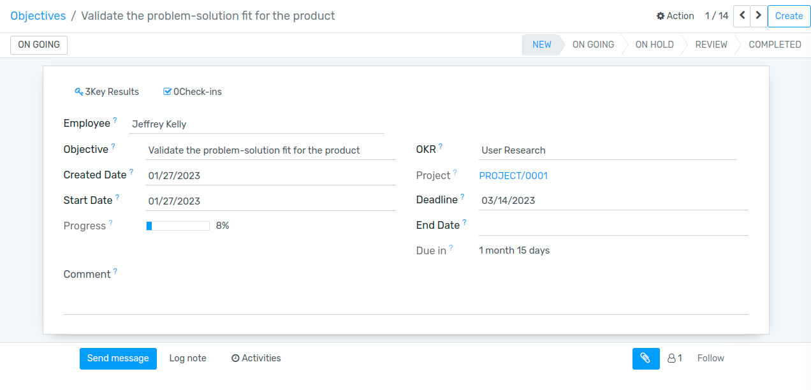
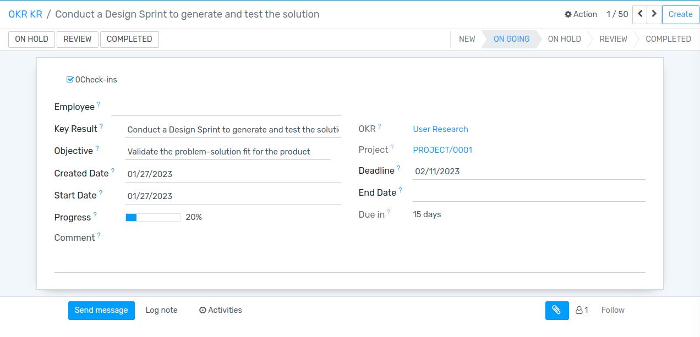

=======
Project
=======

Project
=======

Go to :menuselection:`OKR --> Project --> Projects`.

Here admin can create project and assigned to the project manager, decide the deadline of the project.

Once project is created, project creation mail sent to the assigned project manager and one notification also has been sent.

OKRs
====

Go to :menuselection:`OKR --> Project --> OKRs`.

Here project manager can create OKRs and assigned to the perticuler team and team member(employees), 
can also decide deadline of the project. Manager can only see their project details.can write remark on employee objective and key results.

Once OKRs created, mail sent with the notification to that particular employee who has been assigned to the project.

Objectives and Key Results
==========================

Go to :menuselection:`OKR --> Project --> Objectives`.

Employees can create Objectives and Key results to achieve assigned OKRs. and can check-in monthly oe weekly to update the progress and state of the objective and key results.employee only can see their records(Project,OKR,Objective and key results)

Objectives
----------

Key Results
-----------

