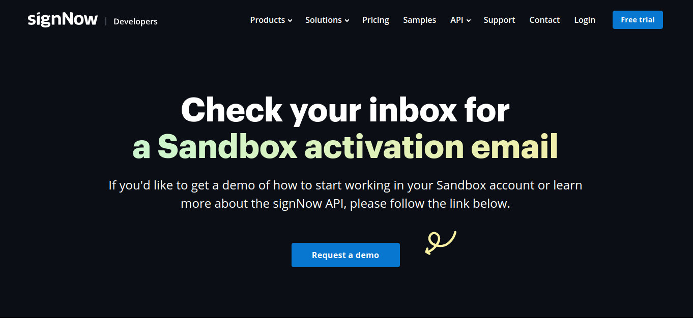
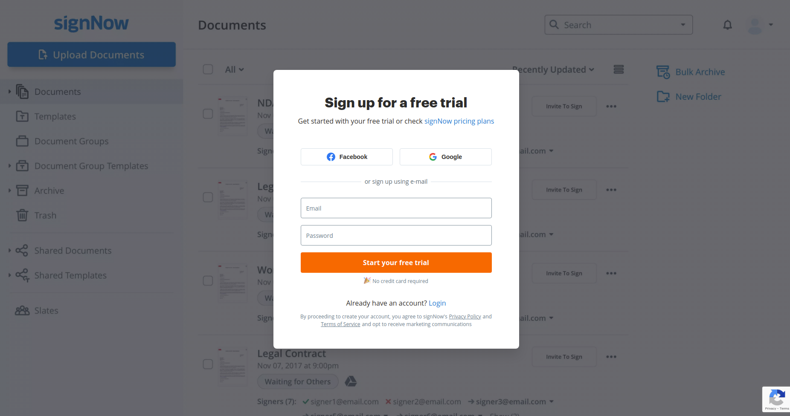
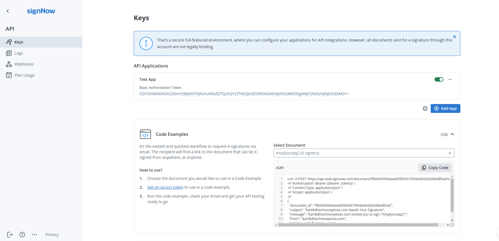
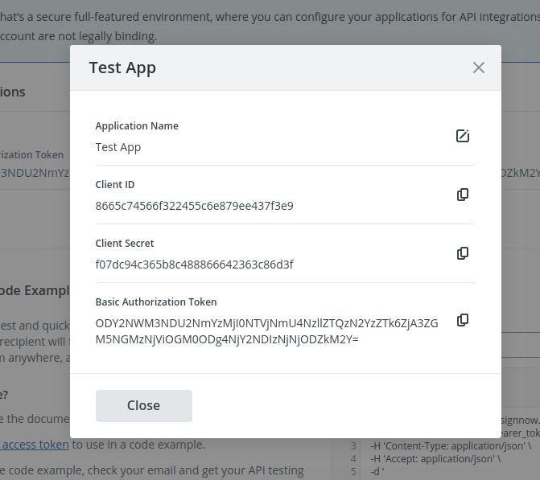
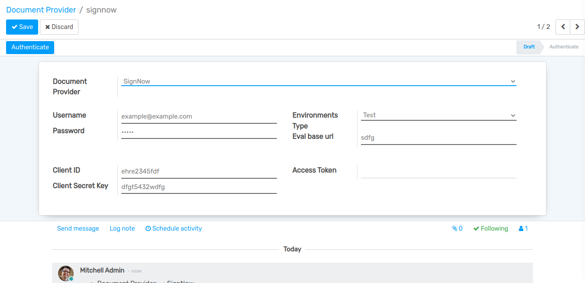
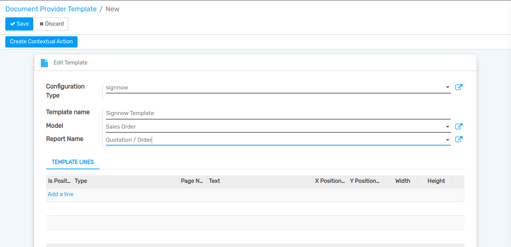
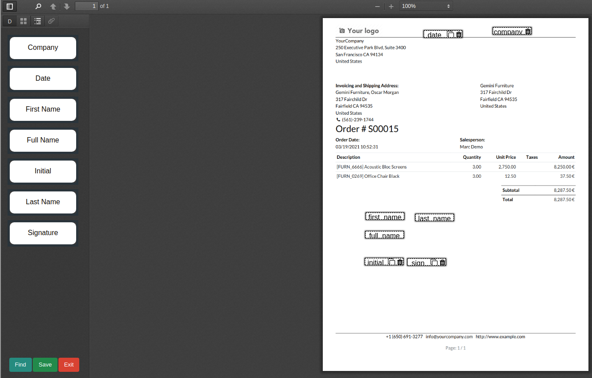
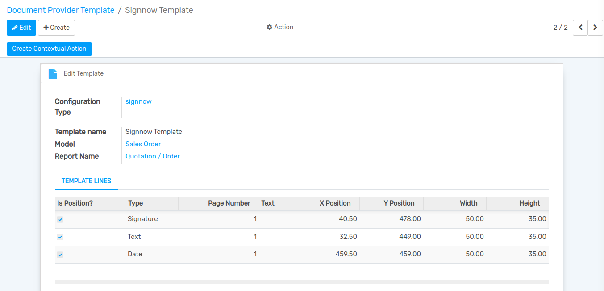
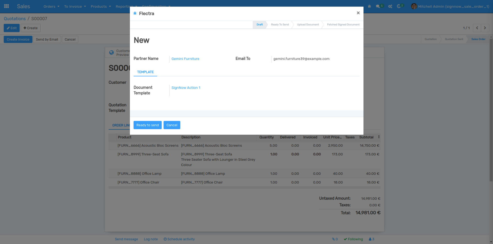
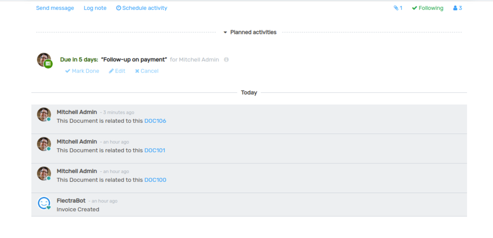

========================
How to Configure Signnow
========================

Configure Signnow
-----------------

Go to 'https://www.signnow.com/' and create your Signnow developer account.

Login in signnow account.

Go to `Api`, click on Test app and open edit mode.

Copy and save your required credential for the forther use.

How to Configure Signnow in Flectra
------------------------------------

Go to :menuselection:`Settings --> Technical --> Document Provider`.
Click on `Create` to create .

Fill the given required fields and click on `Authenticate` button.

Go to :menuselection:`Setting --> Technical --> Document Provider Template`.
Create Signnow Template Fill the fields then click on `Edit` template.

Set Your fields using this drag and drop features and click on save button.

Save document and click `Create Contextual Action` button.

Open Sale Order and click on `Action` Menu.Click on `Ready to send` button and it's automatically send data to document upload stage.

Then you can check your document status in chatter-box via it's document-id.

