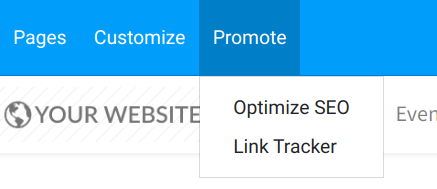

===========================
Track your prospects visits
===========================

Tracking your website pages will give you much more information about
the interests of your website visitors.

Every tracked page they visit will be recorded on your lead/opportunity
if they use the contact form on your website.

Track a webpage
===============

Go to any static page you want to track on your website and under the
*Promote* tab you will find *Optimize SEO*

