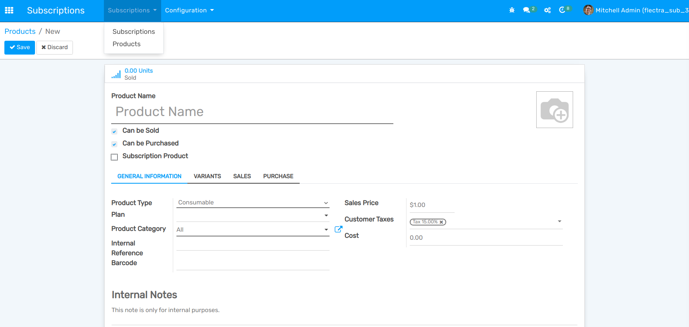

=========================
Add subscription products
=========================

To properly sell your subscriptions using our amazing **Flectra Subscriptions** application, you must
follow these steps:

1. **Create your own subscription templates**
2. **Create your own subscription products with the right settings**

As a result, you will be able to manage your subscriptions like any other product, create your
quotations and continue the sales flow to track the number of subscriptions you sell and manage the
revenue they generate.

Configuration
=============

Go to :menuselection:`Subscriptions -->Products` to learn how you can configure your
own subscription products. You have the possibility to create a new product or edit an existing one.
Once named, be careful to select the option *Can be sold* and deselect *Can be purchased*. For the
product type, it is recommended to use *Service* for subscription products as they are non-material
products that you provide to your customers. Finally, you can adapt your prices and also add an
internal reference.

.. note::
   You can also choose the subscription plan you want to use.

   .. image:: media/subscription-products-using-subscription-templates.png
     :align: center
     :alt: View of a subscription product form in Flectra Subscriptions

.. seealso::
  - :doc:`../../subscriptions/configuration/subscription_templates`