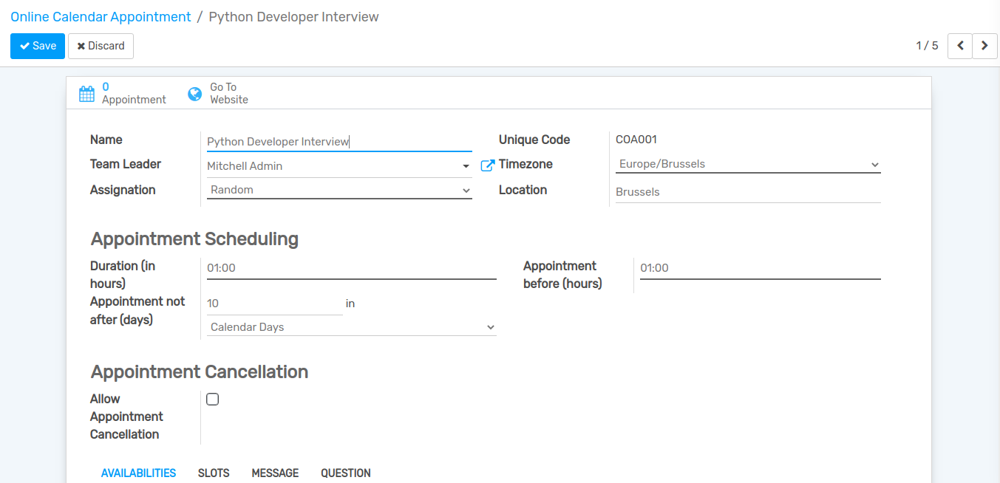
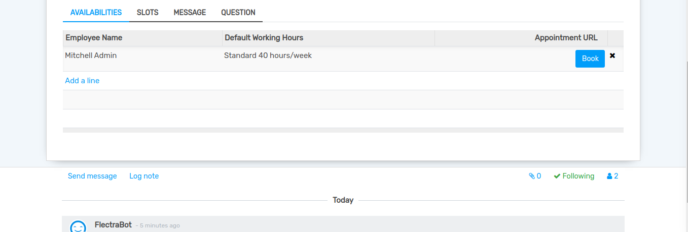
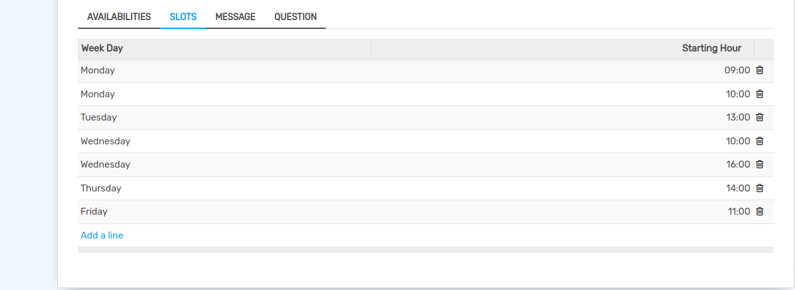
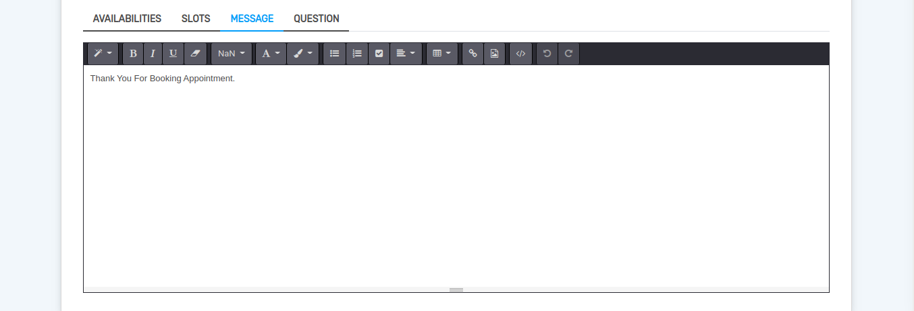
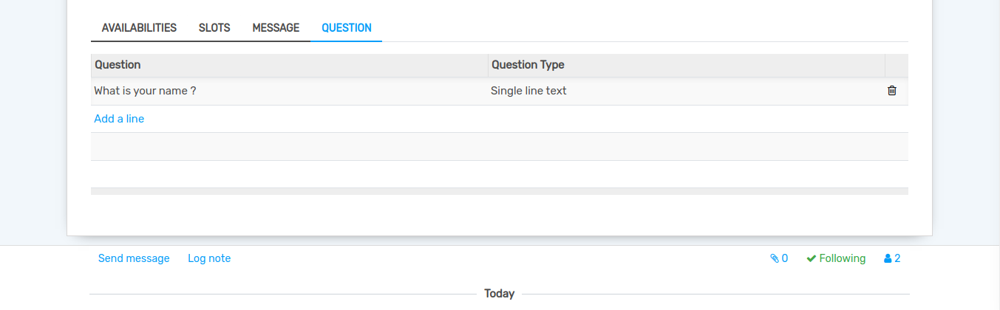
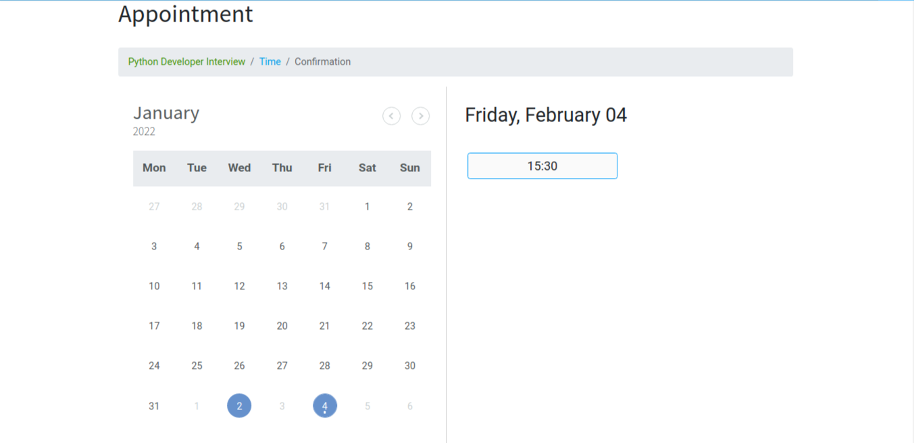
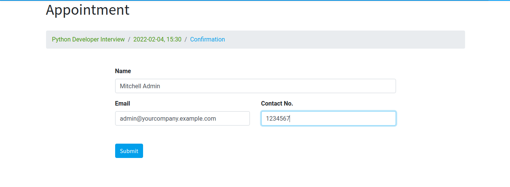
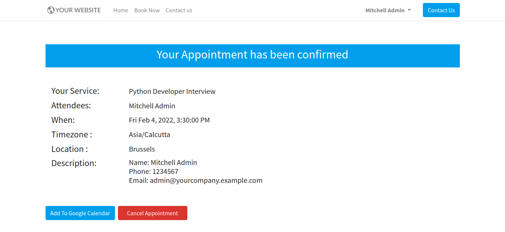
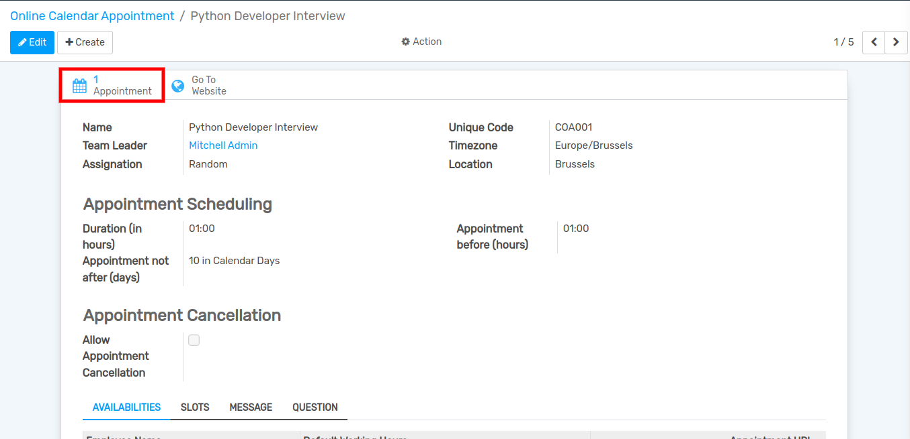
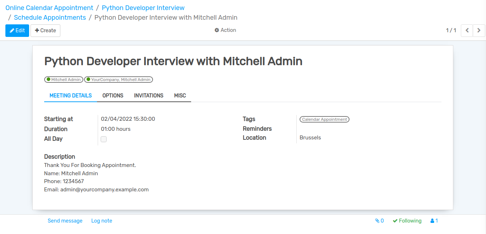

================================
How to Create Online Appointment
================================

Go to :menuselection:`Calendar -->  Online Appointment`.
Click on ``Create`` to create a new Appointment.

#. Name :- Specify the name of appointment in name field.
#. Unique Code :- Set Code for the appointment. Unique code for appointment.
#. Team Leader :- Select a team leader from the list.
#. Timezone :- Select a timezone from the list.
#. Assignation :- Set the method for Assignation staff.
#. Location :- Add a location in location field.
#. Duration :- Specify time duration for current appointment in duration field.
#. Appointment before (hours) :- Minimum hours before that user take appointment.
#. Appointment not after(days) :- Maximum day, only those days user take appointment.
#. Allow Appointment Cancellation :- If this boolean is set, user can cancel appointment.

Pages in online appointment from
--------------------------------

Availabilities
--------------

Add Available persons for current appointment under this page.

Slots
-----

Add slots for current appointment under this page.

Message
-------

Add message for current appointment under this page.

Question
--------

Add Questions for current appointment under this page.

How user can make appointment
=============================

Go to :menuselection:`Home --> Book Now`
Here you can Select a particular appointment from which you want to make an appointment.

.. image:: media/cal-6.png

Select the slot in which you want to make an appointment.

Add your name,email and contact number and click on ``Submit``.

Here you can add your appointment in google calendar or cancel appointment.

Admin can see all the appointments on ``Appointment`` button.

