Configuration
=============

Project
-------

Go to :menuselection:`Field Service --> Configuration --> Projects`. ``Create`` or Edit a Project.

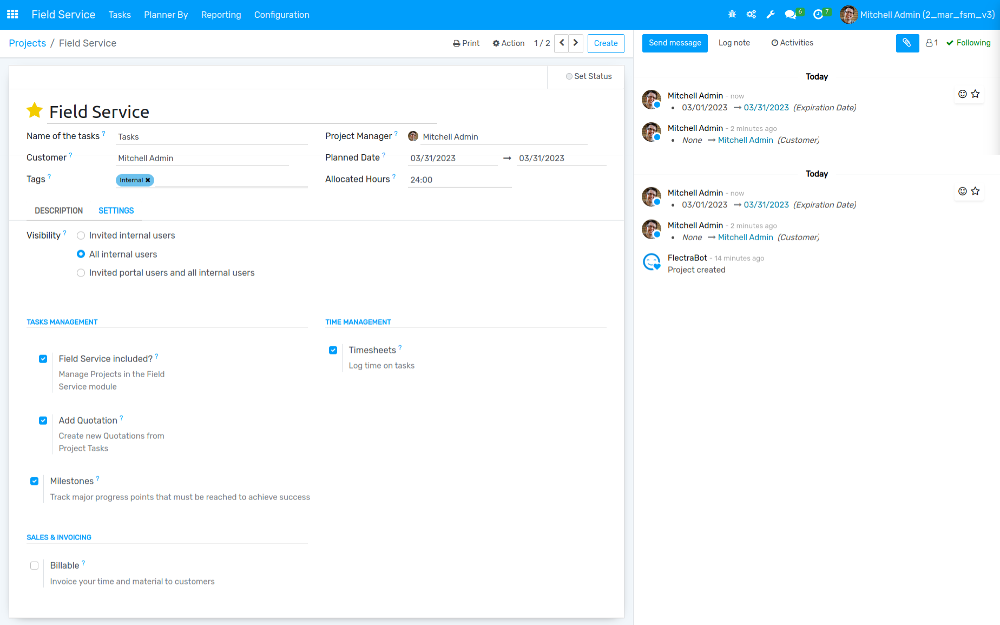

The user can create a new project for the field service.
When you create a project in FSM Configuration, the field service boolean is automatically selected.

Go to :menuselection:`Project --> Configuration --> Projects`. ``Create`` or Edit a Project.

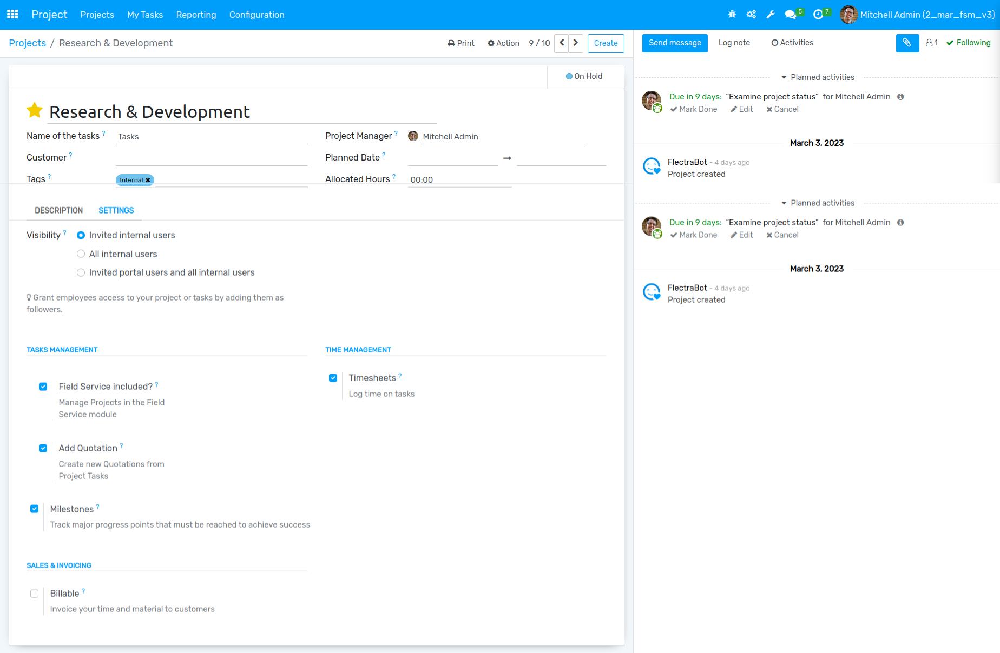

Stage
-----

There's no need to create a project using the FSM module, simply click on the boolean in the project form.

Go to :menuselection:`Field Service --> Configuration --> Stages`. ``Create`` or Edit a Stage.

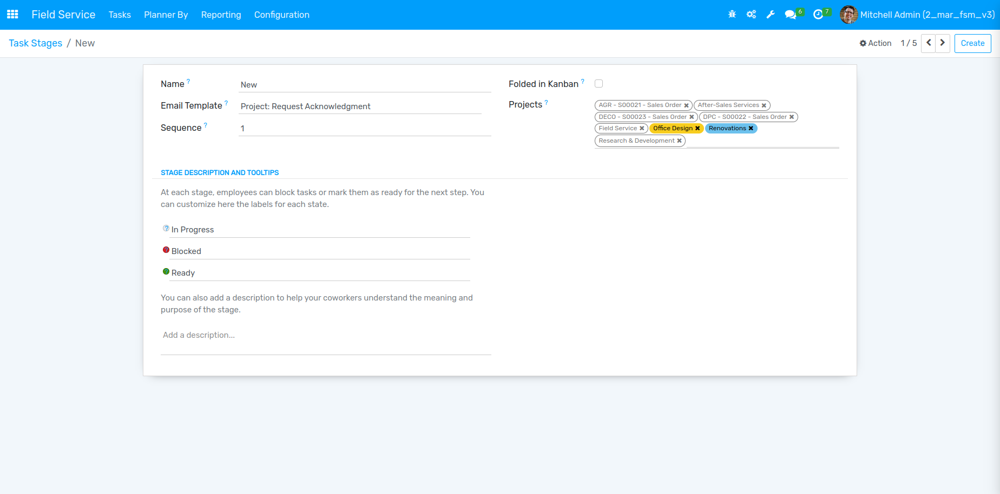

Create a Field Service Stage and and choose the project for specific stages.

Task Type
---------

Go to :menuselection:`Field Service --> Configuration --> Task Types`. ``Create`` or Edit a task type.

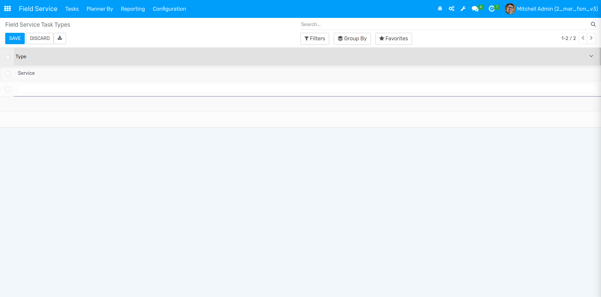

Create a task type for Field Service tasks.

Worksheet Template
------------------
Go to :menuselection:`Field Service --> Configuration --> Worksheet Template`. ``Create`` or Edit a worksheet template.

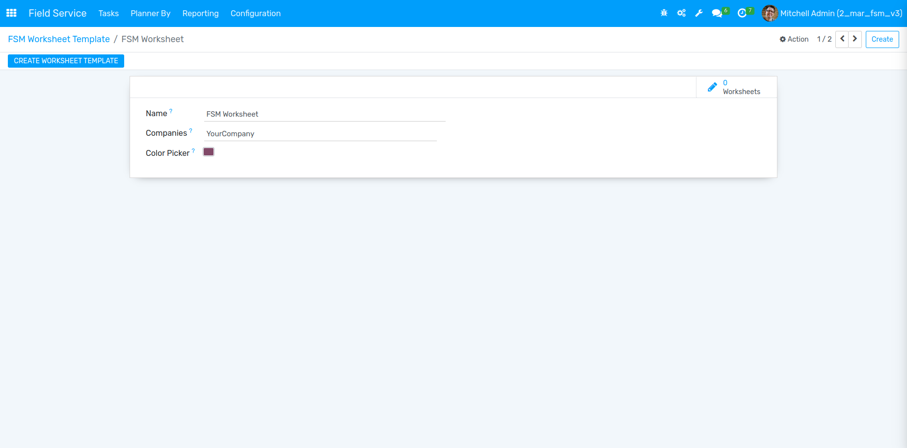

Details of Worksheet Template

#. Name :- Add the name of Worksheet Template.
#. Companies :- Select the Company name.
#. Color Picker :- Add a specific colour to differentiate the worksheets.

Go to :menuselection:`Field Service --> Configuration --> Worksheet Template`.

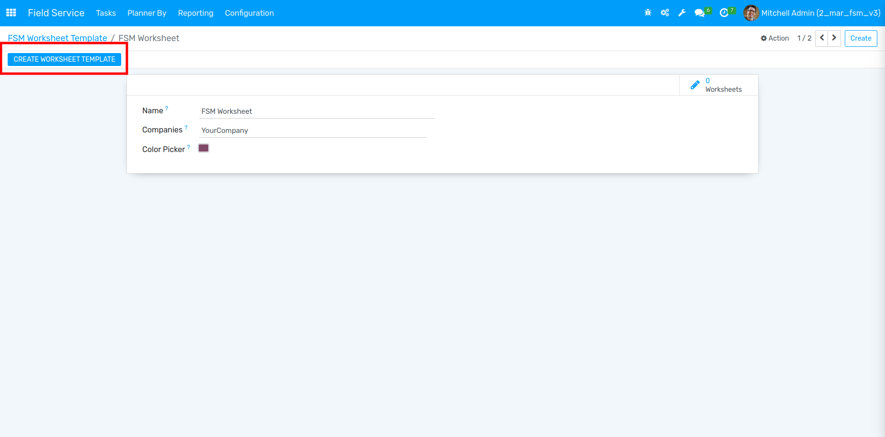

All worksheet templates defined in the field services are described here, and if a customised one is required, the user can select the create option.

Product
-------

Go to :menuselection:`Field Service --> Configuration --> Products`. ``Create`` or Edit a product.

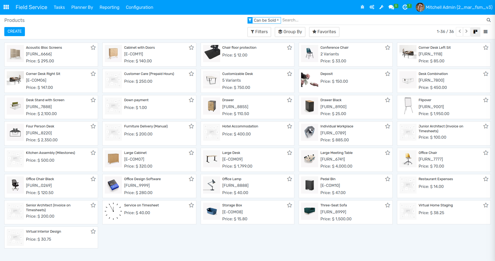

You can manage all the products form here.

Tasks
=====

My Tasks
--------

Go to :menuselection:`Field Service --> Tasks --> My Tasks`. ``Create`` or Edit a Task.

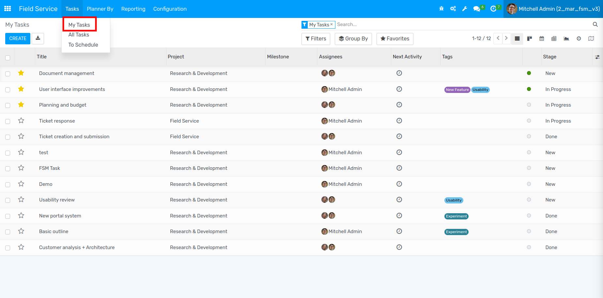

User can view only their tasks from here.

Go to :menuselection:`Field Service --> Tasks --> My Tasks`.

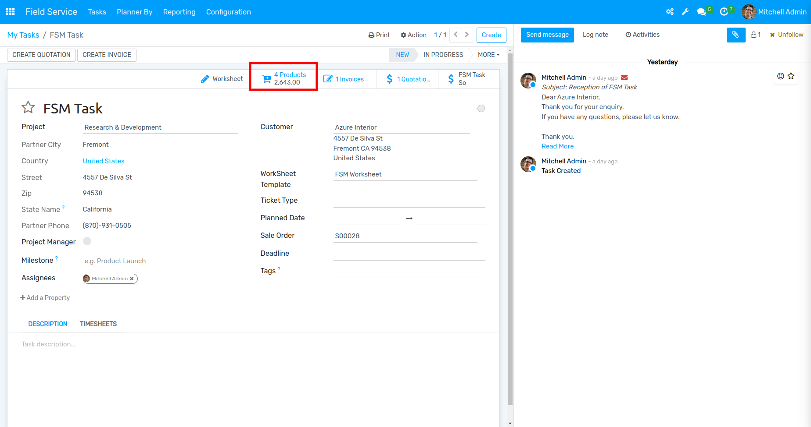

In this smart button you can see the number of products and their price.

Go to :menuselection:`Field Service --> Tasks --> My Tasks`.

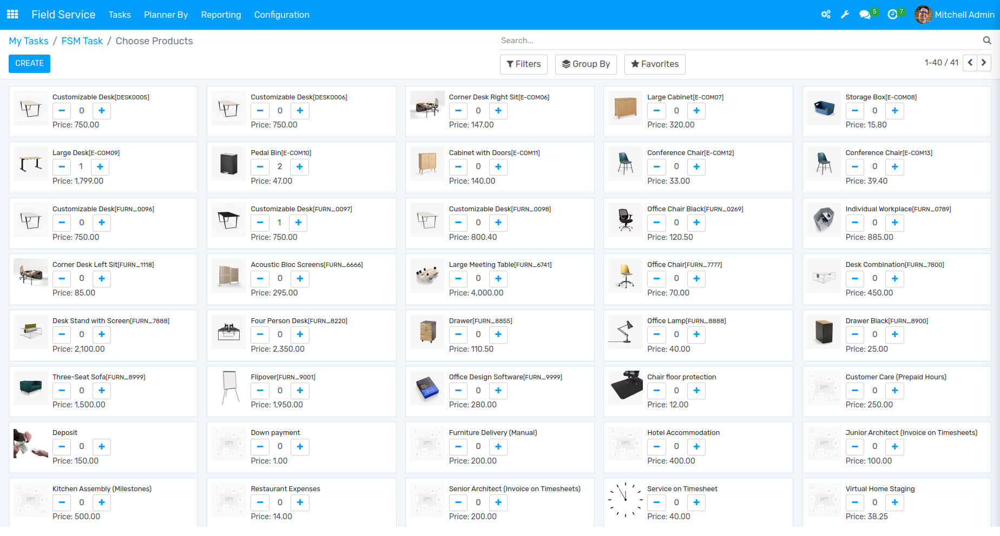

From here you can add any of the product for creating Sale Order.

All Tasks
---------

Go to :menuselection:`Field Service --> Tasks --> All Tasks`. ``Create`` or Edit a Task.

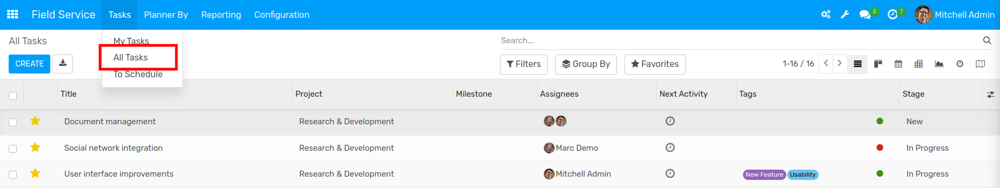

Only admin can view and manage all Employee's tasks.

To Schedule
-----------

Go to :menuselection:`Field Service --> Tasks --> To Schedule`.

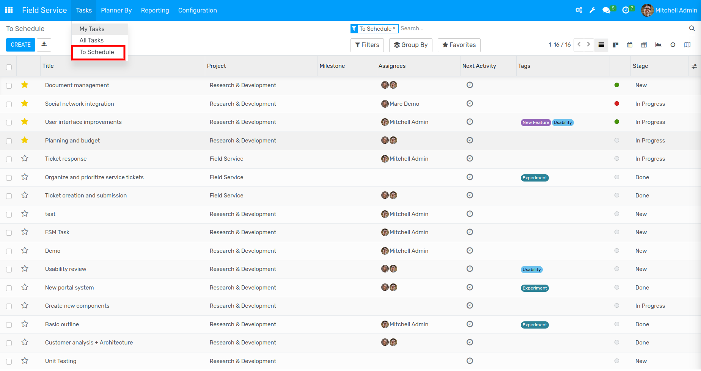

Admin can view the list of unscheduled tasks here; once you plan the date of a specific task, the record will disappear from this list. 

Planner By
==========

You can group the records by Project, User, and Worksheet using these three menus.

By Project
----------

Go to :menuselection:`Field Service --> Planner By --> By Project`.

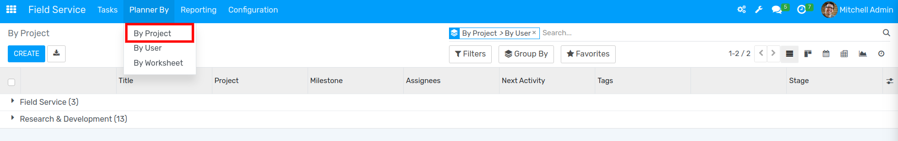

By User
-------

Go to :menuselection:`Field Service --> Planner By --> By User`.

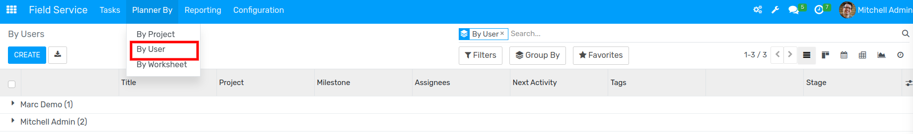

By Worksheet
------------

Go to :menuselection:`Field Service --> Planner By --> By Worksheet`.

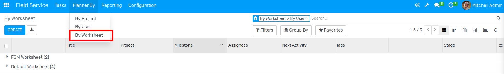

Reporting
=========

Task Analysis
-------------

Go to :menuselection:`Field Service --> Reporting --> Task Analysis`.

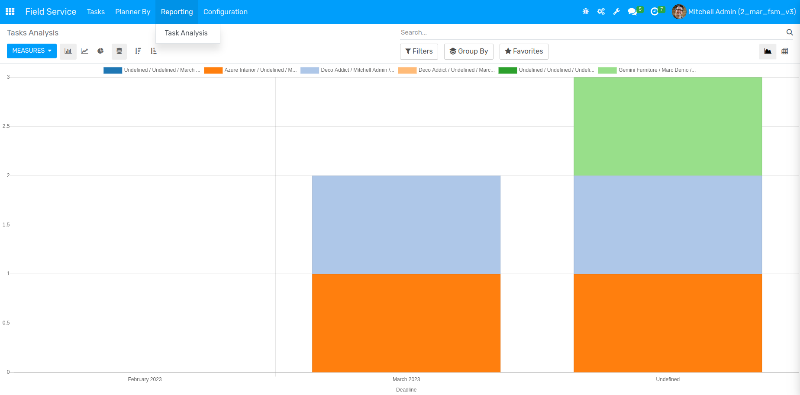
