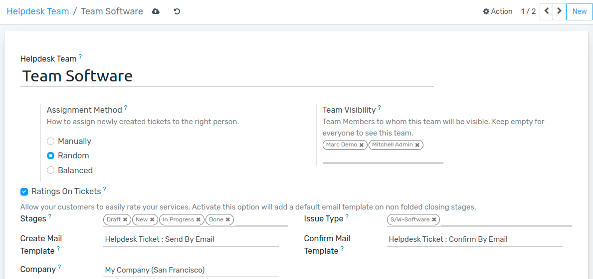
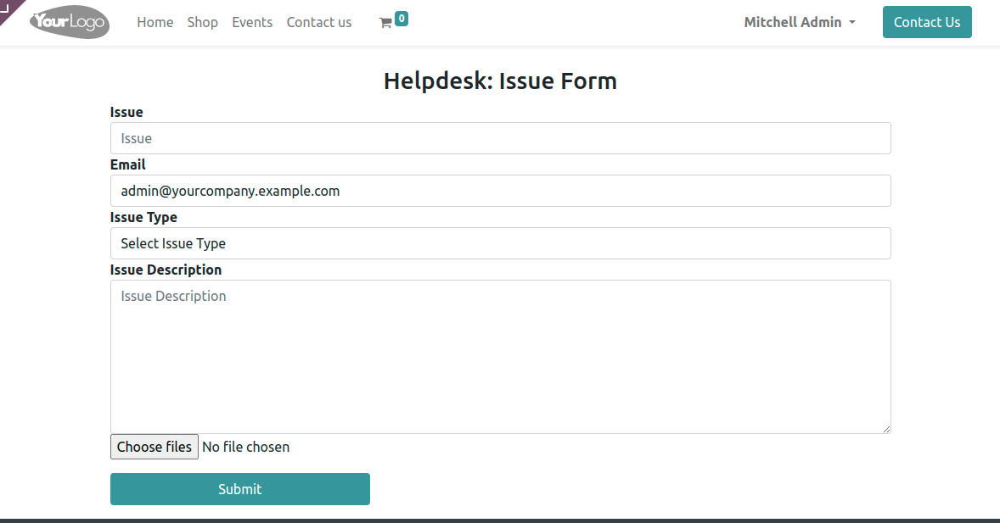
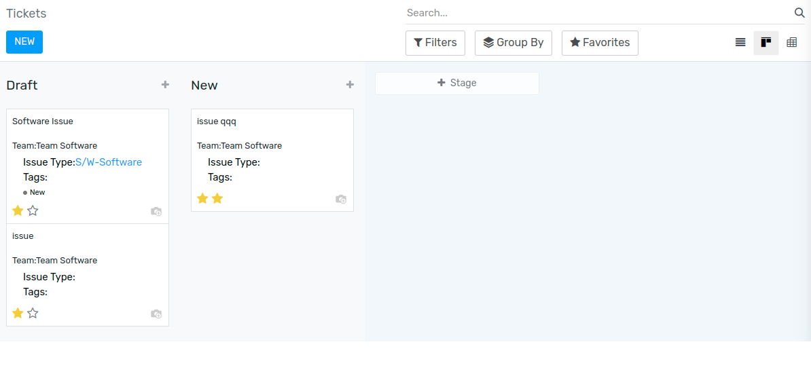

=======================
Start Receiving Tickets
=======================

Offering a variety of channels from where your customers can contact you grants them flexibility
and the right to choose the best one for themselves. And, in order to make sure inquiries across
all channels get addressed, it is essential to have a solution where all interactions come in one
place.

Channels options to submit tickets
==================================

Go to :menuselection:`Helpdesk --> Configuration --> Helpdesk Teams`, and enable the following
features as you want them to be available to your users.

.. note::
   Using your own email server is required to send and receive emails in Flectra Community and
   Professional. Online users benefit from a ready-to-use email server.

Website Form
------------

| Allow your customers to submit a ticket by filling in a form through your website.

From the website page customize the form as you like. Then, publish it by clicking on *Unpublished*.

Prioritize tickets
==================

Use the stars to prioritize your tickets. The most urgent ones appear at the top of your list on
the Kanban view.

- 1 star = *Low priority*
- 2 stars = *High priority*
- 3 stars = *Urgent*

