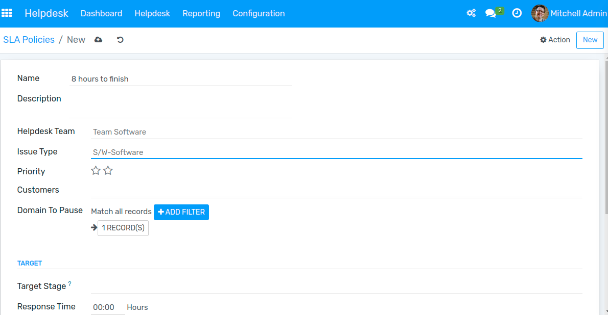
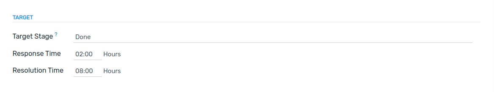
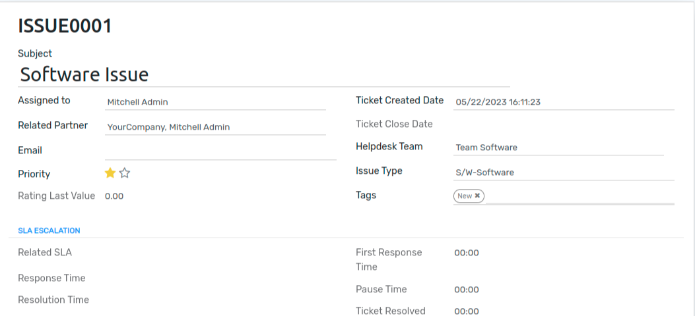
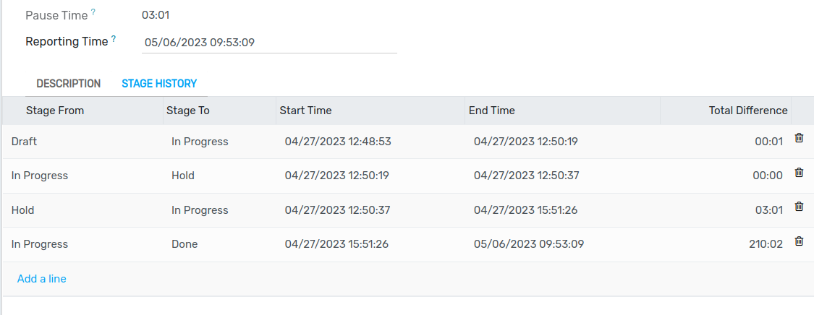
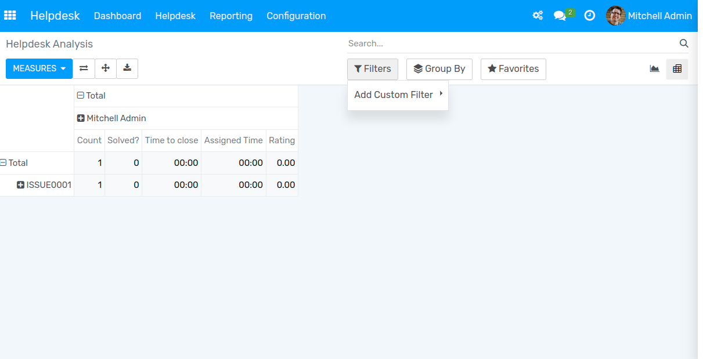

==============================
Service Level Agreements (SLA)
==============================

Service Level Agreements (SLA) are commitments you make with your customers to outline how a
service is delivered. It bolsters trust between you and your customers as it makes clear what
needs to be done, to what standard, and when.

Create your policies
====================

| First, enable the feature on the settings of the team you would like policies to be applied,
  going to :menuselection:`Helpdesk --> Configuration --> Helpdesk Teams`.
| Create your policies through the team’s settings page or go to :menuselection:`Helpdesk -->
  Configuration --> SLA Policies`.

| Choose to which **Team** the policy is relevant and the **Minimum Priority** a ticket needs to
  have for the policy to be applied.
| Select the **Customer** to whom policy is applied and choose the relevant **Issue Type**.

| **Target** is the stage a ticket needs to reach within the period defined to satisfy the SLA. **Response Time** is the time a response should
| be given after ticket creation and the **Resolution Time** is the time a ticket should be resolved.

Helpdesk Tickets
================

Go to :menuselection:`Helpdesk --> Helpdesk --> Tickets`.

| **Related Partner** is the customer to which policy relates. Based on Helpdesk Team and Priority SLA policy will be applied.
| If two SLA has the same priority as the other closest deadline of all SLAs is the one considered.

Stage History
-------------

| It shows time history of ticket's stages i.e **Start Time** shows the time of starting stage and **End Time** shows the time of stage reached.
| **Pause Time** shows how long ticket stay in Hold stage and **Reporting Time** is the time that indicates the ticket has been resolved.

SLA Analysis
============

Go to :menuselection:`Helpdesk --> Reporting --> Helpdesk Report`. Apply *Filters* and
*Group by* to identify tickets that should be prioritized and keep track of upcoming deadlines.

