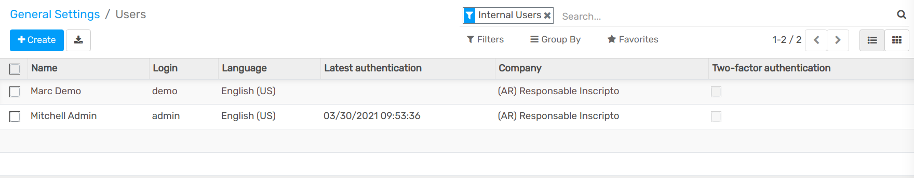
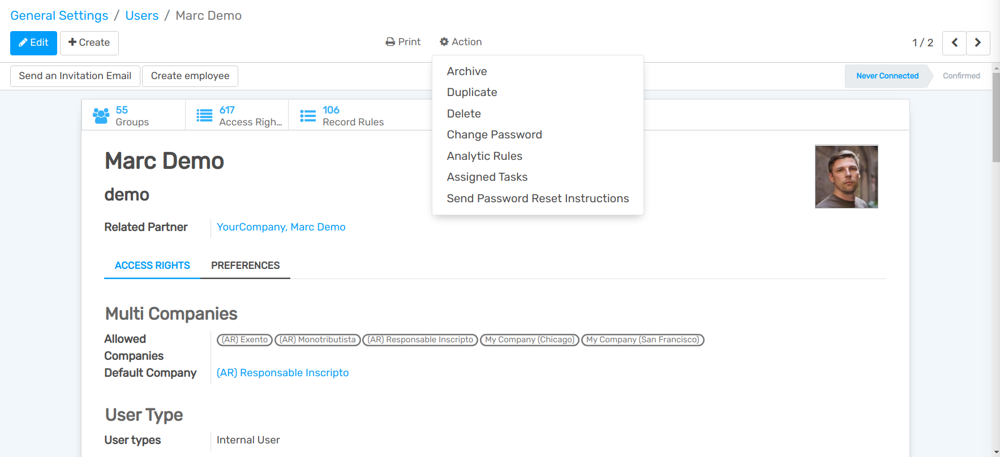
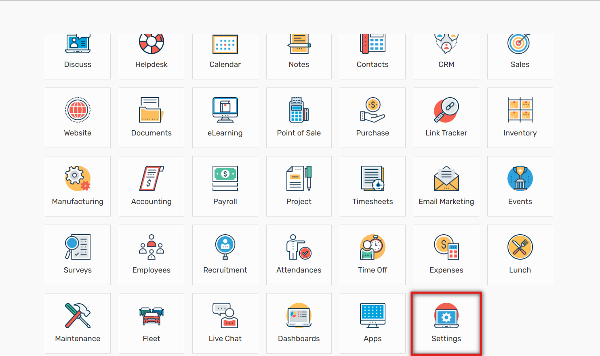
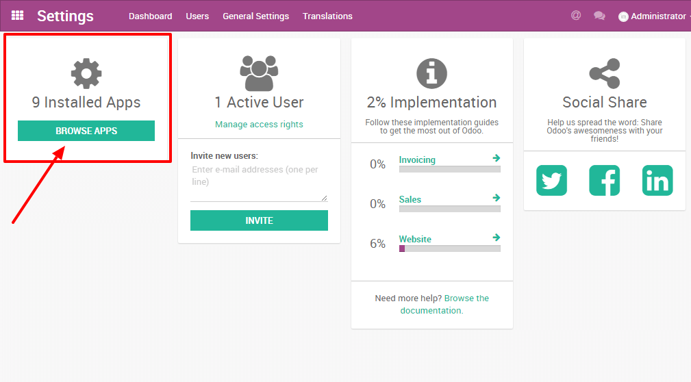
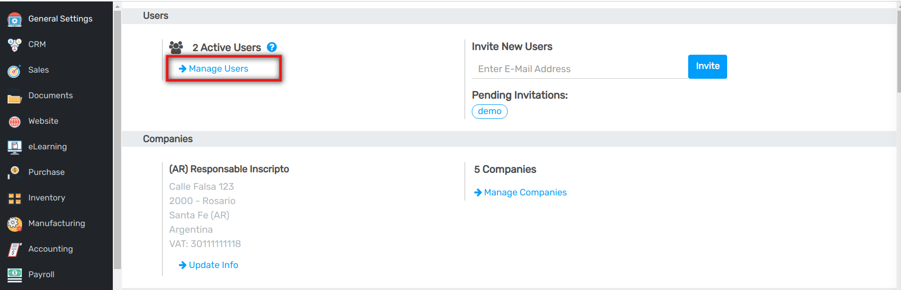

:banner: banners/users.png

==================
Users and Features
==================

As the administrator of your database, you are responsible for its usage.
This includes the Apps you install as well as the number of users currently
in use.

Flectra is many things (ERP, CMS, CRM application, e-Commerce backend, etc.)
but it is *not* a smartphone. You should apply caution when adding/removing
features (especially Apps) on your database since this may impact your
subscription amount significantly (or switch you from a free account
to a paying one on our online platform).

This page contains some information as to how you can manage your Flectra 
instances. Before carrying any of these procedures, we **strongly** advise
to test them on a duplicate of your database first. That way, if something goes
wrong, your day-to-day business is not impacted. 

.. note:: If you have questions about the content of this page or if you
    encounter an issue while carrying out these procedures, please contact
    us through our `support form <https://www.flectrahq.com/help>`__.

Deactivating Users
==================

.. note:: Make sure you have sufficient **administrative rights** if
    you want to change the status of any of your users. 

In your Flectra instance, click on **Settings**. You will have a section
showing you the active users on your database. Click on **Manage Users.** 

+----------------+----------------+
|   |settings|   | |browse_users| |
+----------------+----------------+

You'll then see the list of your users.

.. note:: The pre-selected filter *Internal Users* shows your paying
    users (different from the *Portal Users* which are free). If you
    remove this filter, you'll get all your users (the ones you pay for
    and the portal ones)

In your list of users, click on the user you want to deactivate. As soon
as you are on the userform, click on the Action drop down menu, and
then click on Archive.

The user is now deactivated. 

.. danger:: **Never** deactivate the main user (*admin*)

Good to know
============

* **Uninstalling apps, managing users, etc. is up to you**: no one else can
  know if your business flow is broken better than you. If we were to uninstall
  applications for you, we would never be able to tell if relevant data had
  been removed or if one of your business flow was broken because we *do not
  know how you work* and therefore cannot validate these kinds of operations.
        
* **Flectra Apps have dependencies**: this means that you may need to install
  modules that you do not actively use to access some features of Flectra
  you might need. For example, the Website Builder app is needed to be
  able to show your customer their Quotes in a web page. Even though you
  might not need or use the Website itself, it is needed for the Online
  Quotes feature to work properly.         
        
* **Always test app installation/removal on a duplicate** (or on a
  free trial database): that way you can know what other apps may
  be required, etc. This will avoid surprises when uninstalling
  or when receiving your invoices.

