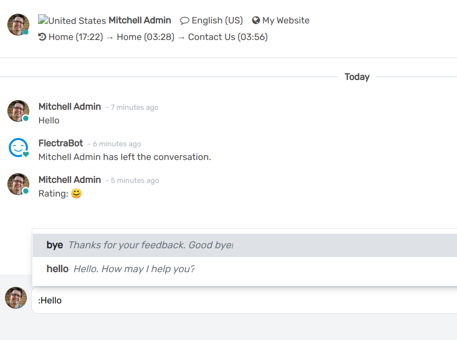

=============================
Commands and Canned Responses
=============================

Using canned responses can help you save time and have a previous, well-thought response, to some
of your most common questions and comments.

Send canned responses
=====================

| Canned responses allow you to have a full piece of text being placed when you type a shortcut word.
  To create them, go to :menuselection:`Live Chat --> Configuration --> Canned Responses`.
| To use them during a conversation, simply type **:** followed by the shortcut word you created.

.. seealso::
   - :doc:`ratings`
