============================
Create Jitsi room on website
============================

In that app, you can create an Event Meeting Room (which creates the Chat Room
you were able to create from the Configuration Menu in the Website app) which
you can then publish on your website.

Setup in Flectra
================

- Install the **Website Jitsi** App from the *Apps* menu.

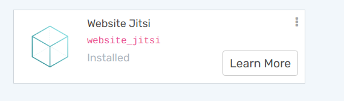

Configuration
=============

Go to :menuselection:`Website --> Configuration --> Settings` and set jitsi server.
The Jitsi server domain can be customized through the settings to use a different server than the default **meet.jit.si**.

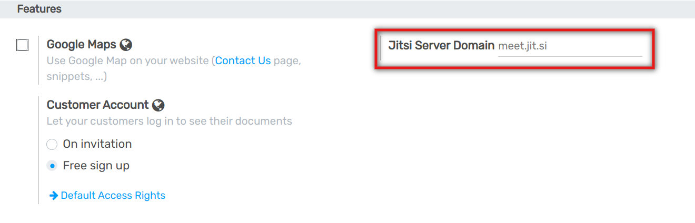

Don't forget to save your changes.

How to create chat room
=======================

- Install the **Events** and **Quiz and Meet on community** and **Event Meeting / Rooms** Apps from the *Apps* menu.

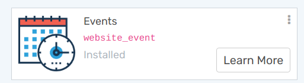
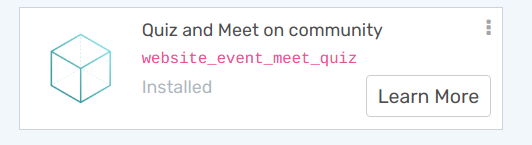
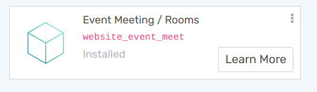

Go to :menuselection:`Events` on website.
and select the online event you want to join...

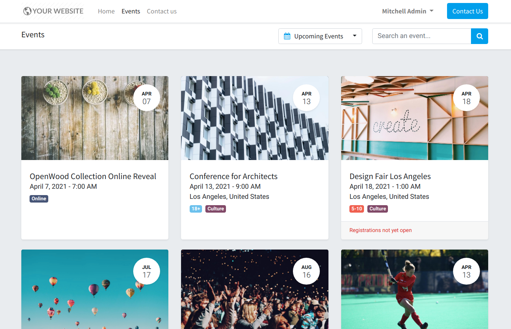

Now, click on **Community** menu.

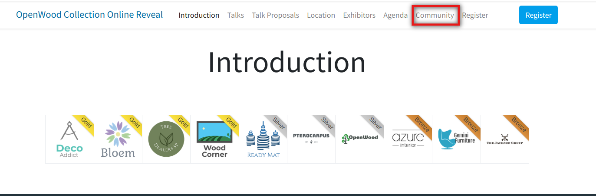

Now, click on **Create a Room** button.

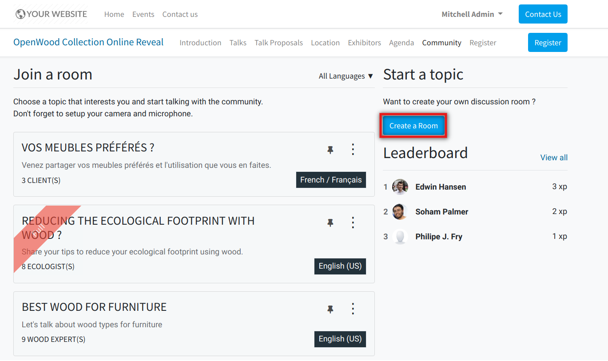

Fill the details of the chat room in given box, and click on **Create**.

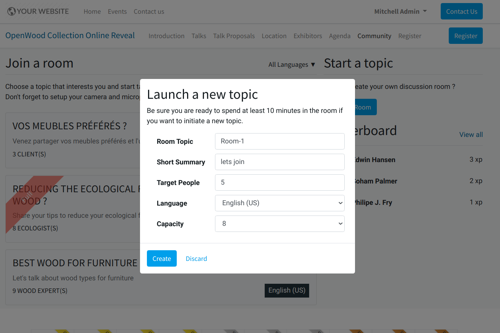

In this way user can **Create** and **Join** the chat room.

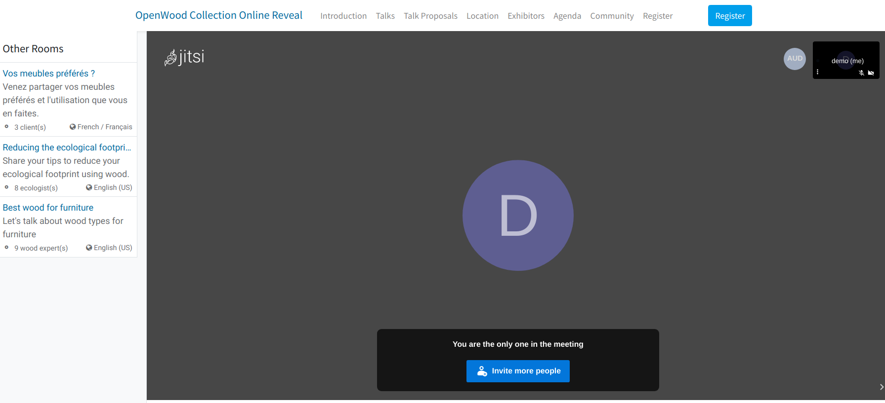

Go to :menuselection:`Website --> Configuration --> Chat Rooms`.

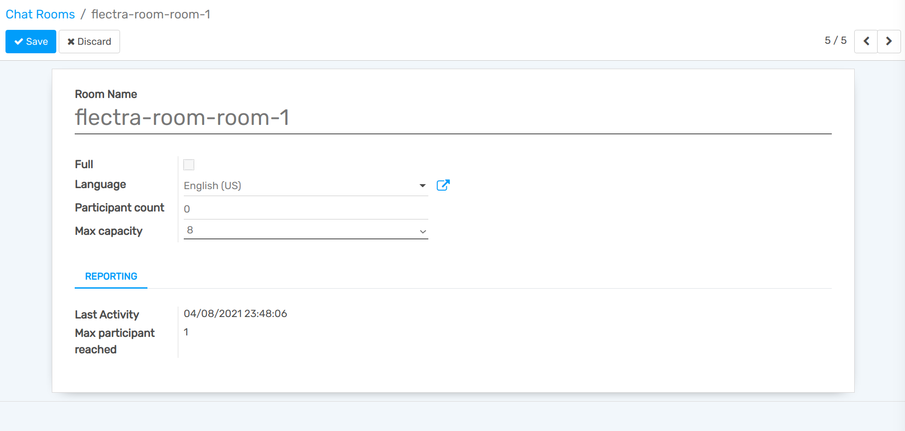

- **Room Name**: Specify the name of the chat room.
- **Full**: It will tick automatically when the room is full.
- **Language**: Set the primary language of room in Language field.
- **Participant count**: Set the participant count.
- **Max capacity**: Set the maximum capacity of the room.
- **Last Activity**: It will display the date and time of last activity.
- **Max participant reached**: Maximum number of participant reached in the room at the same time.
