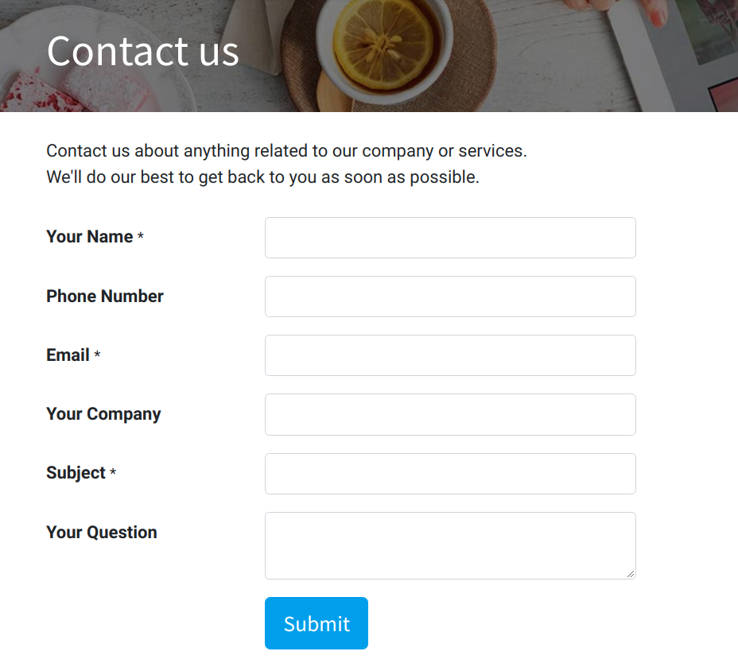
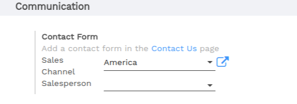
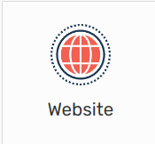
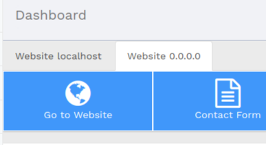

===========================================================
Generate leads/opportunities from your website contact page
===========================================================

Automating the lead/opportunity generation will considerably improve
your efficiency. Any visitor using the contact form on your website will
create a lead/opportunity in the pipeline.

Use the contact us on your website
==================================

You should first go to your website app.

|image0|\ |image1|

With the CRM app installed, you benefit from ready-to-use contact form
on your Flectra website that will generate leads/opportunities
automatically.

To change to a specific sales channel, go to :menuselection:`Website
--> Configuration --> Settings` under *Communication* you will find the
Contact Form info and where to change the *Sales Channel* or
*Salesperson*.

Generate leads instead of opportunities
=======================================

When using a contact form, it is advised to use a qualification step
before assigning to the right sales people. To do so, activate *Leads*
in CRM settings and refer to :doc:`convert`.

