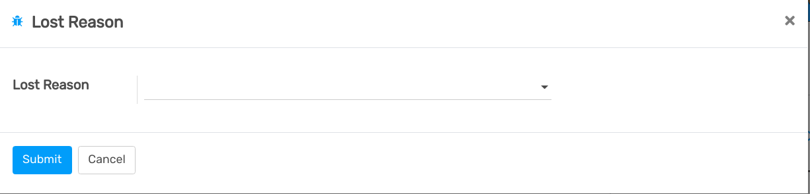

=========================
Manage lost opportunities
=========================

While working with your opportunities, you might lose some of them. You
will want to keep track of the reasons you lost them and also which ways
Flectra can help you recover them in the future.

Mark a lead as lost
===================

While in your pipeline, select any opportunity you want and you will see
a *Mark Lost* button.

You can then select an existing *Lost Reason* or create a new one
right there.

Manage & create lost reasons
----------------------------

You will find your *Lost Reasons* under :menuselection:`Configuration --> Lost Reasons`.

You can select & rename any of them as well as create a new one from
there.

Retrieve lost opportunities
===========================

To retrieve lost opportunities and do actions on them (send an email,
make a feedback call, etc.), select the *Lost* filter in the search
bar.

You will then see all your lost opportunities.

If you want to refine them further, you can add a filter on the *Lost
Reason*.

For Example, *Too Expensive*.

.. seealso::
   * :doc:`../performance/win_loss`
